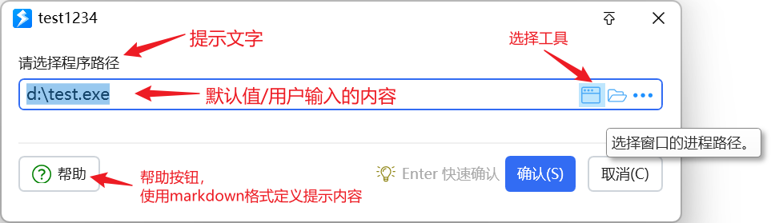
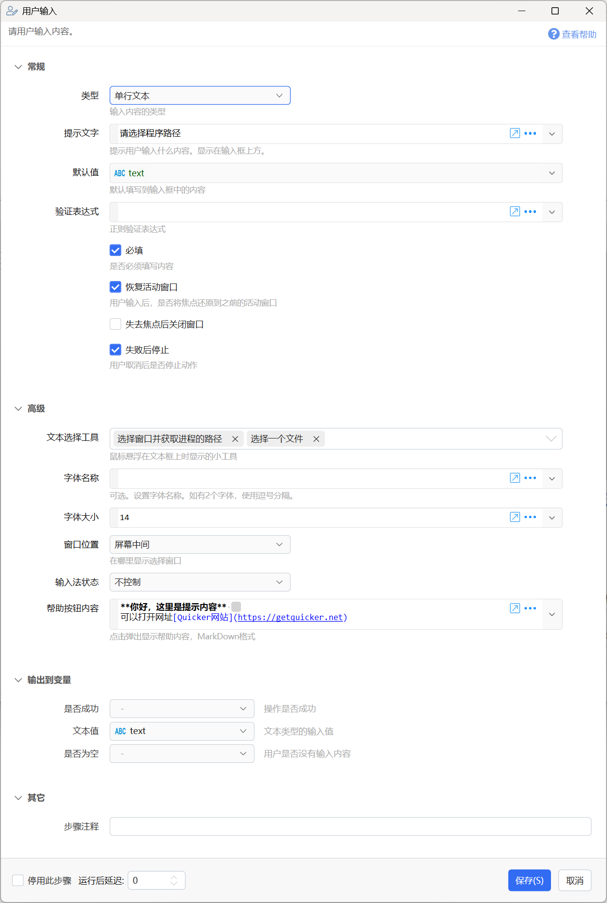

# 用户输入

请用户输入内容。

## 当前模块定义

<XActionModuleMeta moduleKey="sys:userInput" />

## 概述

显示一个文本输入窗口，获取用户输入的内容。

注：

-   用户输入模块仅能用于输入一个信息，如果需要同时输入多个内容，以及使用其它类型的输入方式（如下拉选择等），请使用《[多字段表单](/v2/xaction/modules/form)》模块。

## 参数

### 输入参数

**类型：**输入内容的类型及输入方式。可选值：单行文本、多行文本、数字、日期时间。

**提示文字：**向用户显示的提示信息。

**默认值：**预先填写到输入框里的内容。

**验证表达式：**如果对输入的内容有格式要求，可以使用正则表达式进行验证。

**必填：**是否必须填写内容后才能保存。

**恢复活动窗口：**由于用户输入窗口会抢占输入焦点，如果希望在此窗口关闭后对原有软件窗口进行操作，可以选择此项以将输入焦点恢复到弹窗之前的窗口上。

**失去焦点后关闭窗口：**弹出输入窗口后，如果用户鼠标点击了窗口以外的地方，则自动关闭此窗口取消当前操作。

**失败后停止：**取消输入后，是否停止动作。

**文本选择工具：**在输入框右侧显示的工具按钮（鼠标悬浮在输入框上时显示），点击之后可以用于选择文件、进程路径等内容。

**字体名称：**输入框字体类型；

**字体大小：**输入框字体大小；

**窗口位置：**输入框的显示位置。

**输入法状态：**设置是否主动开启和关闭中文输入状态；

**帮助按钮内容：**Markdown格式的帮助内容，点击“帮助”按钮时显示。提示：

-   两个空格表示换行；
-   \[连接标题\](网址)
-   支持一些[扩展的语法](&lt;https://github.com/whistyun/MdXaml/wiki/How-to-use-Enhanched-syntax &gt;)控制渲染格式。

### 输出

**是否成功：**是否成功获得了用户输入。

**文本值：**输入的文字内容（文本格式）。

**数字值：**输入的数字，用于输出到数字类型变量中。仅适用于类型为“数字”时。

**是否为空：**用户是否没有输入任何内容。

## 更新历史

-   1.1.0，增加“必填”选项。如果为非必填，允许空值的时候保存。
-   20241029 增加帮助按钮Markdown扩展语法文档链接。

## 示例动作

-   [示例：用户输入](https://getquicker.net/sharedaction?code=c6da399c-c64f-468a-6d89-08d6bfa4ff29)
