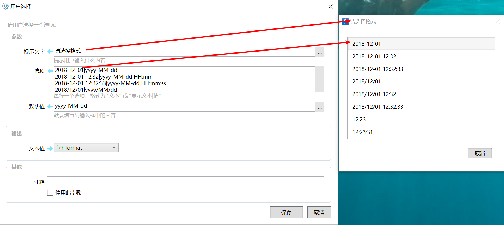
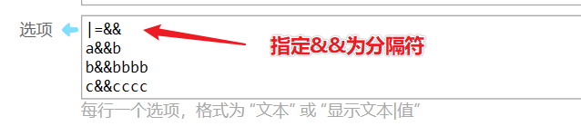
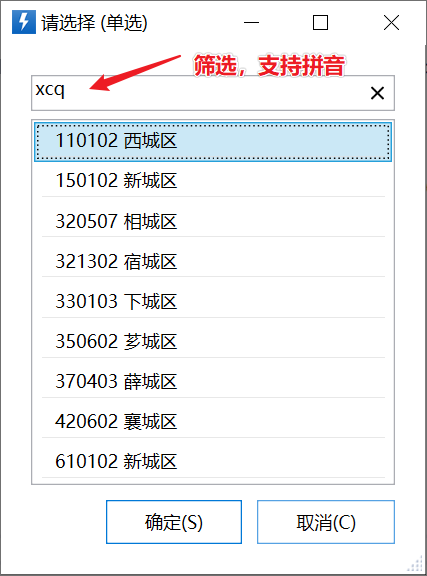

# 用户选择

请用户选择一个选项。

## 当前模块定义

<XActionModuleMeta moduleKey="sys:select" />

## 简介

“用户选择” 模块用于让用户从多个选项中选择一个（或多个）。比如下面的动作（[点击查看动作](https://getquicker.net/sharedaction?code=2a89f753-546d-45d0-bfd9-08d6720e1a02)），让用户选择一个时间格式以插入到当前文档中：

<ChoiceListPreview
  title="请选择格式"
  options={[
    '2022-10-11',
    '2022.10.11',
    '2022/10/11',
    '2022年10月11日',
    '2022-10-11 13:53',
    '2022/10/11 13:53',
    '2022年10月11日13时53分',
    '2022-10-11 13:53:47',
    '2022/10/11 13:53:47',
    '13:53',
    '13:53:47',
  ]}
/>

当用户点击一个选项的时候，会选中此选项并关闭选择窗口。

### 操作说明

单选：

-   左键点击选项：直接选中并保存；
-   键盘上下键切换选项，空格选中保存；
-   Ctrl+选项前面的数字(1-9)可快速选择选项；

多选：

-   左键单击选中或取消选中；
-   按住鼠标拖动，选择多项；
-   键盘上下键切换选项，空格切换选择状态；
-   Ctrl+选项前面的数字可以切换选择状态；

**筛选**

如果启用筛选，可以直接输入拼音首字母或关键词进行筛选。

也可以在任何时候使用`Ctrl+F`打开筛选框（选择窗口占用焦点的情况下）。

筛选默认使用模糊匹配方式，支持拼音、非连续字符等。如需使用更严格的包含方式匹配，请使用`!关键词`的方式。(1.39.16+)

如果设置了右键菜单，点击右键可选菜单项。

## 单选与多选

用户选择支持“单选”和“多选”两种操作类型。

单选时，输出内容为选择选项值文本；多选时，输出内容为选择选项值的列表。

<ModuleParamPreview
  moduleKey="sys:select"
  values={{
    type: 'multi',
    prompt: '请选择',
    items: `aaa
[fa:Light_Pen:#FF0000]bbb
ccc
ddddd`,
    autoCloseSeconds: '0',
    winLocation: 'WithMouse1',
    keepLastPos: '1',
    noKeyboard: 'false',
    closeOnDeactivated: 'true',
    showFilter: '0',
    restoreForeground: 'true',
    allowOkWhenEmpty: 'false',
    stopIfCancel: 'false',
  }}
  outputVars={{multiSelected: 'paths'}}
/>

### 参数说明

**窗口标题**：窗口的标题文字。

**提示信息**：显示在列表下面的提示文字。

**选项**：定义列出的可选择项，每行一个。

支持如下的格式类型：

-   选项内容                         *选项显示内容与值相同的情况*
-   选项显示文字**|****选项值**        *选项显示内容与值不相同的情况，使用竖线分隔显示内容与值*
-   \[fa:Light\_Pen:#99AAFF\]选项文本内容(Tooltip文字内容)|**选项值** *指定选项的图标、文本和Tooltip*

-   图标部分和tooltip部分都为可选。 在提供Tooltip内容时，其长度必须多于2个字符。
-   图标可用格式请参考[《在动作中使用图标》](/v2/xaction/concepts/use-icon-in-actions)。
-   此时`|选项值`的部分不可缺少。

选项显示内容和值之间默认使用**|**作为分隔符。如果希望将分隔符更改为其他值，请在第一行使用 **|=新分隔符** 的形式指定新的分隔符（前面不要有空格）。分隔符可以是单个字母也可以是多个字母的组合。在使用插值时，首行应该为“$$|=新分隔符”。

如果希望根据词典类型的变量指定选项，可以使用 $=&#123;词典变量&#125; 表达式格式填写可选值。此时，词典项的键(Key)将作为选项的显示内容，词典项的值(Value)将作为选项的值。

选择后，“选择的项”将返回词典项的值(Value)，“完整的选项”将会返回词典项的键（Key）。

如果需要调换显示内容和返回值，可以使用词典操作模块中的“翻转键值”。

**默认值：**

*单选模式：*默认选中的选项的值。从1.1.2版本开始，也可以输入序号数字（从0开始，仅支持选择1项）。会先匹配选项的值，匹配成功则选中对应项。如果不成功，会判断是不是一个数字，如果是数字的话就按序号选则项。

*多选模式：*默认选中的值的列表。根据文本类型和列表类型的自动转换机制，也可以使用多行文本，每行为一个要选择的值。自1.43.51版本开始，也支持通过将第0项设置为`//byIndex`，后续项使用待选中项的以0开始的序号的方式指定预先选择的条目。

**右键/全局菜单**：定义右键菜单项。每行一个，格式为：**显示内容|值** 。用户选择右键菜单后，将从“选择的菜单”中输出。显示内容支持可选的图标与tooltip，在开始处使用**\[=\]**时作为全局菜单项，否则作为右键菜单项。例如：

-   \[fa:Solid\_Pen:#ff8800\]右键菜单标题(菜单项的tooltip悬浮提示)|edit。
-   \[=\]\[fa:Solid\_Pen:#FF0000\]全局菜单(tooltip文字第一行\\r\\n文字第二行)|operation

对于特别常用的全局菜单项，可以通过在标题前增加“!”符号的方式，将其显示为独立按钮。（1.44.26+版本）。如：

-   \[=\]**!**按钮文字|operation
-   \[=\]\[fa:Solid\_Pen:#FF0000\]**!**全局按钮(tooltip文字第一行\\r\\n文字第二行)|operation

显示效果如下：

<ChoiceListPreview
  title="请选择"
  options={['a', 'b', 'c', 'd']}
  selectedIndex={3}
  globalButtons={['按钮文字', '全局按钮']}
  showMoreMenu
/>

全局菜单的下拉按钮“...”可以通过快捷键Alt+M展开（可以一起按，或先按Alt再按M）。（1.44.44+版本）

**自动关闭**：几秒钟后如果未操作则自动关闭选择窗口，0表示不自动关闭。 如果预先选中了选项，则自动保存；否则自动取消。

**窗口位置**：选项窗口的显示位置。

**最大窗口尺寸**：格式为：最大宽度,最大高度。可以为数字或百分比，数字表示考虑dpi缩放后的逻辑像素，百分比表示所在屏幕高度或宽度的比例。如 500,100%  表示最宽500逻辑像素，最高整个屏幕的高度。

（1.12.21+版本) 在前面插入**!**（半角叹号）可以为窗口设定固定尺寸。如："**!**30%,80%"，则窗口尺寸为屏幕的30%宽，80%高。

**使用上次的位置**：在同一个动作中重复显示选择窗口的时候，是否保持上次显示的位置。在多次显示选择窗口的情况下，用户可能希望调整窗口位置以避开工作区域。

**不使用焦点**：必须使用鼠标选择，不能使用键盘选择。 此时窗口不会抢占输入焦点。

**失去焦点后关闭窗口**：如果在弹出选择窗口后用户点击了其他位置，则自动关闭选择窗口并取消输入。仅在“不使用焦点”未启用的时候有效。

**启用筛选**：当选项比较多的时候，可以使用筛选功能快速找到选项。

**恢复活动窗口到弹出前**：选择过后，是否将输入焦点还原到弹出选择窗口之前的窗口上。

**允许不选择任何选项时点击确定**：允许不选择的时候点击“确定”按钮。

**取消后停止**：取消选择后是否停止动作。

**窗口标识**：再次运行动作时，可根据标识自动关闭前一个窗口并在该位置显示新窗口。

**帮助按钮内容**：显示帮助按钮，点击后显示一些帮助文本。在这里使用Markdown格式指定要显示的帮助文本。支持一些[扩展的语法](&lt;https://github.com/whistyun/MdXaml/wiki/How-to-use-Enhanched-syntax &gt;)控制渲染格式。

## 输出

【是否选择】是否选择了选项；

【选择的项】单选时，返回选择的项的值。

【索引号】单选时，返回选择的项的序号，从0开始。

【选择的项列表】多选时，选择的所有选项的值的列表；

【选择的菜单】如果用户点击了右键菜单或全局菜单，则返回点击菜单项的值；

【选择的完整选项】

-   单选模式下：选中选项的原始定义。如果使用词典指定选项，则输出选中词典项的键（Key）。
-   多选模式下：选中选项的原始选项定义的列表。如果使用词典指定选项，则输出选中词典项的键（Key）的列表。也可以输出为多行文本。

【选择的选项标题】所选中选项的标题文字。

【筛选内容】最后使用的筛选词。

## 使用场景

1.  将多个类似的动作组合在一起：

-   从一组常用的网址中打开一个（参考：[Quicker网站](https://getquicker.net/sharedaction?code=131086b3-22d9-493e-4a5d-08d68595e9fd) ）；
-   从一组常用的输入中（比如地址、电话、qq号等），选择一个发送到窗口（参考：[快捷短语](https://getquicker.net/Sharedaction?code=66f0e5c6-1800-4073-ae9f-08d66d40bba1)）；
-   从一组常用的软件中打开一个，参考动作：[常用软件](https://getquicker.net/Sharedaction?code=4b701d72-99fd-49c1-15f8-08d68278cc52)；
-   从一组常用的文件夹中打开一个；

2.  选择后续动作的分支：选择一个值后，结合 “如果” 模块执行不同的操作。参考动作：[示例：选择并执行动作](https://getquicker.net/Sharedaction?code=16ac0322-10c1-46b0-d7a2-08d682aaa91c&fromMyShare=true)
3.  选择某个动作模块的参数，如选择时间的格式等。参考动作：[插入日期时间](https://getquicker.net/sharedaction?code=2a89f753-546d-45d0-bfd9-08d6720e1a02) 

## 其它信息

## 更新历史

-   1.1.2 增加自动关闭参数（指定秒数后未操作，则自动保存选中的项。如果未选中在，则取消操作）；默认值支持使用序号指定默认选择的项。
-   1.1.12 增加筛选功能。
-   1.6.0  增加右键菜单等功能。
-   1.39.16 增加严格匹配方式筛选的说明。
-   20241029 完善参数说明。
-   20241213 增加多选模式通过序号指定预先选择条目的说明。
-   20251020 增加全局菜单条目显示为按钮的说明。
-   20251121 增加展开下拉全局菜单的快捷键。
