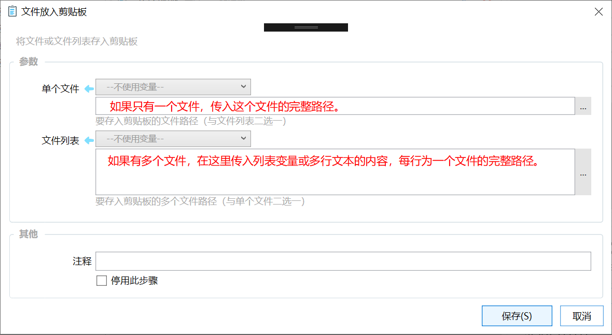

# 文件放入剪贴板

将文件或文件列表存入剪贴板

{/* xaction-metadata:start */}
## 当前模块定义

- 模块 Key：`sys:fileToClipboard`
- 分类：剪贴板操作（`Clipboard`）
- 类型：`Action`
- 风险操作：否
- 专业版：否

## 输入参数

| Key | 名称 | 类型 | 默认值 | 必填 | 变量模式 | 条件 | 说明 |
| --- | --- | --- | --- | --- | --- | --- | --- |
| `file` | 单个文件 | `Text` |  | 否 | `UseVarOrInput` |  | 要存入剪贴板的文件(夹)路径（与文件列表二选一） |
| `list` | 文件列表 | `List` |  | 否 | `UseVarOrInput` |  | 要存入剪贴板的多个文件路径（与单个文件二选一） |
| `useCut` | 剪切文件 | `Boolean` | false | 否 | `UseVarOrInput` |  | 是否剪切文件 |
| `stopIfFail` | 失败后停止 | `Boolean` | true | 否 | `Input` |  | 失败后是否停止动作 |

## 输出参数

| Key | 名称 | 类型 | 条件 | 说明 |
| --- | --- | --- | --- | --- |
| `isSuccess` | 是否成功 | `Boolean` |  | 操作是否成功 |
{/* xaction-metadata:end */}

## 概述

将指定的一个或多个文件存入剪贴板，方便在其他软件中粘贴（如粘贴在聊天窗口里）。

## 参数

根据需求，【单个文件】和【文件列表】两个参数选择一个使用。

单个文件时，使用【单个文件】参数，输入此文件的完整路径。

文件数量不定或多个文件时（这时候也可能列表里只有一个文件），使用【文件列表】参数传入多个文件的路径列表。

请确保文件都是存在的并且可以正常读取（没有被其他软件锁定）。
