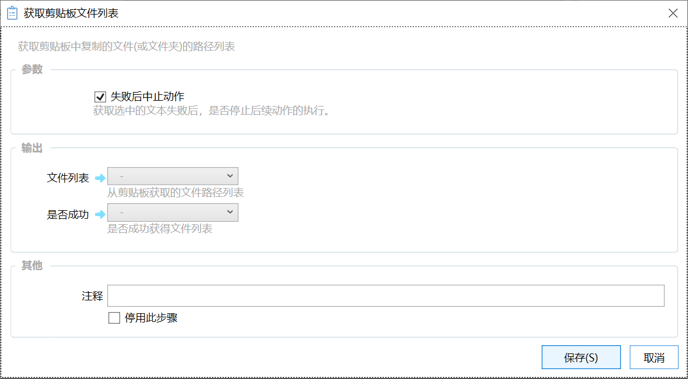

# 获取剪贴板文件列表

获取剪贴板中复制的文件(或文件夹)的路径列表

{/* xaction-metadata:start */}
## 当前模块定义

- 模块 Key：`sys:getClipboardFiles`
- 分类：剪贴板操作（`Clipboard`）
- 类型：`Action`
- 风险操作：否
- 专业版：否

## 输入参数

| Key | 名称 | 类型 | 默认值 | 必填 | 变量模式 | 条件 | 说明 |
| --- | --- | --- | --- | --- | --- | --- | --- |
| `stopIfFail` | 失败后中止动作 | `Boolean` | true | 否 | `Input` |  | 获取剪贴板文件失败后，是否停止后续动作的执行。 |

## 输出参数

| Key | 名称 | 类型 | 条件 | 说明 |
| --- | --- | --- | --- | --- |
| `isSuccess` | 是否成功 | `Boolean` |  | 是否成功获得文件列表 |
| `output` | 文件列表 | `List` |  | 从剪贴板获取的文件路径列表 |
| `elapsedMs` | 已更新时间 | `Integer` |  | 剪贴板最后更新是在多少毫秒以前 |
{/* xaction-metadata:end */}

## 概述

返回剪贴板中的文件列表。内容为所有选中文件的路径。

## 参数

### 输入

【失败后中止动作】如果从剪贴板获取内容失败，则停止执行动作。

### 输出

【文件列表】从剪贴板获取的文件路径列表。

【是否成功】操作是否成功。注：如果此参数输出到变量中，则出错时不再提示提示信息。
