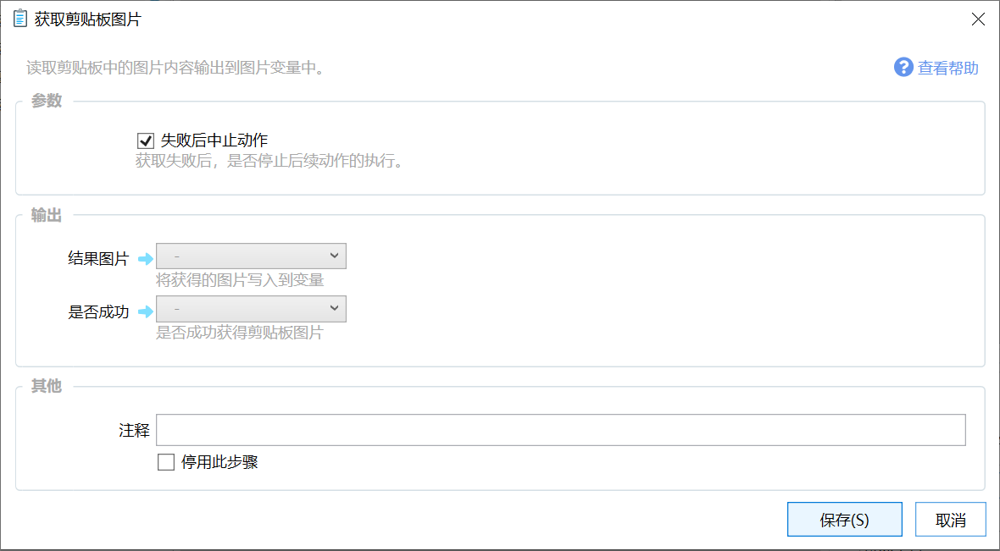

# 获取剪贴板图片

读取剪贴板中的图片内容输出到图片变量中。

## 当前模块定义

<XActionModuleMeta moduleKey="sys:getClipboardImage" />

## 概述

读取剪贴板图片并保存到变量中。

一般用于获取截图内容等情况。

## 参数

### 输入

【失败后中止动作】如果从剪贴板获取内容失败，则停止执行动作。

### 输出

【结果图片】从剪贴板获取的图片对象。

【是否成功】操作是否成功。注：如果此参数输出到变量中，则出错时不再提示提示信息。
