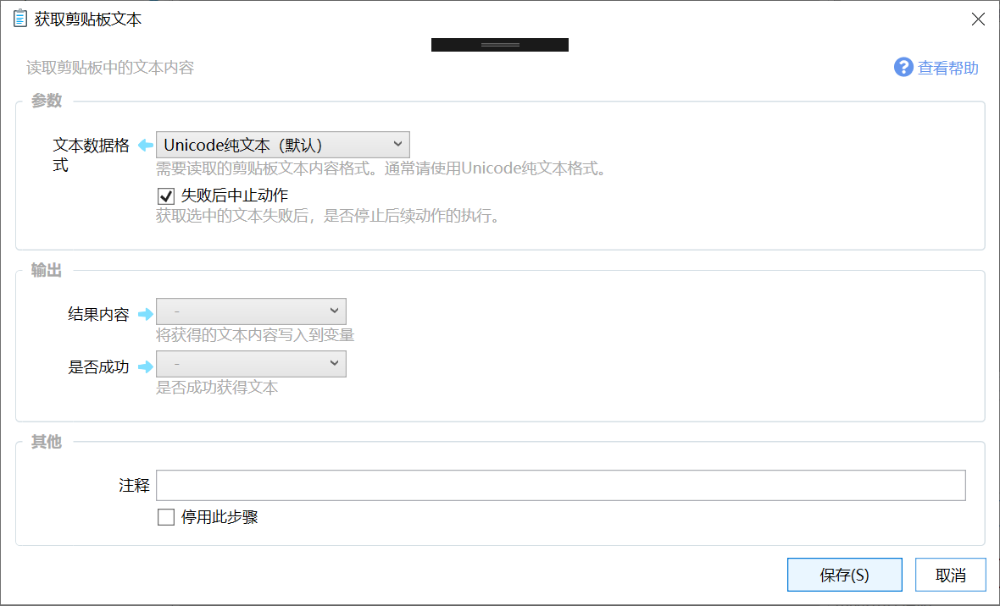
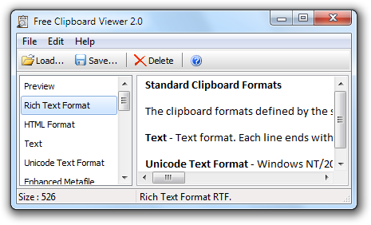

# 获取剪贴板文本

读取剪贴板中的文本内容

## 当前模块定义

<XActionModuleMeta moduleKey="sys:getClipboardText" />

## 概述

读取剪贴板中的文本格式内容。

## 参数

### 输入

【文本数据格式】选择读取剪贴板中哪种格式的文本。剪贴板中可能同时存在多种格式的文本数据，根据动作需求读取一种。一般使用Unicode纯文本格式。当需要读取某个软件的特定剪贴板内容时，可以选择“自定义格式名”。

【格式名称】文本数据格式为“自定义格式名”时，输入格式名称。（可以在Free Clipboard Viewer软件中左侧格式列表中查看）。

【文本编码】文本数据格式为“自定义格式名”时，使用什么编码读取文本。

【失败后中止动作】剪贴板中没有内容或读取失败时是否停止后续步骤。

### 输出

【结果内容】从剪贴板读取到的数据。

【是否成功】是否读取成功。

-   功能

-   当剪贴板中存在文本时，获取该文本并输出到一个文本类型变量中。
-   输出获取状态（可选），获取成功时，输出True，否则输出False。

-   使用场景

-   在需处理剪贴板中文本的情况下，首先执行此步骤获取到待处理的文本。

## 变更历史

-   1.0.13 增加自定义格式的读取支持。

## 参考工具

-   [http://www.freeclipboardviewer.com/](http://www.freeclipboardviewer.com/)  剪贴板内容查看器。

    
