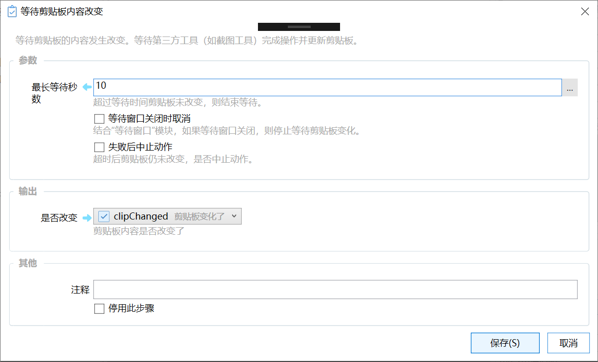

# 等待剪贴板内容改变

等待剪贴板的内容发生改变。等待第三方工具（如截图工具）完成操作并更新剪贴板。

{/* xaction-metadata:start */}
## 当前模块定义

- 模块 Key：`sys:waitClipboardChange`
- 分类：剪贴板操作（`Clipboard`）
- 类型：`Action`
- 风险操作：否
- 专业版：否

## 输入参数

| Key | 名称 | 类型 | 默认值 | 必填 | 变量模式 | 条件 | 说明 |
| --- | --- | --- | --- | --- | --- | --- | --- |
| `maxWaitSeconds` | 最长等待秒数 | `Number` | 10 | 是 | `UseVarOrInput` |  | 超过等待时间剪贴板未改变，则结束等待。 |
| `recentChangeMs` | 包含临近的改变 | `Integer` | 10 | 是 | `UseVarOrInput` |  | 包含在此之前一定时间内(毫秒)发生的改变。 |
| `monitorWaitWin` | 等待窗口关闭时取消 | `Boolean` | false | 否 | `Input` |  | 结合"等待窗口"模块，如果等待窗口关闭，则停止等待剪贴板变化。 |
| `stopIfFail` | 失败后中止动作 | `Boolean` | true | 否 | `Input` |  | 超时后剪贴板仍未改变，是否中止动作。 |

## 输出参数

| Key | 名称 | 类型 | 条件 | 说明 |
| --- | --- | --- | --- | --- |
| `isSuccess` | 是否改变 | `Boolean` |  | 剪贴板内容是否改变了 |
{/* xaction-metadata:end */}

## 概述

通常用于等待第三方工具（如截图软件）完成操作并将内容写入剪贴板。

使用截图软件的通常操作步骤为：

1.  发送快捷键或运行截图软件启动截图
2.  等待剪贴板内容变化
3.  获取剪贴板图片

【注】Quicker 0.10.1 之后的版本已内置[屏幕](/v2/xaction/modules/screencapture)[截图](/v2/xaction/modules/screencapture)[模块](/v2/xaction/modules/screencapture)。

### 输入参数

**最长等待时间**：持续检测剪贴板变化，直到达到超时时间。

**等待窗口关闭时取消**：结合“[等待窗口](/v2/xaction/modules/showwaitwin)”模块从而实现提前取消等待的功能。

**失败后中止动作**：如果达到超时时间后剪贴板仍然没有变化，是否停止后续动作的执行。

### 输出

**是否改变**：剪贴板是否变化。

## 注意事项

-   等待剪贴板改变后尽量不要立即使用模拟按键功能。
    这时Ctrl和C键仍未抬起，模拟按键可能导致Ctrl和C处于按下状态无法抬起。 如需使用模拟按键，可以尝试在模拟按键消息之前增加100-200ms的延迟。
