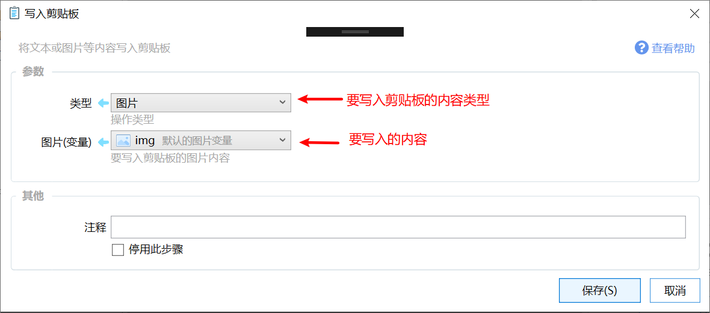
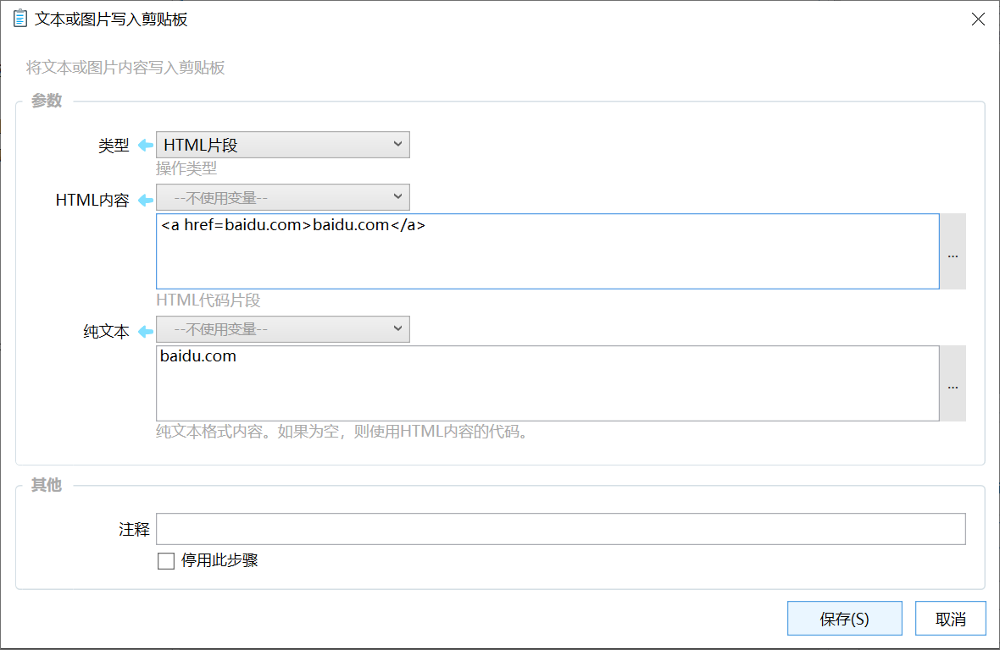

# 写入剪贴板

将文本或图片等内容写入剪贴板

## 当前模块定义

<XActionModuleMeta moduleKey="sys:writeClipboard" />

## 概述

本模块用于将文本、图片或HTML代码片段写入剪贴板中，供后续的粘贴使用。

## 参数

【类型】写入剪贴板的内容类型。支持的类型有：

-   自动
-   Html片段
-   纯文本
-   图片
-   Csv
-   Rtf
-   清空剪贴板

**类型：自动（图片或纯文本）**

用于将文本或图片变量的内容写入剪贴板。这种方式接受任何类型的变量，如果变量内容是图片则读取图片写入剪贴板，如果是其他类型，则转换为文本后写入剪贴板。

**类型：HTML片段**

用于将一段HTML代码写入剪贴板后，作为HTML格式粘贴到编辑器中。通常应该同时提供html格式内容和纯文本格式的内容以方便不同的第三方应用粘贴时使用。

【HTML内容】要写入剪贴板的HTML代码片段。

【纯文本】要同时写入剪贴板的纯文本内容。如果为空，则自动将html内容作为纯文本格式使用。

## 示例动作

-   [将链接转换为HTML格式](https://getquicker.net/sharedaction?code=0e698f4e-04ac-426d-b3eb-08d6c3be0bea)

## 其他资源

-   剪贴板查看器：[http://www.freeclipboardviewer.com/](http://www.freeclipboardviewer.com/)
