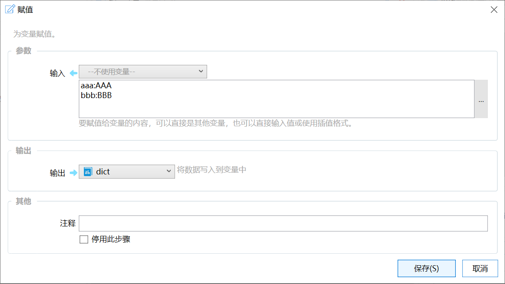
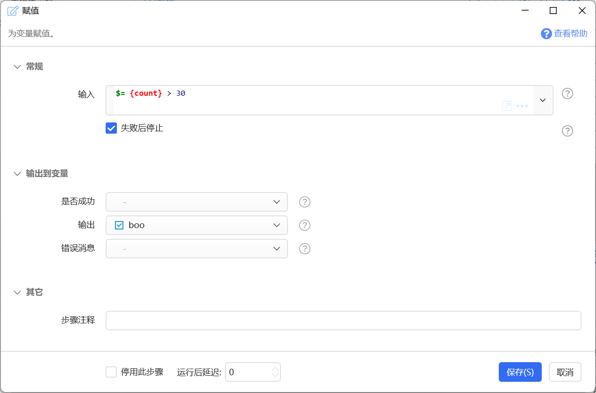
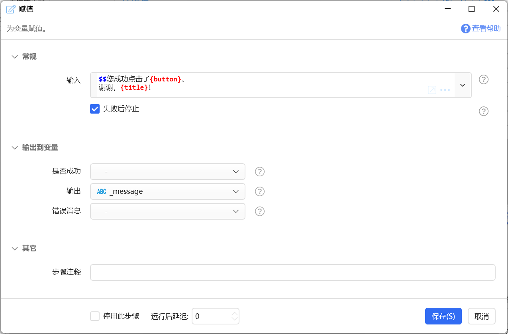
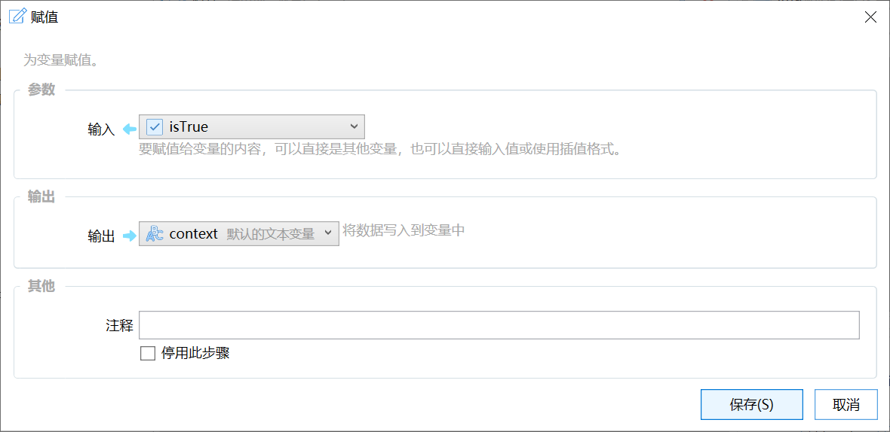

# 赋值

为变量赋值。

{/* xaction-metadata:start */}
## 当前模块定义

- 模块 Key：`sys:assign`
- 分类：计算与比较（`Compute`）
- 类型：`Action`
- 风险操作：否
- 专业版：否

## 输入参数

| Key | 名称 | 类型 | 默认值 | 必填 | 变量模式 | 条件 | 说明 |
| --- | --- | --- | --- | --- | --- | --- | --- |
| `input` | 输入 | `Any` |  | 是 | `UseVarOrInput` |  | 要赋值给变量的内容，可以直接是其他变量，也可以直接输入值或使用插值格式。 |
| `stopIfFail` | 失败后停止 | `Boolean` | true | 否 | `Input` |  | 失败后是否停止动作 |

## 输出参数

| Key | 名称 | 类型 | 条件 | 说明 |
| --- | --- | --- | --- | --- |
| `isSuccess` | 是否成功 | `Boolean` |  | 操作是否成功 |
| `output` | 输出 | `Any` |  | 将数据写入到变量中 |
{/* xaction-metadata:end */}

将指定的内容或变量的值赋予另一个变量。（可以用于变量类型的转换）

## 参数

【输入】要赋值给变量的源数据。支持[插值写法](/v2/xaction/concepts/interpolation)、[表达式](/v2/xaction/concepts/expression)。

## 输出

【输出】将内容赋值给的变量。

注意：如果目标输出变量为列表或词典类型，赋值操作将会自动创建新的对象传递给变量。如果输入也是列表或词典内容，这将会创建他们的副本。

## 示例

**赋值给词典变量**

（另一种方式是使用json:xxxx，其中xxxx为json数据）

**赋值给布尔变量**

**文本拼接赋值**

（实际上可以在需要使用这个结果的地方直接写，不需要使用赋值模块处理一遍）

**类型转换**

## 更新说明

-   20230901 增加赋值给列表和词典时会创建副本的说明。
