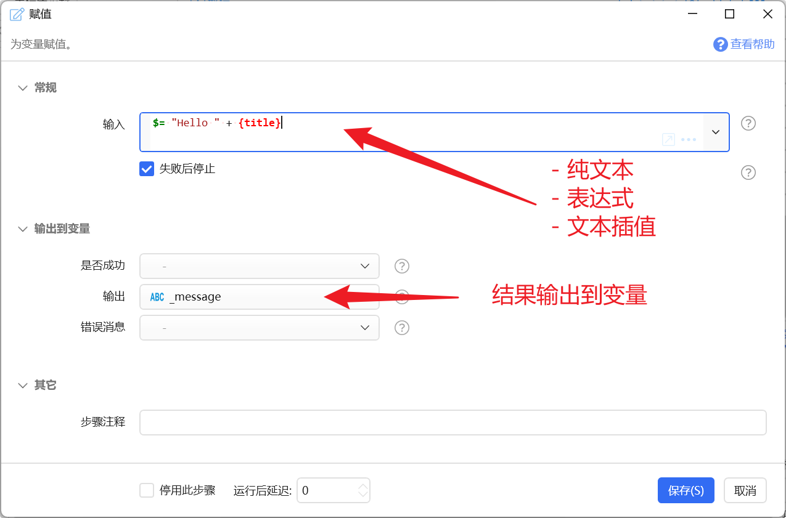

# 赋值

为变量赋值。

## 当前模块定义

<XActionModuleMeta moduleKey="sys:assign" />

将指定的内容或变量的值赋予另一个变量。（可以用于变量类型的转换）

## 参数

【输入】要赋值给变量的源数据。支持[插值写法](/v2/xaction/concepts/interpolation)、[表达式](/v2/xaction/concepts/expression)。

## 输出

【输出】将内容赋值给的变量。

注意：如果目标输出变量为列表或词典类型，赋值操作将会自动创建新的对象传递给变量。如果输入也是列表或词典内容，这将会创建他们的副本。

## 示例

**赋值给词典变量**

（另一种方式是使用json:xxxx，其中xxxx为json数据）

<ModuleParamPreview
  moduleKey="sys:assign"
  focusKeys={['input', 'output']}
  values={{input: 'aaa:AAA\nbbb:BBB'}}
  outputVars={{output: 'dict'}}
/>

**赋值给布尔变量**

<ModuleParamPreview
  moduleKey="sys:assign"
  focusKeys={['input', 'output']}
  values={{input: '$= {count} > 30'}}
  outputVars={{output: 'boo'}}
/>

**文本拼接赋值**

（实际上可以在需要使用这个结果的地方直接写，不需要使用赋值模块处理一遍）

<ModuleParamPreview
  moduleKey="sys:assign"
  focusKeys={['input', 'output']}
  values={{input: '$$您成功点击了 {button}。\n谢谢，{title}!'}}
  outputVars={{output: '_message'}}
/>

**类型转换**

<ModuleParamPreview
  moduleKey="sys:assign"
  focusKeys={['input', 'output']}
  values={{input: 'isTrue'}}
  outputVars={{output: 'context'}}
/>

## 更新说明

-   20230901 增加赋值给列表和词典时会创建副本的说明。
