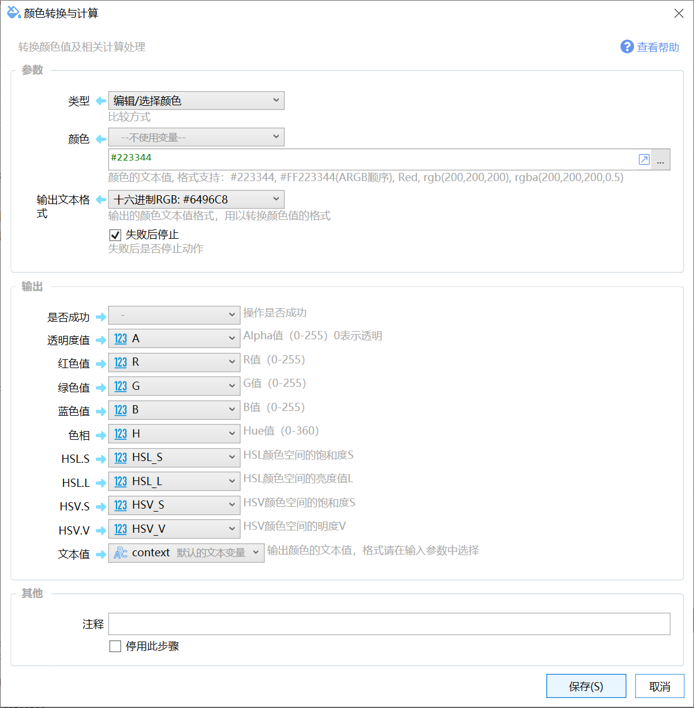
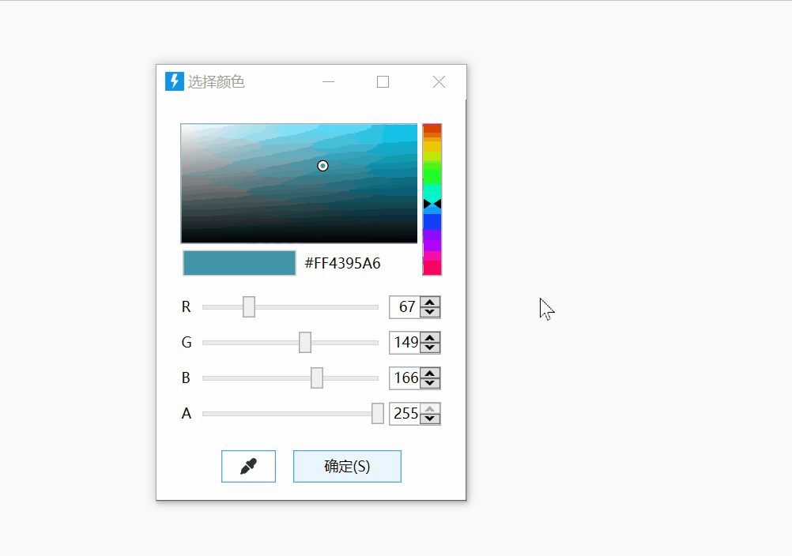
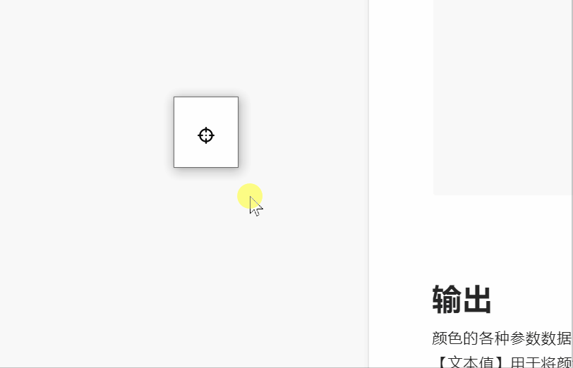

# 屏幕取色/颜色转换与计算

转换颜色值及相关计算处理

## 当前模块定义

<XActionModuleMeta moduleKey="sys:color" />

注：子1.3.10版本提供。

获取或编辑颜色，并返回颜色信息中各通道颜色的值。

支持的操作类型：

-   通过文本指定颜色：根据指定的颜色文本（如“#223444”等）获取颜色信息；
-   取屏幕指定位置颜色：根据指定的坐标位置，取屏幕颜色；
-   从屏幕选取颜色：手动选择屏幕位置获取颜色；
-   编辑/选择颜色：从颜色选择器中选择颜色；

## 参数

【颜色】通过文本方式指定的颜色的**当前值**。支持的格式有：

-   HTML颜色格式：#RGB 、 #RRGGBB
-   ARGB格式：#AARRGGBB
-   rgb(10,20,30)
-   rgba(10,20,30,0.5)

【坐标】在“取屏幕指定位置颜色”操作模式下，设定要获取颜色的屏幕坐标。

【输出文本格式】用于控制“文本值”输出参数中输出的文本格式。

### 编辑/选择颜色

弹出颜色选择窗口，并预先选择当前的颜色值。可以在此窗口中调整颜色或使用吸管工具从其他位置选择颜色。

### 从屏幕选择颜色

显示一个小方框，按下后开始从屏幕上选择颜色。

## 输出

颜色的各种参数数据。

【文本值】用于将颜色使用指定的格式输出，通常用于转换颜色的格式。具体格式由输入参数“输出文本格式”指定。

## 示例动作

-   [https://getquicker.net/sharedaction?code=a6aaa916-9fea-4355-fbd4-08d7cd418588](https://getquicker.net/sharedaction?code=a6aaa916-9fea-4355-fbd4-08d7cd418588)
