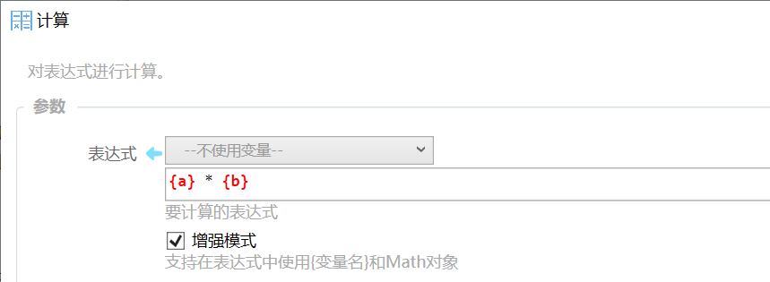

# 计算

把一段文本当成公式或表达式来计算。只要比两个数，用 [比较数字](/v2/xaction/modules/numcompare)；只要赋给变量，用 [赋值](/v2/xaction/modules/assign)。

## 当前模块定义

<XActionModuleMeta moduleKey="sys:compute" />

## 概述

例如 `3*5+20` 得到 `35`，`15>6` 得到真。可结合 [插值](/v2/xaction/concepts/interpolation) 把变量嵌进公式：表达式写成 `$$ {变量a} > 5 and {变量a} < 20`，若 `变量a` 为 `30`，插值后变成 `30 > 5 and 30 < 20`，结果为假。

<ModuleParamPreview moduleKey="sys:compute" />

## 参数说明

**表达式**：要计算的公式。

**增强模式**：开启后支持在表达式里使用 `{变量名}` 和 C# 的 `Math`。默认关闭。

**失败后停止**：计算失败是否中止动作。默认开启。旧稿未写。

## 输出

- **是否成功**：计算是否成功。旧稿未写。
- **结果**：计算结果。

## 普通模式与增强模式

### 普通模式

内部使用 [NCalc](https://github.com/ncalc/ncalc)。也可以结合插值：

- 类型转换：`$${含有数字的文本变量}` → 数字；`$$ '{数字}'` → 文本
- 判断：`$$ {变量} > 5 and {变量} < 30`
- 计算：`50 * 2 * Sqrt(40)`、`Min(1,2)`

*以下运算符和函数说明有部分转载自 [tangyikejun 的文章](https://segmentfault.com/u/tangyikejun/articles)，感谢。*

#### 普通模式支持的运算符

1. 原子运算符 `(`, `)`
2. 单目运算符 `!`, `not`, `-`, `~`（按位取反）
3. 幂次运算符；位运算符 `&`, `|`, `^`（xor）, `<<`, `>>`
4. 乘除运算符 `*`, `/`, `%`
5. 加减运算符 `+`, `-`
6. 关系运算符 `=`, `==`, `!=`, `<>`, `<`, `<=`, `>`, `>=`
7. 逻辑运算符 `or`, `||`, `and`, `&&`

#### 普通模式支持的函数

结果中的 M 代表 Decimal，d 代表 Double。

| 函数名 | 描述 | 用例 | 用例结果 |
| --- | --- | --- | --- |
| Abs | 绝对值 | Abs(-1) | 1M |
| Acos | 反余弦 | Acos(1) | 0d |
| Asin | 反正弦 | — | d |
| Atan | 反正切 | — | d |
| Ceiling | 向上取整 | Ceiling(1.5) | 2d |
| Cos | 余弦 | — | d |
| Exp | e 的 X 次幂 | Exp(0) | 1d |
| Floor | 向下取整 | Floor(1.5) | 1d |
| IEEERemainder | IEEE 754 取余。普通取余用 `%`，如 `15 % 7` 为 1 | IEEERemainder(3, 2) | -1d |
| Log | 以第二参数为底取对数 | Log(1,10) | 0d |
| Log10 | 以 10 为底 | Log10(1) | 0d |
| Max | 较大值 | Max(1,2) | 2 |
| Min | 较小值 | Min(1,2) | 1 |
| Pow | 乘方 | Pow(3,2) | 9d |
| Round | 第二参数是小数位。舍入为奇进偶舍 | Round(3.222,2) | 3.22d |
| Sign | 符号 | Sign(-10) | -1 |
| Sin | 正弦 | — | d |
| Sqrt | 平方根 | Sqrt(4) | 2d |
| Tan | 正切 | — | d |
| Truncate | 截取整数部分 | Truncate(1.7) | 1 |

其它通用函数：

| 函数名 | 描述 | 用例 | 结果 |
| --- | --- | --- | --- |
| in | 第一个元素是否在后面的值之中 | in(1 + 1, 1, 2, 3) | true |
| if | 类似 `条件 ? a : b` | if(3 % 2 = 1, 'value is true', 'value is false') | 'value is true' |

自定义函数：把 Unix 时间戳转成时间 `UnixTimestampToDateTime(1552437663)`。

### 增强模式

语法与通用 [表达式](/v2/xaction/concepts/expression) 相同。前面不必写 `$=`；如果写了，会先算一遍，再把结果当成表达式算第二遍。

## 限制与排障

普通模式不认 `{变量名}`，要把变量嵌进去请用插值 `$$`，或打开增强模式。增强模式里再写 `$=` 会解析两遍，结果往往不是你想要的。公式非法时步骤失败，可看 **是否成功**。

## 示例动作

<ShareLinkCard
  code="16317b5d-ffdf-4193-a919-08d7b30d7779"
  title="示例：计算模块"
  description="演示计算模块的使用。需1.4.21版"
  author="CL"
/>

<StepProgramView example="9205705f-d1a7-4713-3d38-08d673be1748" />

<ShareLinkCard
  code="9205705f-d1a7-4713-3d38-08d673be1748"
  title="计算多行"
  description="例子：计算多行表达式"
  author="CL"
/>

## 相关链接

<RelatedDocs
  items={[
    {
      href: '/v2/xaction/concepts/expression',
      label: '表达式',
      description: '增强模式用这套语法。',
    },
    {
      href: '/v2/xaction/concepts/interpolation',
      label: '插值写法',
      description: '普通模式里把变量嵌进公式。',
    },
    {
      href: '/v2/xaction/modules/numberprocess',
      label: '数字转换与处理',
      description: '只要取整、改小数位或进制。',
    },
    {
      href: '/v2/xaction/modules/if',
      label: '如果',
      description: '用计算结果做分支。',
    },
  ]}
/>
