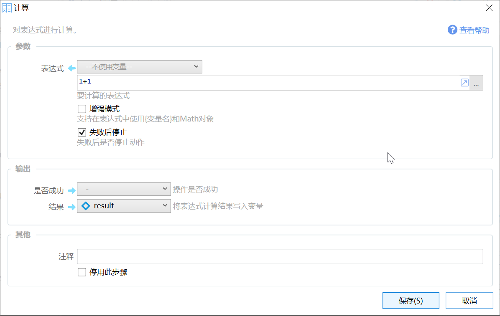

# 计算

对表达式进行计算。

## 当前模块定义

<XActionModuleMeta moduleKey="sys:compute" />

## 简介

用于将一段**文本内容**作为计算公式或表达式进行解析计算。例如：

-   3\*5+20  （结果为35）
-   15&gt;6    (结果为True）

可以结合[插值语法](/v2/xaction/concepts/interpolation)将变量的值替换到表达式中。例如表达式为：“$$  &#123;变量a&#125; &gt; 5 and &#123;变量a&#125; &lt; 20” ，如果 变量a 的值为 30，那么表达式在插值后变为“30 &gt; 5 and 30 &lt; 20” ，其结果为false。（插值后得到文本表达式，然后计算这个表达式得到最终结果）

## 参数

### 输入参数

**【表达式】**表示需要计算的数学公式。

**【增强模式】**强模式支持变量和C#语言的Math类。

### 输出

【结果】计算结果。

## 普通模式与增强模式

### 普通模式

这个模块在内部使用了[NCalc](https://www.google.com/search?q=ncalc&pws=0&gl=us&gws_rd=cr)组件，您也可以参考这个组件的文档以了解这个模块可以实现的功能。

#### 示例

-   类型转换

-   $$&#123;含有数字的文本变量&#125;   =&gt;  转换为数字
-   $$ '&#123;数字&#125;'     =&gt;  转换为文本

-   判断

-   $$ &#123;变量&#125; &gt; 5 and &#123;变量&#125; &lt; 30
-   $$ &#123;变量&#125; \* 5 &lt; 20
-   $$ &#123;变量1&#125; &gt; &#123;变量2&#125;             =&gt; 判断 变量1 和 变量2 的大小关系

-   计算

-   50 \* 2 \* Sqrt(40)
-   Min(1,2)

*以下内容有部分转载自* [*tangikejun的文章*](https://segmentfault.com/u/tangyikejun/articles)*，感谢！*

#### 普通模式支持的运算符

1.  原子运算符 `(`, `)`
2.  单目运算符 `!`, `not`, `-`, `~`(按位取反)
3.  幂次运算符 (原文作者遗漏了，他写了位运算符 `&`, `|`, `^`(xor), `<<`, `>>` )
4.  乘除运算符 `*`, `/`, `%`
5.  加减运算符 `+`, `-`
6.  关系运算符 `=`, `==`, `!=`, `<>`, `<`, `<=`, `>`, `>=`
7.  逻辑运算符 `or`,`||`,`and`,`&&`

#### 普通模式支持的函数

**注：**结果中的 M 代表 Decimal 类型，d 代表 Double 类型，是不同精度的有理数。

| 函数名 | 描述 | 用例 | 用例结果 |
| --- | --- | --- | --- |
| Abs | 返回绝对值 | Abs(-1) | 1M |
| Acos | 返回余弦值对应的角度 | Acos(1) | 0d |
| Asin | \- | \- | d |
| Atan | \- | \- | d |
| Ceiling | 向上取整 | Ceiling(1.5) | 2d |
| Cos | \- | \- | d |
| Exp | 相当于 e 的 X 次幂 | Exp(0) | 1d |
| Floor | 向下取整 | Floor(1.5) | 1d |
| IEEERemainder | IEEE 754 标准下的取余操作，具体细节自行百度。普通的整数取余数请使用%操作符，如 15 % 7 结果为 1。 | IEEERemainder(3, 2) | \-1d |
| Log | 以第二个参数为底取对数 | Log(1,10) | 0d |
| Log10 | 以10为底取对数 | Log10(1) | 0d |
| Max | \- | Max(1,2) | 2 |
| Min | \- | Min(1,2) | 1 |
| Pow | \- | Pow(3,2) | 9d |
| Round | 第二个参数表示保留几位小数，Round 的舍入规则是“四舍六入五成双”，具体的舍入中间值可以在构造 Expression 对象时用 `EvaluateOption.RoundAwayFromZero` 设定。 | Round(3.222,2) | 3.22d |
| Sign | 取符号 | Sign(-10) | \-1 |
| Sin | \- | \- | d |
| Sqrt | 取平方根 | Sqrt(4) | 2d |
| Tan | \- | \- | d |
| Truncate | 截取整数部分 | Truncate(1.7) | 1 |

其他通用函数：

| 函数名 | 描述 | 用例 | 结果 |
| --- | --- | --- | --- |
| in | 判断第一个元素是否在后面的一系列值之中 | in(1 + 1, 1, 2, 3) | true |
| if | 类似于 expression ? a:b 。根据表达式结果在后两个参数中选择一个返回 | if(3 % 2 = 1, 'value is true', 'value is false') | 'value is true' |

#### 自定义函数

将Unix时间戳转换为时间：UnixTimestampToDateTime(1552437663)

### 增强模式

增强模式可以使用通用表达式相同的语法：[/v2/xaction/concepts/expression](/v2/xaction/concepts/expression)，（不需要在前面写$=，如果写了，会先解析表达式后，把得到的结果再作为表达式解析一遍）

## 示例动作

-   示例：计算模块： [https://getquicker.net/sharedaction?code=16317b5d-ffdf-4193-a919-08d7b30d7779](https://getquicker.net/sharedaction?code=16317b5d-ffdf-4193-a919-08d7b30d7779)
-   计算多行：[https://getquicker.net/sharedaction?code=9205705f-d1a7-4713-3d38-08d673be1748](https://getquicker.net/sharedaction?code=9205705f-d1a7-4713-3d38-08d673be1748)

## 使用场景

-   简单的运算求解，比如计算选中的一个数学算式；
-   比较数字、文本等，以获得分支条件；
-   变量类型转换，比如将文本转换成数字等；
