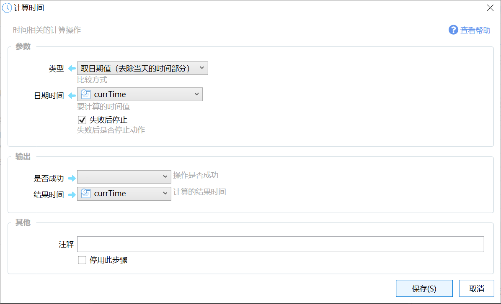
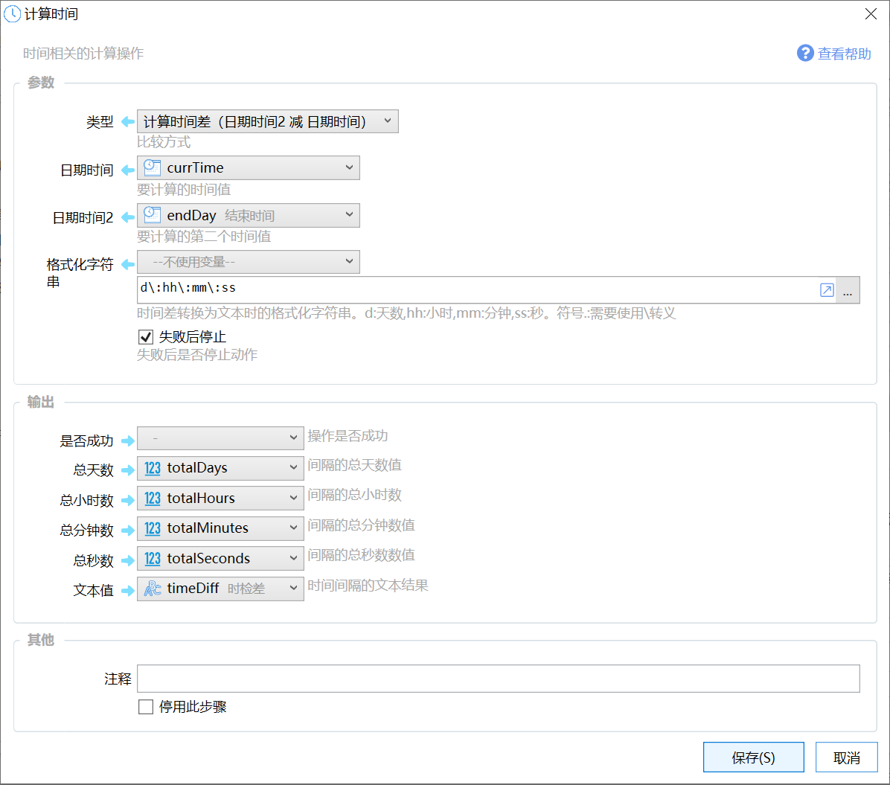
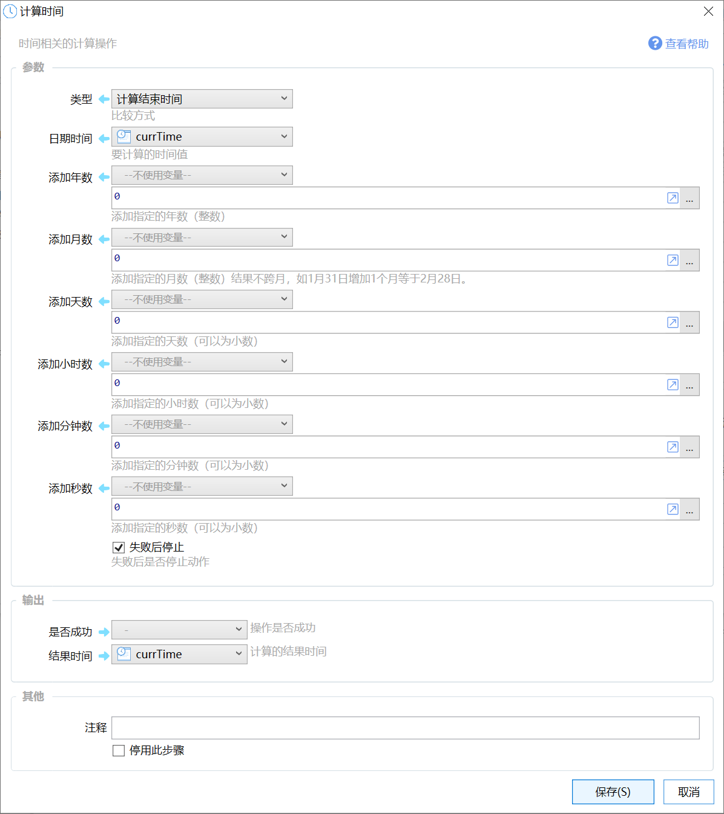
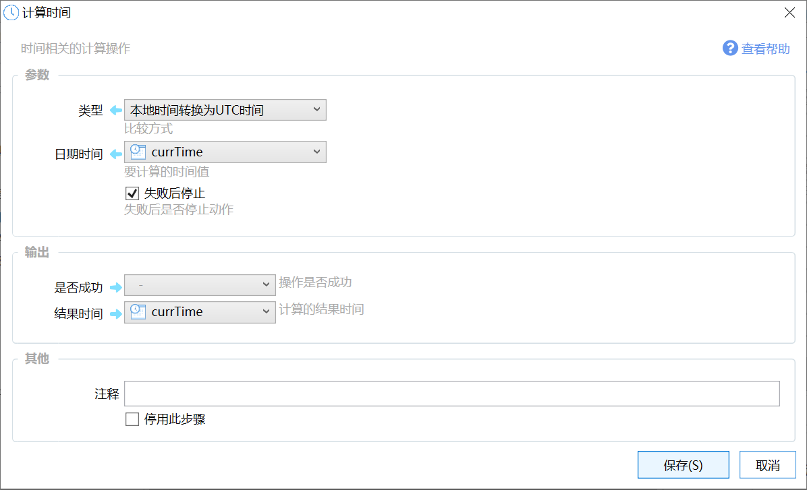

# 计算时间

时间相关的计算操作

## 当前模块定义

<XActionModuleMeta moduleKey="sys:computeTime" />

时间相关的计算操作。

## 操作类型

### 取日期值

比如 2020-1-1 12:34:00 ，去除时间值12:34:00，返回当天0点的时间值 2020-1-1 0:0:0

### 计算时间差

计算“日期时间”和“日期时间2”两个时间的差值。

格式化字符串所支持的代号请参考：[https://learn.microsoft.com/zh-cn/dotnet/standard/base-types/custom-timespan-format-strings](https://learn.microsoft.com/zh-cn/dotnet/standard/base-types/custom-timespan-format-strings)

### 计算结束时间

根据“日期时间”指定的开始时间，增加相应的年、月、天、小时、分钟、秒数后，计算结果时间。

一般仅指定一个参数，如添加700天后的时间等。可以为负值。

### 本地时间转换为UTC时间、UTC时间转换为本地时间

本地时间和UTC时间之间进行转换。

