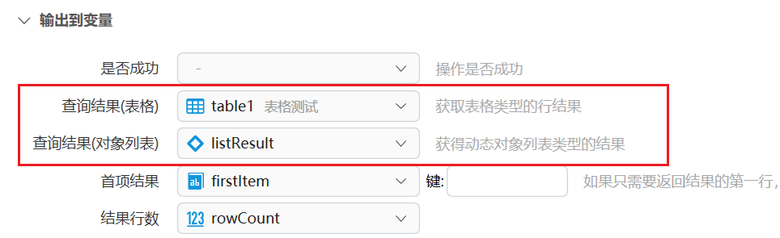

# 数据库查询

对指定数据库执行 SQL，并按执行方式返回表格、对象列表、影响行数或单个值。需要具备数据库基础知识。本功能仍为预览状态，欢迎反馈问题。

## 当前模块定义

<XActionModuleMeta moduleKey="sys:dboperation" />

## 概述

支持 SQL Server、MySQL、SQLite、OleDB、ODBC。内部用 [Dapper](https://github.com/DapperLib/Dapper) 执行查询。

更新、删除数据可能造成重大损失，请谨慎操作。

<ModuleParamPreview moduleKey="sys:dboperation" />

## 参数说明

**数据库连接类型**：SQL Server、MySQL、SQLite、OleDB、ODBC。

**连接字符串**：数据库的 ConnectionString。各类型写法不同，可参考 [connectionstrings.com](https://www.connectionstrings.com/)。Quicker 对下面两种情况做了补全：

- SQLite：可以直接填数据库文件的完整路径，会自动补成 `Data Source=SQLite数据库文件完整路径;Version=3;`
- OleDB 访问 Access（`.mdb` / `.accdb`）：也可以直接填文件路径，会自动补成 `Provider=Microsoft.ACE.OLEDB.12.0;Data Source=Access文件路径;Persist Security Info=False;`

**SQL语句**：要执行的 SQL。语句里可用 `@参数名` 写参数，例如：

`select * from contacts Where first_name = @FirstName`

**参数**：仅在 SQL 里使用了参数时提供。写参数名时**不要**带前面的 `@`。支持：

1. 词典变量，键为 SQL 里的参数名。
2. 能转成词典的文本：
   - 简单格式：每行一个，`参数名:参数值`
   - JSON：`{"文本参数名":"参数值","数字参数2":参数值2}`
3. C# `DataRow` 对象。
4. 匿名对象：`$= new { ParamName= value }`

**超时秒数**：执行查询的超时时间。留空或 `0` 表示默认。

**执行方式**：

- **Query：查询并返回结果数据**：主要用于 `SELECT`，例如 `SELECT * FROM Table1`
- **Execute：执行并返回影响的行数**：主要用于 `INSERT`、`UPDATE`、`DELETE`
- **ExecuteScalar：执行并返回单个值(首行首列的值)**：例如 `SELECT COUNT(1) FROM Table1`

各方式的输出见下面。

**失败后停止**：遇到异常时是否停止动作。默认开启。查询结果为空不一定会失败，请以实测为准。

### Query：查询并返回结果数据

<ModuleParamPreview
  moduleKey="sys:dboperation"
  focusKeys={[
    'dbType',
    'connectionString',
    'sql',
    'sqlParam',
    'timeoutSeconds',
    'operationType',
    'isSuccess',
    'dataTableResult',
    'listResult',
    'firstItem',
    'rowCount',
  ]}
  values={{
    dbType: 'sqlite',
    sql: 'select * from contacts',
    operationType: 'Query',
  }}
  inputVars={{connectionString: 'path'}}
  outputVars={{
    dataTableResult: 'table1',
    listResult: 'listResult',
    firstItem: 'firstItem',
    rowCount: 'rowCount',
  }}
/>

### Execute：执行并返回影响的行数

<ModuleParamPreview
  moduleKey="sys:dboperation"
  focusKeys={[
    'dbType',
    'connectionString',
    'sql',
    'sqlParam',
    'timeoutSeconds',
    'operationType',
    'isSuccess',
    'rowsAffected',
  ]}
  values={{
    dbType: 'sqlite',
    sql:
      'insert into contacts (first_name, last_name, email, phone)\nvalues(@FirstName, @LastName, @Email, @Phone)',
    sqlParam:
      'FirstName:李\nLastName:四\nEmail:lisi@getquicker.net\nPhone:13888889999',
    operationType: 'Execute',
  }}
  inputVars={{connectionString: 'path'}}
  outputVars={{rowsAffected: 'rowsAffected'}}
/>

### ExecuteScalar：执行并返回单个值

<ModuleParamPreview
  moduleKey="sys:dboperation"
  focusKeys={[
    'dbType',
    'connectionString',
    'sql',
    'sqlParam',
    'timeoutSeconds',
    'operationType',
    'isSuccess',
    'scalarResult',
  ]}
  values={{
    dbType: 'sqlite',
    sql: 'select COUNT(1) from contacts',
    sqlParam: 'FirstName:李',
    operationType: 'ExecuteScalar',
  }}
  inputVars={{connectionString: 'path'}}
  outputVars={{scalarResult: 'scalarResult'}}
/>

## 输出

- **是否成功**：是否未出现异常。不代表一定有返回行，也不代表一定改到了数据。
- **查询结果(表格)**：仅 Query。表格类型（DataTable）。可用 [表格数据操作](/v2/xaction/modules/tableoperation) 查看或继续处理。
- **查询结果(对象列表)**：仅 Query。动态对象列表，每行一个对象。
- **首项结果**：仅 Query。第一行，可输出到动态对象或词典。没有结果时为 `null`。
- **结果行数**：仅 Query。
- **影响行数**：仅 Execute。创建、更新或删除的行数。
- **单值结果**：仅 ExecuteScalar。查询返回的单个值。

### 遍历数据行

需要 Quicker 1.28.10+。查询结果可以输出到表格，或输出到动态对象列表，再用 [每个](/v2/xaction/modules/each) 循环。

1. 对表格的每行循环，见 [表格变量类型](/v2/xaction/concepts/tablevar)。
2. 对动态对象列表循环：

<ModuleParamPreview
  moduleKey="sys:each"
  focusKeys={['input', 'useMultiThread', 'item', 'count']}
  values={{useMultiThread: '0'}}
  inputVars={{input: 'listResult'}}
  outputVars={{item: 'item'}}
/>

此时「项」应输出到动态对象变量。循环里用 `{行对象}.列名` 访问某一列。

<PreviewMarks marks={[{key: 'msg', label: '用列名访问每一行的字段'}]}>
  <ModuleParamPreview
    moduleKey="sys:notify"
    focusKeys={['msg', 'maxLines', 'type', 'placement']}
    values={{
      msg: '$= "动态对象列表结果条目：" + {item}.first_name + {item}.last_name',
      maxLines: '0',
      type: 'Info',
      placement: 'BottomCenter',
    }}
  />
</PreviewMarks>

## 限制与排障

- 本功能仍为预览状态。更新、删除请先在测试库验证。
- 结果为空通常不会触发失败；不要只靠 **是否成功** 判断有没有行。
- SQL 参数名不要带 `@`。连接字符串写错时，先按下面的格式核对。
- MySQL 使用 [MySqlConnector](https://mysqlconnector.net/)，SQLite 使用 [System.Data.SQLite](https://system.data.sqlite.org/)。

### 常见连接字符串

**SQL Server**

- 标准：`Server=myServerAddress;Database=myDataBase;User Id=myUsername;Password=myPassword;`
- 连接到某个实例：`Server=myServerName\myInstanceName;Database=myDataBase;User Id=myUsername;Password=myPassword;`
- 非标准端口：`Server=myServerName,myPortNumber;Database=myDataBase;User Id=myUsername;Password=myPassword;`

**MySQL**

`Server=myserver;User ID=mylogin;Password=mypass;Database=mydatabase`

### 创建 SQLite 数据库

可以用下面的子程序创建 SQLite 数据库，参数为数据库文件的完整路径。

<ShareLinkCard
  kind="subprogram"
  id="343473d7-6677-46c5-7aee-08d9bf67e5c4"
  title="创建 SQLite 数据库"
  description="参数为要创建的数据库文件完整路径。"
/>

## 示例动作

步骤较多，只保留分享卡片。

<ShareLinkCard
  code="3eba3790-6c37-41c7-7aff-08d9bf67e5c4"
  title="数据库操作测试"
  description="数据库操作示例动作，使用 SQLite，默认保存在 D 盘根目录"
  author="CL"
/>

## 相关链接

<RelatedDocs
  items={[
    {
      href: '/v2/xaction/modules/tableoperation',
      label: '表格数据操作',
      description: '处理 Query 返回的表格结果。',
    },
    {
      href: '/v2/xaction/modules/each',
      label: '每个',
      description: '按行或按对象列表逐项处理。',
    },
    {
      href: '/v2/xaction/concepts/tablevar',
      label: '表格变量类型',
      description: '对表格每行循环时的写法。',
    },
  ]}
/>
