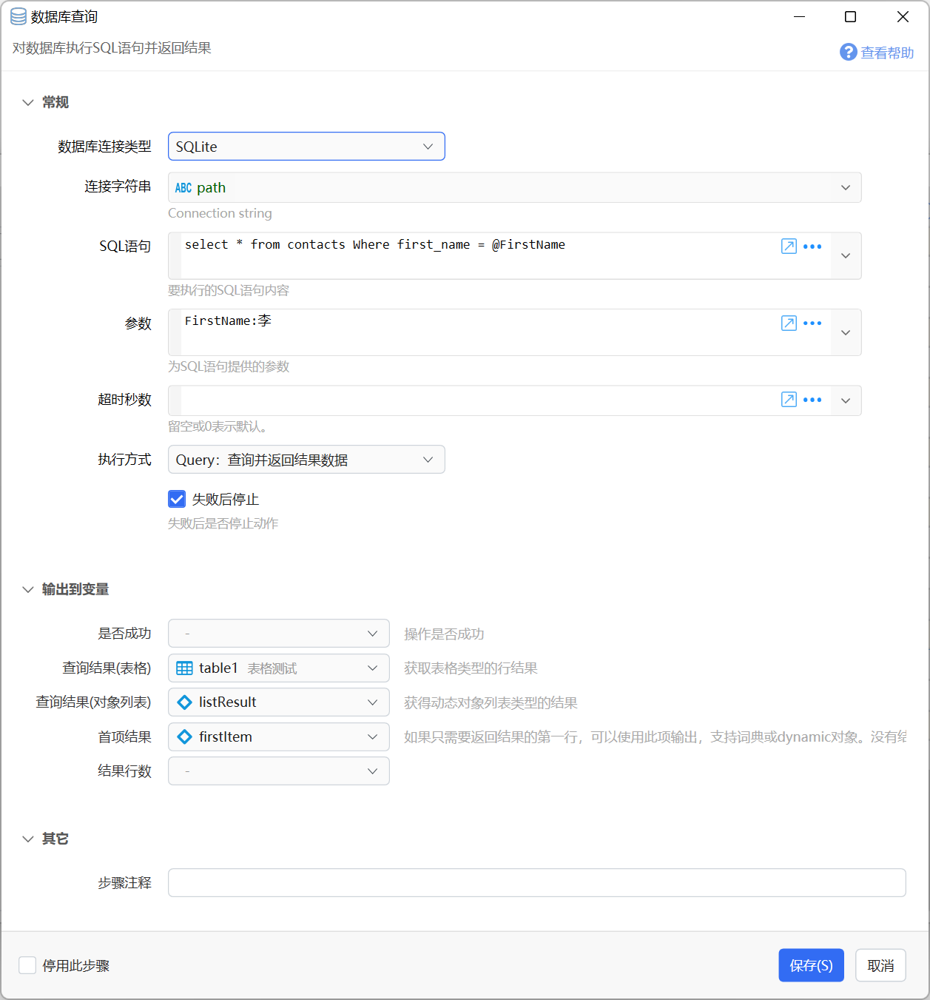
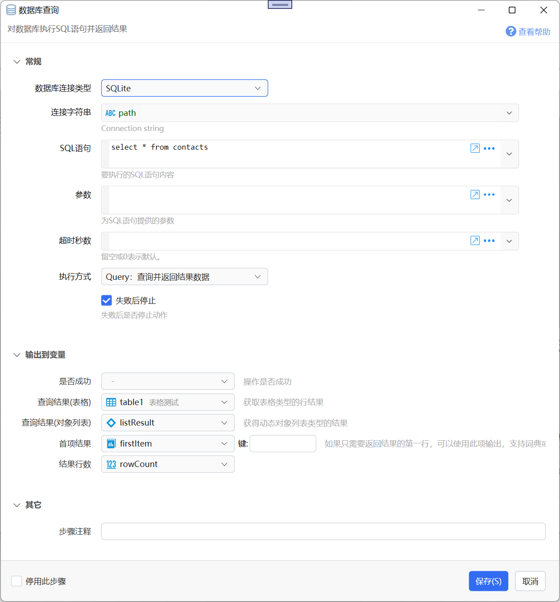
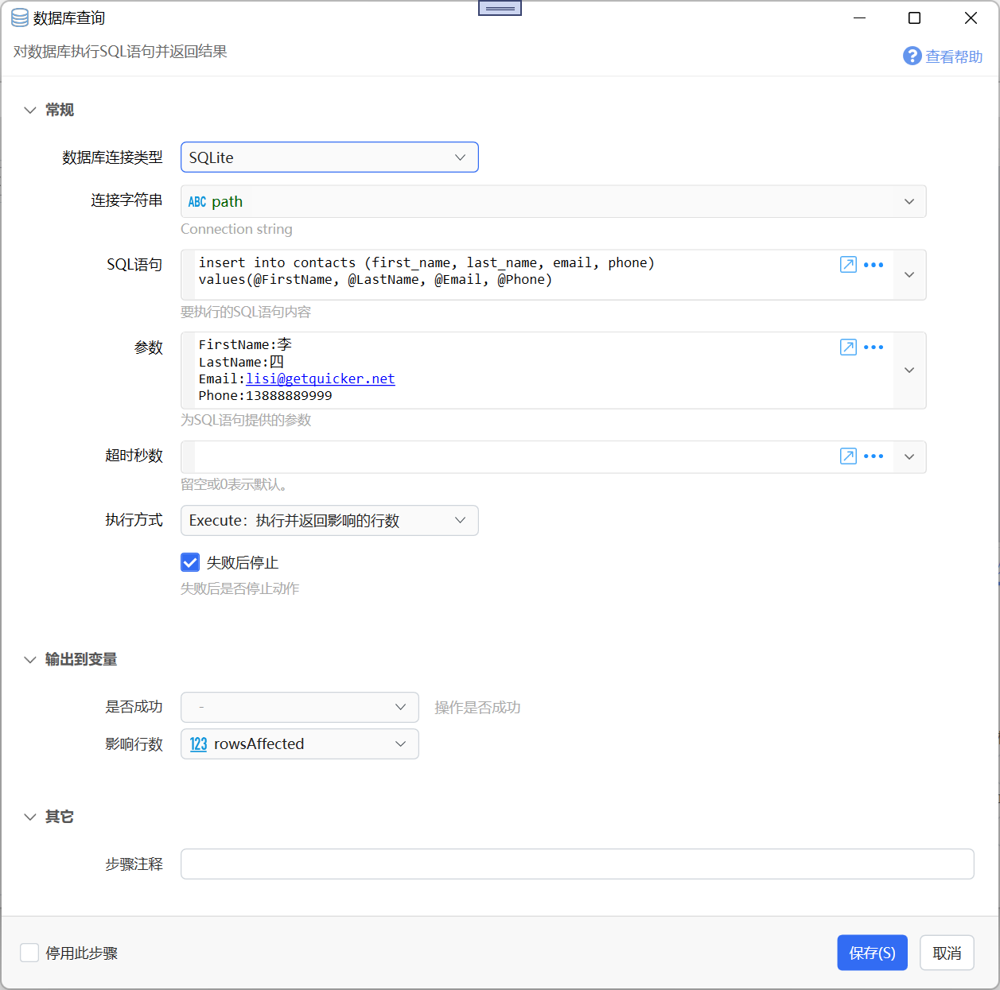
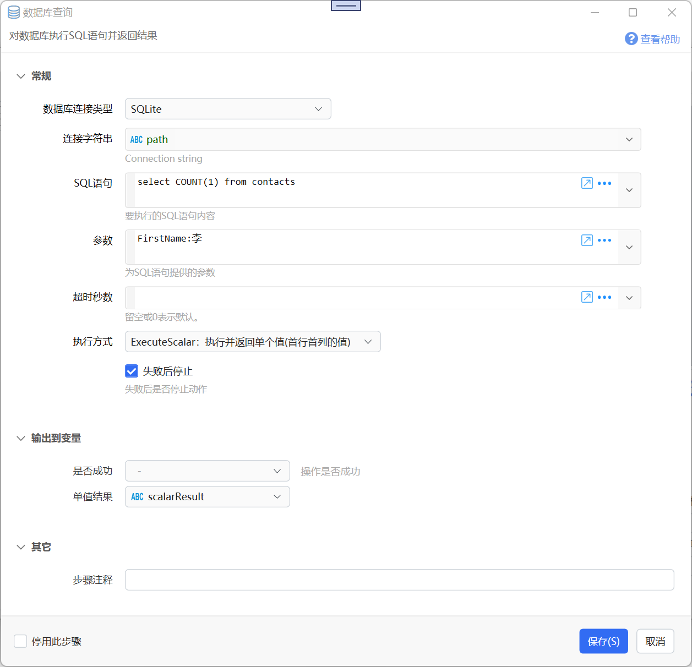
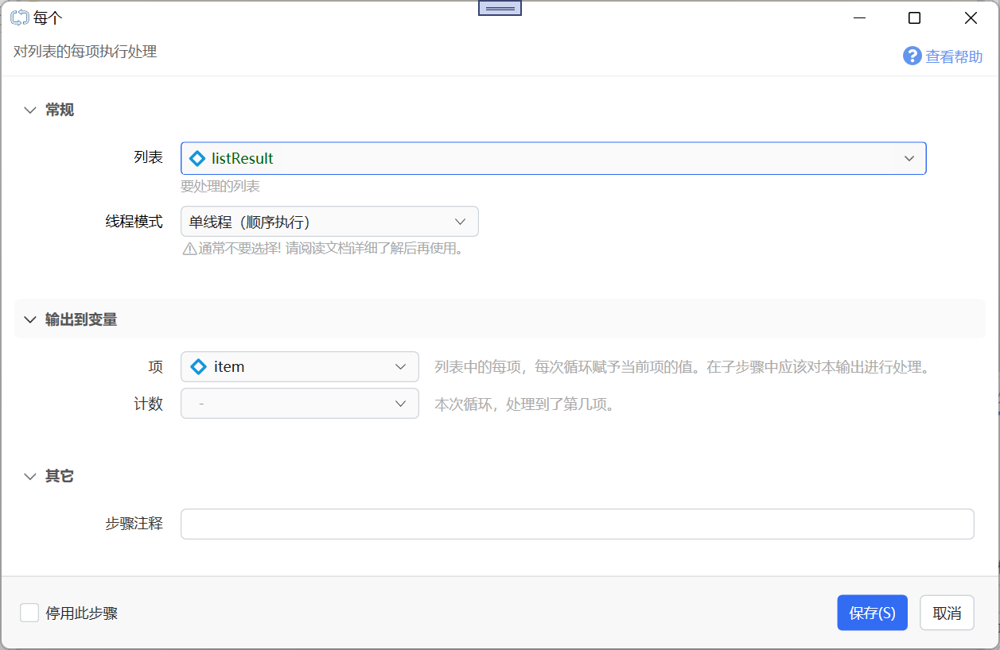
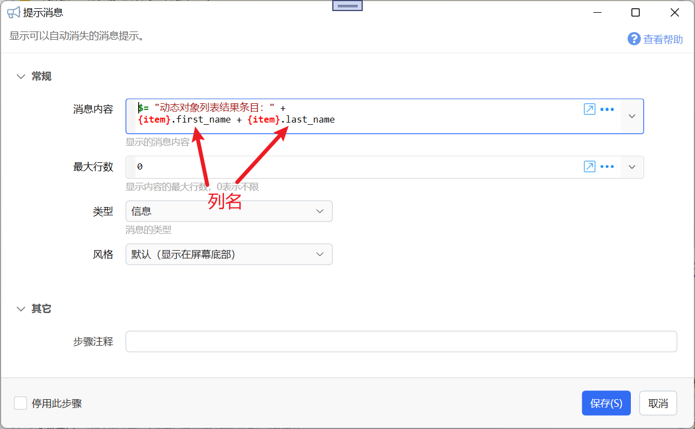

# 数据库查询

对数据库执行SQL语句并返回结果

{/* xaction-metadata:start */}
## 当前模块定义

- 模块 Key：`sys:dboperation`
- 分类：计算与比较（`Compute`）
- 类型：`Action`
- 风险操作：否
- 专业版：否

## 输入参数

| Key | 名称 | 类型 | 默认值 | 必填 | 变量模式 | 条件 | 说明 |
| --- | --- | --- | --- | --- | --- | --- | --- |
| `dbType` | 数据库连接类型 | `Enum` |  | 否 | `Input` |  |  |
| `connectionString` | 连接字符串 | `Text` |  | 否 | `UseVarOrInput` |  | Connection string |
| `sql` | SQL语句 | `Text` |  | 否 | `UseVarOrInput` |  | 要执行的SQL语句内容 |
| `sqlParam` | 参数 | `Object` |  | 否 | `UseVarOrInput` |  | 为SQL语句提供的参数 |
| `timeoutSeconds` | 超时秒数 | `Integer` |  | 否 | `UseVarOrInput` |  | 留空或0表示默认。 |
| `operationType` | 执行方式 | `Enum` | Query | 是 | `Input` |  |  |
| `stopIfFail` | 失败后停止 | `Boolean` | true | 否 | `Input` |  | 失败后是否停止动作 |

## 输出参数

| Key | 名称 | 类型 | 条件 | 说明 |
| --- | --- | --- | --- | --- |
| `isSuccess` | 是否成功 | `Boolean` |  | 操作是否成功 |
| `rowsAffected` | 影响行数 | `Integer` | 仅：Execute |  |
| `scalarResult` | 单值结果 | `Any` | 仅：ExecuteScalar |  |
| `dataTableResult` | 查询结果(表格) | `Table` | 仅：Query | 获取表格类型的行结果 |
| `listResult` | 查询结果(对象列表) | `Object` | 仅：Query | 获得动态对象列表类型的结果 |
| `firstItem` | 首项结果 | `Object` | 仅：Query | 如果只需要返回结果的第一行，可以使用此项输出，支持词典或dynamic对象。没有结果时返回null。 |
| `rowCount` | 结果行数 | `Integer` | 仅：Query |  |

## 选项值

### `dbType` 数据库连接类型

| Value | 名称 | 说明 |
| --- | --- | --- |
| `sqlserver` | SQL Server |  |
| `mysql` | MySQL |  |
| `sqlite` | SQLite |  |
| `oledb` | OleDB |  |
| `odbc` | ODBC |  |

### `operationType` 执行方式

| Value | 名称 | 说明 |
| --- | --- | --- |
| `Query` | Query：查询并返回结果数据 |  |
| `Execute` | Execute：执行并返回影响的行数 |  |
| `ExecuteScalar` | ExecuteScalar：执行并返回单个值(首行首列的值) |  |
{/* xaction-metadata:end */}

【本功能为预览状态，欢迎反馈问题】

对指定的数据库执行SQL查询并返回结果。

-   支持的数据库连接类型包含：SQLServer、MySQL、SQLite、OleDb、ODBC。

-   您需要了解数据库相关知识才能使用本模块。
-   本模块内部使用[Dapper](https://github.com/DapperLib/Dapper)执行查询。

-   更新、删除数据可能会造成重大损失，请谨慎操作。

## 步骤参数

**【数据库连接类型】**

选择所要访问的数据库连接类型。

**【连接字符串】**

指定数据库连接字符串（ConnectionString）。每种数据库有自己的格式规范，您可以参考[https://www.connectionstrings.com/](https://www.connectionstrings.com/) 网站了解对应数据库连接字符串的写法。

为了方便您的使用，Quicker对以下情况做了特殊处理：

-   对SQLite数据库，可以直接指定SQLite数据库文件的完整路径。Quicker会自动补全连接字符串，格式为：`Data Source=SQLite数据库文件完整路径;Version=3;`
-   在使用OleDb类型时，对于Access文件（扩展名为`.mdb`或`.accdb`）也可以直接指定文件路径。Quicker会自动补全连接字符串，格式为：`Provider=Microsoft.ACE.OLEDB.12.0;Data Source=Access文件路径;Persist Security Info=False;`

**【SQL语句】**

要执行的SQL语句。在语句中，可以通过`@参数名`的方式指定参数。

例如：

`select * from contacts Where first_name = @FirstName`

**【参数】**

仅仅在SQL语句中使用参数的情况下提供。

在指定参数名时**不需要**写前面的`@`符号。

支持通过如下方式指定参数：

（1）词典变量。词典的键为SQL语句中的参数名称。

（2）可以转换为词典的文本格式的内容：

-   简单格式：每行一个参数，格式为：“`参数名:参数值`”
-   Json格式：`{"文本参数名":"参数值","数字参数2":参数值2}`

（3）C# DataRow类型的对象。

（4）匿名对象。`$= new { ParamName= value }`

**【超时秒数】**

执行查询的超时时间。

**【执行方式】**

（1）Query：查询并返回结果数据。主要用于使用SELECT语句获取行数据，例如：`SELECT * FROM Table1`

（2）Execute：执行并返回影响的行数。主要用于INSERT、UPDATE、DELETE等语句更新数据的情况。

（3）ExecuteScalar：执行并返回单值结果。例如：`SELECT COUNT(1) FROM Table1`

各执行方式的输出值信息请参考下面的章节。

**【失败后停止】**

当遇到异常情况时是否停止动作。请注意：查询结果为空不一定会产生异常造成失败，请以实际测试结果为准。

### 各执行方式与输出

#### Query：查询并返回结果数据

【是否成功】是否成功执行查询（不代表一定有返回结果）。

【查询结果（表格）】

得到表格类型(DataTable)的查询结果。 可使用 “表格数据操作” 模块查看表格内容或进行其他处理。

【查询结果（对象列表）】

得到动态对象的列表。每行为一个对象。

【首项结果】

查询结果中的第一行数据。可以输出到动态对象或词典类型变量中。

#### Execute：执行并返回影响的行数

【是否成功】

执行查询是否未出现异常。不代表实际更新了数据库。

【影响行数】

创建、更新或删除的数据行数。

#### ExecuteScalar：执行并返回单个值

【是否成功】

执行查询是否未出现异常。不代表实际更新了数据库。

【单值结果】

查询返回的单个结果。

### 遍历数据行

（需要Quicker 1.28.10+版本）

当通过SQL查询到一些数据以后，可以将结果输出到表格或者一个动态对象的列表，然后通过“每个”模块循环。

（1）对表格的每行进行循环。

请参考[表格变量类型](/v2/xaction/concepts/tablevar)文档中的说明。

（2）对动态对象的列表进行循环。

此时，“项”应该输出到一个动态对象类型的变量中。在循环中，使用 `{行对象}.列名` 的方式访问某一列的数据。

## 参考

#### 类库使用

MySQL使用的库为[MySqlConnector](https://mysqlconnector.net/)，SQLite使用的库为[System.Data.SQLite](https://system.data.sqlite.org/) 。

#### 常见连接字符串格式参考

**SQLServer**

-   标准：`Server=myServerAddress;Database=myDataBase;User Id=myUsername;Password=myPassword;`
-   连接到某个数据库实例：`Server=myServerName\myInstanceName;Database=myDataBase;User Id=myUsername;Password=myPassword;`

-   使用非标准端口：`Server=myServerName,myPortNumber;Database=myDataBase;User Id=myUsername;Password=myPassword;`

**MySQL**

`Server=myserver;User ID=mylogin;Password=mypass;Database=mydatabase`

#### 创建SQLite数据库

可以使用[这个子程序](https://getquicker.net/subprogram?id=343473d7-6677-46c5-7aee-08d9bf67e5c4)创建SQLite数据库，参数为要数据库文件的完整路径。

## 示例动作

示例动作：[https://getquicker.net/Sharedaction?code=3eba3790-6c37-41c7-7aff-08d9bf67e5c4](https://getquicker.net/Sharedaction?code=3eba3790-6c37-41c7-7aff-08d9bf67e5c4)
