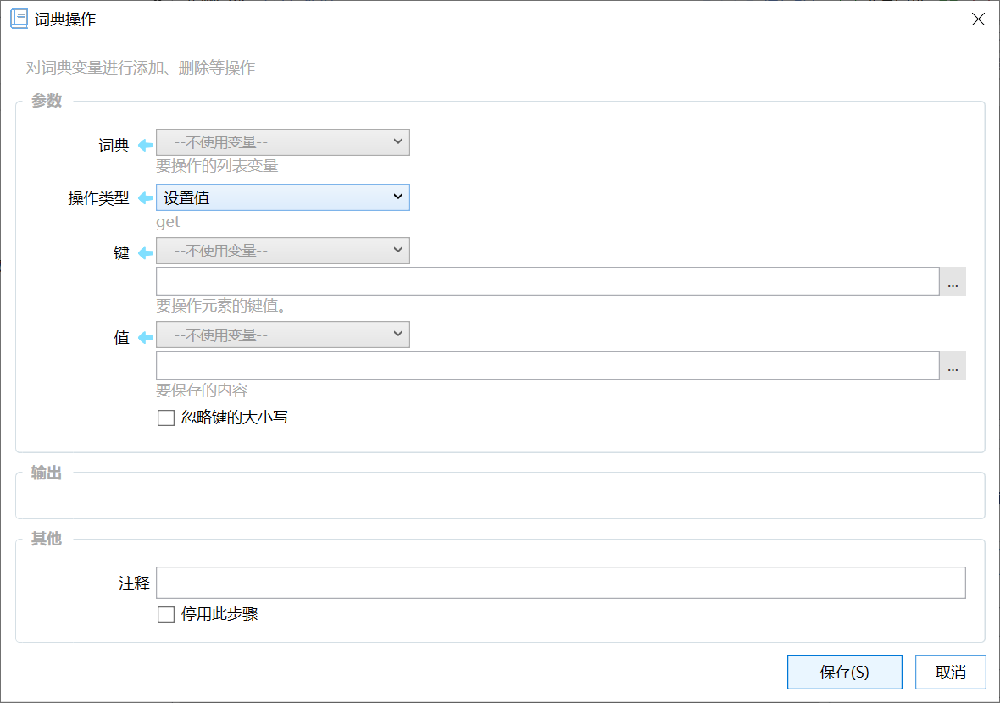

# 词典操作

对词典变量进行添加、删除等操作

{/* xaction-metadata:start */}
## 当前模块定义

- 模块 Key：`sys:dictOperations`
- 分类：计算与比较（`Compute`）
- 类型：`Action`
- 风险操作：否
- 专业版：否

## 输入参数

| Key | 名称 | 类型 | 默认值 | 必填 | 变量模式 | 条件 | 说明 |
| --- | --- | --- | --- | --- | --- | --- | --- |
| `type` | 操作类型 | `Enum` | setOriginValue | 是 | `Input` |  |  |
| `dict` | 词典 | `Dict` |  | 否 | `UseVar` | 排除：queryStringToDict | 要操作的词典变量 |
| `queryString` | 查询字符串 | `Text` |  | 否 | `UseVarOrInput` | 仅：queryStringToDict | 要解析的查询字符串 |
| `key` | 键 | `Text` |  | 否 | `UseVarOrInput` | 仅：get, set, remove, setOriginValue | 要操作元素的键值。 |
| `value` | 值 | `Text` |  | 否 | `UseVarOrInput` | 仅：set, setOriginValue | 要保存的内容 |
| `returnEmptyIfKeyNotExist` | 键不存在时返回空值 | `Boolean` | false | 否 | `Input` | 仅：get | 此时不作为失败处理 |
| `ignoreCase` | 忽略键的大小写 | `Boolean` | false | 否 | `Input` | 仅：set, get, remove, setOriginValue |  |
| `stopIfFail` | 失败后停止 | `Boolean` | false | 否 | `Input` |  | 失败后是否停止动作 |

## 输出参数

| Key | 名称 | 类型 | 条件 | 说明 |
| --- | --- | --- | --- | --- |
| `isSuccess` | 是否成功 | `Boolean` |  | 操作是否成功 |
| `value` | 结果 | `Any` | 仅：get, keyList, valueList, reverse, queryStringToDict, dictToQueryString, dictToQueryStringNoEncode | 操作后的输出（取的元素值、键列表、值列表等） |

## 选项值

### `type` 操作类型

| Value | 名称 | 说明 |
| --- | --- | --- |
| `get` | 取值 |  |
| `set` | 设置值 (文本类型) |  |
| `setOriginValue` | 设置值 (变量原始类型) |  |
| `remove` | 删除一项 |  |
| `clear` | 清空 |  |
| `keyList` | 获取键(Key)列表 |  |
| `valueList` | 获取值列表 |  |
| `reverse` | 翻转键值 |  |
| `queryStringToDict` | 查询字符串转换为词典(name1=value1&name2=value2...) |  |
| `dictToQueryString` | 词典转换为查询字符串 |  |
| `dictToQueryStringNoEncode` | 词典转换为查询字符串(不对键和值进行URL编码) |  |
{/* xaction-metadata:end */}

对词典类型变量进行信息提取或数据处理。

## 参数

【词典】要操作的词典变量。

【操作类型】要进行的操作。可选值为：

-   取值：读取词典中某个键（Key）对应的值（Value）。
-   设置值（文本类型）：设置词典变量中某个键对应的值。其它类型的内容在保存时会自动转换成文本类型。
-   设置值（变量原始类型）：设置词典中某个键对应的值，在保存时不更改其类型。

-   **注意：**如果值保存的是一个**引用类型**的对象（如列表/词典/c#类的实例等，而不是数字/文本/布尔这种简单的**值类型**），那么值中指向的内容**可能**是会变化的。例如，保存列表变量到词典的某个值以后，如果列表增加或删除了项，那么词典中的这个值也会对应发生变化，因为它们都是同一个内存对象的引用。请参考此[示例动作](https://getquicker.net/sharedaction?code=a46e9573-1e4e-4e11-e93f-08d82eb96b41)。

-   删除值：从词典变量中去除键值对。
-   获取键列表：将词典所有键（Key）组成一个文本列表返回。
-   获取值列表：将词典的所有值（Value）构成一个文本列表返回。
-   翻转键-值：生成一个新的词典对象输出到“结果”中，将原词典中的每个键值对的键转换为值，值转换为键。此时原词典每个键的值也必须是文本类型，而且不能含有重复的值。(1.5.3版本增加）
-   查询字符串转换为词典。将name1=value1&name2=value2&name3=value3形式的查询字符串（与网址中的查询字符串格式一致），转换为词典类型，输出到【结果】参数中。(1.9.15 版本增加）
-   词典转换为查询字符串。将词典值转换为name1=value1&name2=value2&name3=value3形式的查询字符串，输出到【结果】参数中。(1.9.15 版本增加）

【键】要操作的数据项索引名。

【值】要存到指定键（索引名）下的值。

【忽略键的大小写】读写数据的时候，是否忽略大小写。

## 输出

【结果】处理结果，依据“操作类型”结果内容不同：

-   “取值”：返回指定键对应的值。
-   “获取键列表”：返回所有键的列表。
-   “获取值列表”：返回所有值的列表。

【是否成功】操作是否成功。

## 示例动作

-   [示例：词典操作](https://getquicker.net/Sharedaction?code=456c2ade-5d5c-4096-a96c-08d7296fb043)（@Ever）

## 更新历史

-   1.5.3 增加“翻转键值”操作类型。
-   1.9.11 设置值增加保持原有类型的操作。
-   1.9.15 增加词典与查询字符串之间的转换功能。
