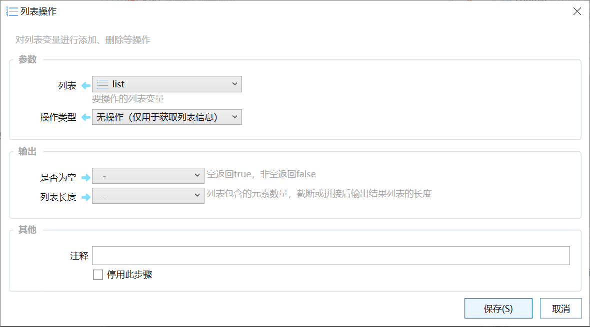

# 列表操作

对列表变量进行添加、删除等操作

## 当前模块定义

<XActionModuleMeta moduleKey="sys:listOperations" />

对列表变量的项进行添加、删除等操作。

## 参数

【列表】要操作的列表变量。

如果仅用于输出内容，这里也可以直接使用多行文本的方式构建临时列表。

【操作类型】对列表进行的操作，可选值为：

-   无操作（仅用于获取列表信息）
-   读取某位置元素：按序号取出某个元素的值放入“结果”输出。
-   添加元素到末尾：添加元素到列表的末尾。“列表”参数为变量时有效。
-   插入元素：将元素插入到“序号”指定的位置。该位置原来的项向后移动。
-   设置/更新某序号元素：将指定需要的元素替换为指定的值。
-   去除元素(指定值)：根据值从列表中去除指定的文本元素。
-   去除元素(指定位置)：去除指定位置的元素。
-   去除元素(匹配正则表达式的项)：去除所有符合正则表达式的元素。

-   如输入列表&#123;1, 12, 1234, 0&#125;，正则表达式：1 → 输出列表&#123;0&#125;

-   去除元素(不匹配正则表达式的项)：去除所有不符合正则表达式的元素。
-   清空列表：将列表中的所有元素去除。
-   排序A-Z（输出到结果）：将列表排序后输出到“结果”输出中。此操作不会修改修改输入的被排序的列表。
-   排序Z-A（输出到结果）：按相反顺序排序。排序后输出到“结果”输出中。此操作不会修改修改输入的被排序的列表。
-   自然排序A-Z（输出到结果）：使用类似于资源管理器中的文件名排序相似的方式排序文本列表。通常用以解决文件名排序时2在11前面的问题。
-   倒置：将列表元素前后顺序颠倒。
-   截取（输出到结果）：取元素的一部分。从“序号”开始，取“长度”参数中指定的个数构成一个新的列表，返回到“结果”输出。“是否为空”“列表长度”返回新列表的信息。
-   拼接（输出到结果）：将“列表”和“列表2”拼接成一个新的列表，返回到“结果”输出。“是否为空”“列表长度”返回新列表的信息。
-   去除重复（输出到结果）：去除列表中的重复项，将结果列表返回到“结果”输出。“是否为空”“列表长度”返回新列表的信息。
-   获取值的序号：根据指定的值，返回其所在列表中的序号（从0开始）；如果值不存在列表中，则返回-1；
-   筛选（正则,输出到结果）：根据给出的正则表达式筛选列表。筛选后生成的新列表输出到“结果”中。“是否为空”和“列表长度”为新列表的信息。
-   筛选（默认,输出到结果）：根据指定的“值”筛选列表，支持字符匹配、拼音匹配等默认筛选方式。筛选后生成的新列表输出到“结果”中。“是否为空”和“列表长度”为新列表的信息。

【列表2】进行“拼接”操作时，拼接到列表末尾的另一个列表。

【序号】目标元素的序号，从0开始。**负值**表示从后向前的第几个。（适用于“读取某位置元素”“插入元素”“设置/更新某序号元素”，“去除元素(指定位置)”，“截取”等操作类型）

【长度】操作元素的数量。（适用于“截取”等操作类型）

【值】要插入或更新的值。（适用于“添加元素到末尾”，“插入元素”，“设置/更新某序号元素”，“去除元素(指定值)”）

【正则表达式】要匹配的正则表达式。（适用于“去除元素(匹配正则表达式的项)”，“去除元素(不匹配正则表达式的项)”）

## 输出

【是否为空】“列表”是否为空（没有元素）

【列表长度】“列表”包含的元素数量，截断或拼接后输出结果列表的长度。

【结果】操作后的输出（取的元素值、排序、切片或拼接后的列表等）。操作类型中包含“（输出到结果）”的操作，都会将处理后的列表输出到此处指定的变量中。

## 更新历史

-   1.1.8 增加筛选功能和获取值的序号功能。
