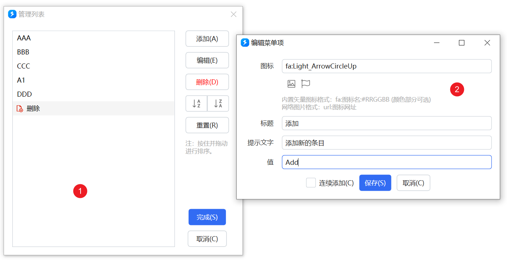
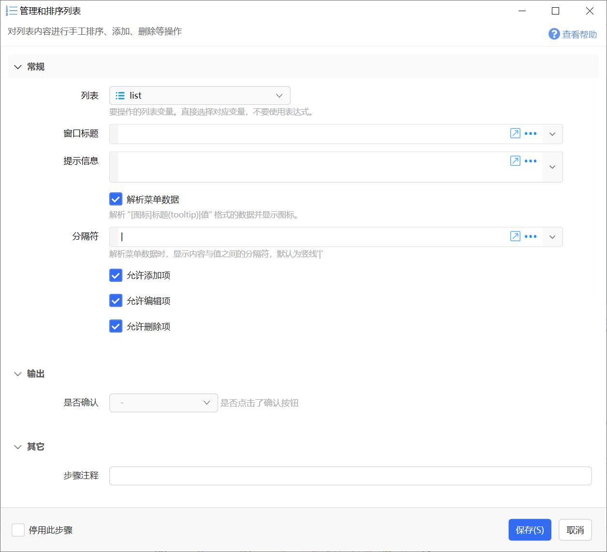
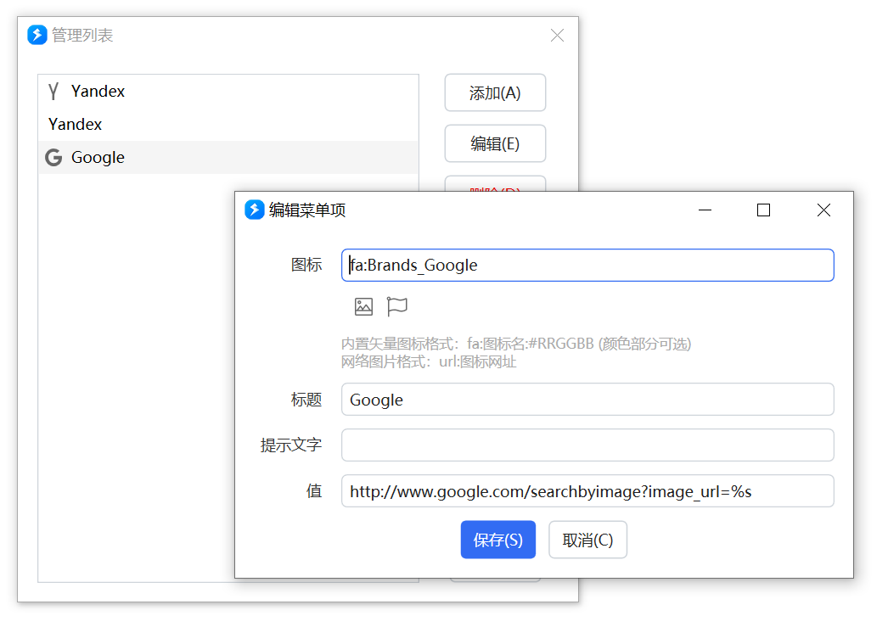
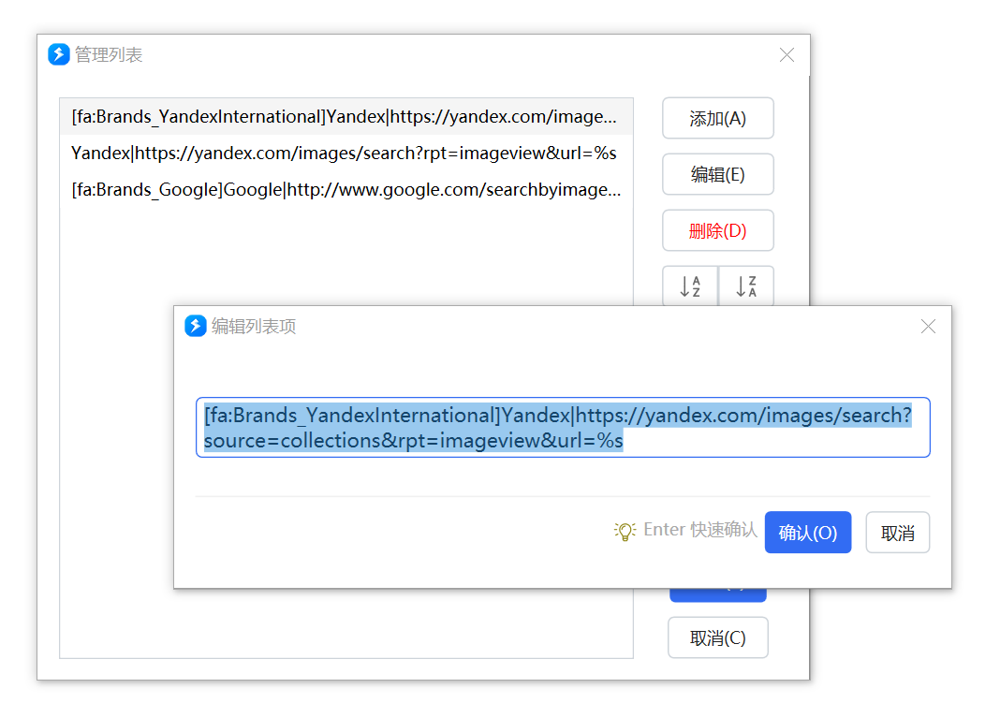

# 管理和排序列表

对列表内容进行手工排序、添加、删除等操作

{/* xaction-metadata:start */}
## 当前模块定义

- 模块 Key：`sys:manageList`
- 分类：计算与比较（`Compute`）
- 类型：`Action`
- 风险操作：否
- 专业版：否

## 输入参数

| Key | 名称 | 类型 | 默认值 | 必填 | 变量模式 | 条件 | 说明 |
| --- | --- | --- | --- | --- | --- | --- | --- |
| `list` | 列表 | `List` |  | 否 | `UseVarOnly` |  | 要操作的列表变量。直接选择对应变量，不要使用表达式。 |
| `winTitle` | 窗口标题 | `Text` |  | 否 | `UseVarOrInput` |  |  |
| `note` | 提示信息 | `Text` |  | 否 | `UseVarOrInput` |  |  |
| `allowAdd` | 允许添加项 | `Boolean` | true | 否 | `Input` |  |  |
| `allowEdit` | 允许编辑项 | `Boolean` | true | 否 | `Input` |  |  |
| `allowDelete` | 允许删除项 | `Boolean` | true | 否 | `Input` |  |  |
| `stopIfFail` | 取消后停止动作 | `Boolean` | false | 否 | `Input` |  |  |
| `parseData` | 解析菜单数据 | `Boolean` | false | 否 | `Input` |  | 解析 "[图标]标题(tooltip)\|值" 格式的数据并显示图标。 |
| `seperator` | 分隔符 | `Text` | \| | 否 | `Input` |  | 解析菜单数据时，显示内容与值之间的分隔符，默认为竖线'\|' |
| `windowSize` | 窗口宽度 | `Text` |  | 否 | `Input` |  | 可选，在需要自定义窗口宽度的情况下使用。最小值为200。 |
| `titleDelegate` | 显示内容提取表达式 | `Text` |  | 否 | `Input` |  | 可选，在不解析菜单数据时自定义每一项的显示内容。使用方式请参考模块文档。 |
| `help` | 帮助按钮内容 | `Text` |  | 否 | `Input` |  | 点击弹出显示帮助内容，MarkDown格式 |

## 输出参数

| Key | 名称 | 类型 | 条件 | 说明 |
| --- | --- | --- | --- | --- |
| `isSuccess` | 是否确认 | `Boolean` |  | 是否点击了确认按钮 |
{/* xaction-metadata:end */}

## 概述

用于调整列表中条目的顺序，或添加、修改或删除列表项。

列表管理界面如下：

### 管理界面使用

**添加新**条目**：**点击右侧“添加”按钮。

-   如果在列表中选择了某个条目，则新条目添加到该选择的项之后。
-   如果没有选择任何条目，则新条目添加到列表末尾。
-   如果在步骤参数中启用了【解析菜单数据】选项，添加新项时会使用“编辑菜单项”窗口。此时可以用于生成带图标的[菜单数据项](/v2/xaction/concepts/action-custom-context-menu)。
-   在“编辑菜单项”窗口中，可以选择开启“连续添加”模式。

**编辑：**选中要编辑的项后，点“编辑”按钮。或者双击要编辑的项。

**删除：**选中要删除的项后，点“删除”按钮。按Ctrl或Shift可以多选。

**排序：**用鼠标按住并拖动到新位置松开。也可点击右侧的“A-Z”“Z-A”按钮按字母顺序或倒序排列。

**重置：**将数据恢复至打开窗口时的原始状态。

## 参数

【列表】要管理的列表变量。

【窗口标题】列表管理窗口的自定义标题。

【提示信息】显示给用户的帮助提示文字。

【解析菜单数据】是否将类似于`[fa:Solid_Pen:#FF0000]文字标题(提示文字内容)|值` 格式的内容当作菜单项管理。

当作菜单项管理时，列表显示解析后的图标、标题。编辑时使用“编辑菜单项”窗口。

当作普通内容管理时，列表显示原始内容，编辑时使用文本框输入。

【分隔符】菜单项的外观内容和值之间的分隔符，通常为竖线“|”。

【允许添加项】【允许编辑项】【允许删除项】：对列表的操作方式进行限制。

【取消后停止动作】点击“取消”按钮后，是否停止运行动作的后续步骤。

【帮助按钮内容】Markdown格式的提示内容，设置后会在界面上显示“帮助”按钮，点击该按钮后显示此内容。

【显示内容提取表达式】可选，在“解析菜单数据”关闭时生效。1.42.34+版本支持。

有的时候列表中每一项内容较长，但是每项中仅有一部分是关键信息。如：对一个路径列表进行排序时，文件所在目录相同，仅文件名是关键信息。 此时可以使用自定义的表达式，在显示列表项时仅显示文件名：`Path.GetFileName(x);`

“显示内容提取表达式”用于对列表的每一项进行转换，得到显示标题。其写法类似于[普通表达式](/v2/xaction/concepts/expression)，但是有如下的区别：

-   不需要以`$=`开始。（如果加了$=开始标记，表达式会被预先解析从而出错）
-   在表达式中使用`x`表示当前需要处理的项，返回要显示的标题。

### 输出

【是否确认】用户是否点击了“完成”按钮。

对列表的操作将直接更新到列表变量中，因此不需要额外的列表输出。

## 更新内容

-   20240504 (1.42.34) 增加“显示内容提取表达式”和“取消后停止动作”参数。
-   20241023 修复错别字。
