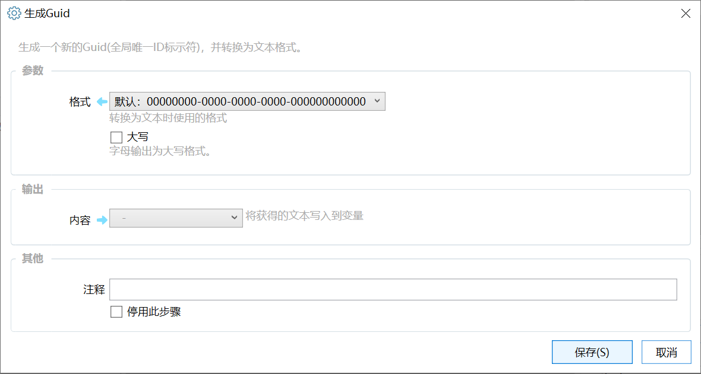

# 生成Guid

生成一个新的Guid(全局唯一ID标示符)，并转换为文本格式。

## 当前模块定义

<XActionModuleMeta moduleKey="sys:newGuid" />

生成一个新的Guid(全局唯一ID标示符)，并转换为文本格式。

GUID一般在编程中使用。

## 参数

【格式】指定转换成文本之后的格式。支持：

-   默认：00000000-0000-0000-0000-000000000000
-   32位数字：00000000000000000000000000000000
-   大括号包围：&#123;00000000-0000-0000-0000-000000000000&#125;
-   小括号包围：(00000000-0000-0000-0000-000000000000)
-   十六进制：&#123;0x00000000,0x0000,0x0000,&#123;0x00,0x00,0x00,0x00,0x00,0x00,0x00,0x00&#125;&#125;

【大写】字母是否使用大写格式。

## 输出

【内容】生成的GUID文本。
