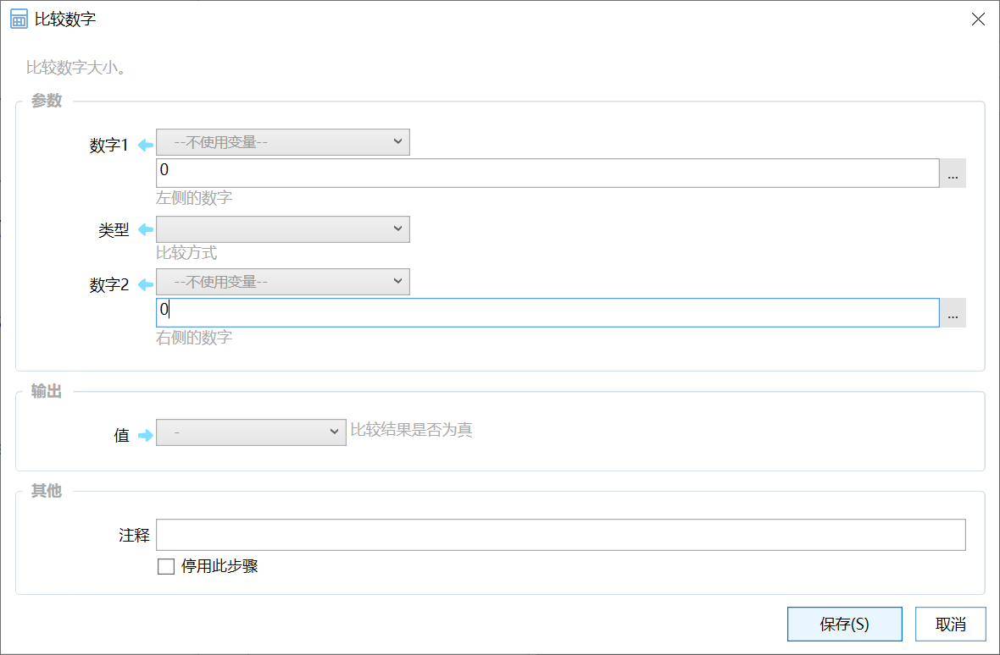

# 比较数字

比较数字大小。

{/* xaction-metadata:start */}
## 当前模块定义

- 模块 Key：`sys:numCompare`
- 分类：计算与比较（`Compute`）
- 类型：`Action`
- 风险操作：否
- 专业版：否

## 输入参数

| Key | 名称 | 类型 | 默认值 | 必填 | 变量模式 | 条件 | 说明 |
| --- | --- | --- | --- | --- | --- | --- | --- |
| `param1` | 数字1 | `Number` | 0 | 是 | `UseVarOrInput` |  | 左侧的数字 |
| `type` | 类型 | `Enum` | &gt; | 是 | `Input` |  | 比较方式 |
| `param2` | 数字2 | `Number` | 0 | 是 | `UseVarOrInput` |  | 右侧的数字 |

## 输出参数

| Key | 名称 | 类型 | 条件 | 说明 |
| --- | --- | --- | --- | --- |
| `value` | 值 | `Boolean` |  | 比较结果是否为真 |

## 选项值

### `type` 类型

| Value | 名称 | 说明 |
| --- | --- | --- |
| `>` | &gt; |  |
| `>=` | &gt;= |  |
| `=` | = |  |
| `<` | &lt; |  |
| `<=` | &lt;= |  |
{/* xaction-metadata:end */}

比较两个数字的大小。

也可以直接以表达式的形式写在布尔类型参数输入框中，请参考“如果”模块。

## 参数

【数字1】被比较的数字。

【数字2】对比数字。

【类型】比较操作符。

## 输出

【值】比较结果。 如 数字1为5， 数字2为6， 则 数字1 &lt; 数字2 为 True， 数字1 = 数字2 为 False。
