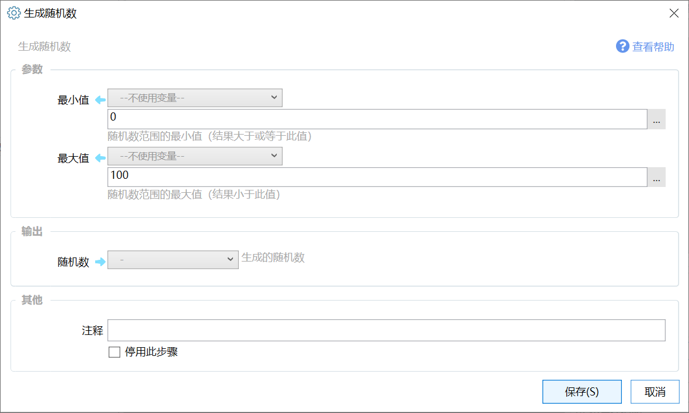

# 生成随机数

生成随机数

{/* xaction-metadata:start */}
## 当前模块定义

- 模块 Key：`sys:randomNum`
- 分类：计算与比较（`Compute`）
- 类型：`Action`
- 风险操作：否
- 专业版：否

## 输入参数

| Key | 名称 | 类型 | 默认值 | 必填 | 变量模式 | 条件 | 说明 |
| --- | --- | --- | --- | --- | --- | --- | --- |
| `min` | 最小值 | `Integer` | 0 | 是 | `UseVarOrInput` |  | 随机数范围的最小值（结果大于或等于此值） |
| `max` | 最大值 | `Integer` | 100 | 是 | `UseVarOrInput` |  | 随机数范围的最大值（结果小于此值） |

## 输出参数

| Key | 名称 | 类型 | 条件 | 说明 |
| --- | --- | --- | --- | --- |
| `output` | 随机数 | `Integer` |  | 生成的随机数 |
{/* xaction-metadata:end */}

生成一个随机的数字（整数）。

最小值 &lt;= 随机数 &lt; 最大值。

## 参数

【最小值】随机数的最小值，结果可能等于这个值。

【最大值】随机数的最大值，结果小于这个值。

## 输出

【随机数】计算生成的随机数。
