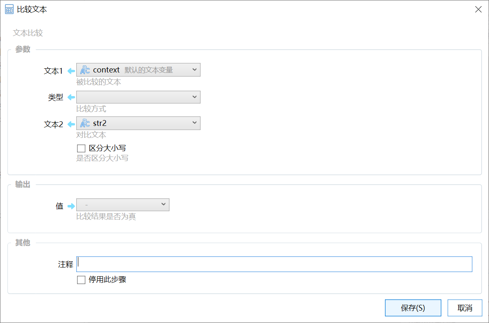

# 比较文本

文本比较

{/* xaction-metadata:start */}
## 当前模块定义

- 模块 Key：`sys:strCompare`
- 分类：计算与比较（`Compute`）
- 类型：`Action`
- 风险操作：否
- 专业版：否

## 输入参数

| Key | 名称 | 类型 | 默认值 | 必填 | 变量模式 | 条件 | 说明 |
| --- | --- | --- | --- | --- | --- | --- | --- |
| `param1` | 文本1 | `Text` |  | 是 | `UseVarOrInput` |  | 被比较的文本 |
| `type` | 类型 | `Enum` | &gt; | 是 | `Input` |  | 比较方式 |
| `param2` | 文本2 | `Text` |  | 是 | `UseVarOrInput` |  | 对比文本。拼音匹配时，也可用于指定拼音、拼音首字母。 |
| `case` | 区分大小写 | `Boolean` | false | 否 | `Input` | 排除：pinyinMatch | 是否区分大小写 |

## 输出参数

| Key | 名称 | 类型 | 条件 | 说明 |
| --- | --- | --- | --- | --- |
| `value` | 值 | `Boolean` |  | 比较结果是否为真 |

## 选项值

### `type` 类型

| Value | 名称 | 说明 |
| --- | --- | --- |
| `>` | &gt; |  |
| `=` | = |  |
| `<` | &lt; |  |
| `contains` | 包含 |  |
| `startsWith` | 以指定内容开始 |  |
| `endsWith` | 以指定内容结束 |  |
| `match` | 正则匹配 |  |
| `pinyinMatch` | 包含指定内容，或匹配拼音、拼音首字母 |  |
{/* xaction-metadata:end */}

比较两段文本是否符合指定的关系。

## 参数

【文本1】【文本2】参与比较的两个文本。

【类型】比较方式，可选值：

-   \&gt; ：文本1是否在字母顺序的角度大于文本2。比如“def”&gt; “abc”。
-   \= ：文本1是否等于文本2；
-   &lt; ：文本1是否小于文本2；
-   包含：文本1是否包含文本2；比如“This is China”包含“China”
-   以指定的内容开始：文本1是否以文本2的内容开始，比如“This is China”以“This”开始。
-   以指定的内容结束：文本1是否以文本2的内容结束。
-   正则匹配：文本1的内容是否能够匹配文本2中指定的正则表达式。

【区分大小写】比较时是否区分大小写字母。

### 输出

【值】比较的结果是否为“真”。
