# 表格数据操作

表格变量的相关处理操作

## 当前模块定义

<XActionModuleMeta moduleKey="sys:tableoperation" />

【本功能为预览状态，欢迎反馈问题】

对某个表格变量（[DataTable对象](https://docs.microsoft.com/en-us/dotnet/api/system.data.datatable?view=netframework-4.7.2)）进行读写或更新。

关于表格变量的相关说明，请参考文档《[表格变量类型](/v2/xaction/concepts/tablevar)》。

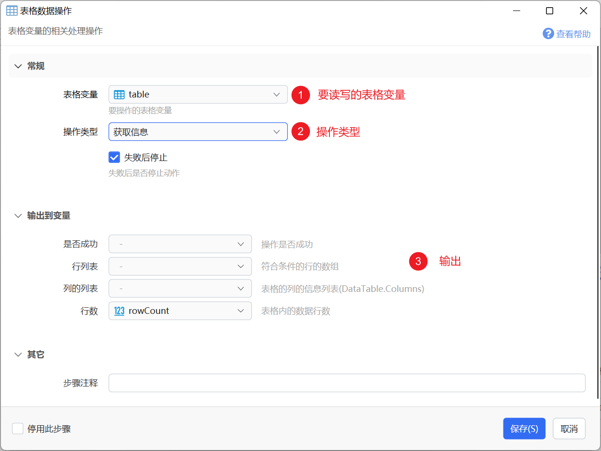

## 通用输入输出参数

输入参数：

【表格变量】选择要操作的目标表格变量。

【操作类型】对表格变量进行的操作种类。

【失败后停止】遇到异常情况时停止继续执行后续步骤。

输出参数：

【是否成功】操作是否没有遇到异常。

## 操作类型

### 获取信息

获取表格变量的数据信息。

输出参数：

-   行列表：表格的[Rows](https://docs.microsoft.com/en-us/dotnet/api/system.data.datatable.rows?view=netframework-4.7.2#System_Data_DataTable_Rows)数据。需输出到“对象”类型变量中。
-   列的列表：表格的[Columns](https://docs.microsoft.com/en-us/dotnet/api/system.data.datatable.columns?view=netframework-4.7.2)数据。需输出到“对象”类型变量中。
-   行数：表格数据的总行数。

### 添加行

向表格中添加一行数据。

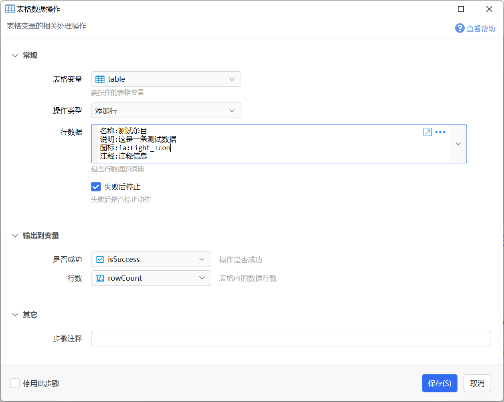

【行数据】

新添加行的各列数据。为词典类型，每一项的Key为列名，Value为值。

注：不需要为自动生成值的列提供数据（如自增长的列等）。

### 更新行

更新符合条件的行的某些列的内容。1.42.38+支持。

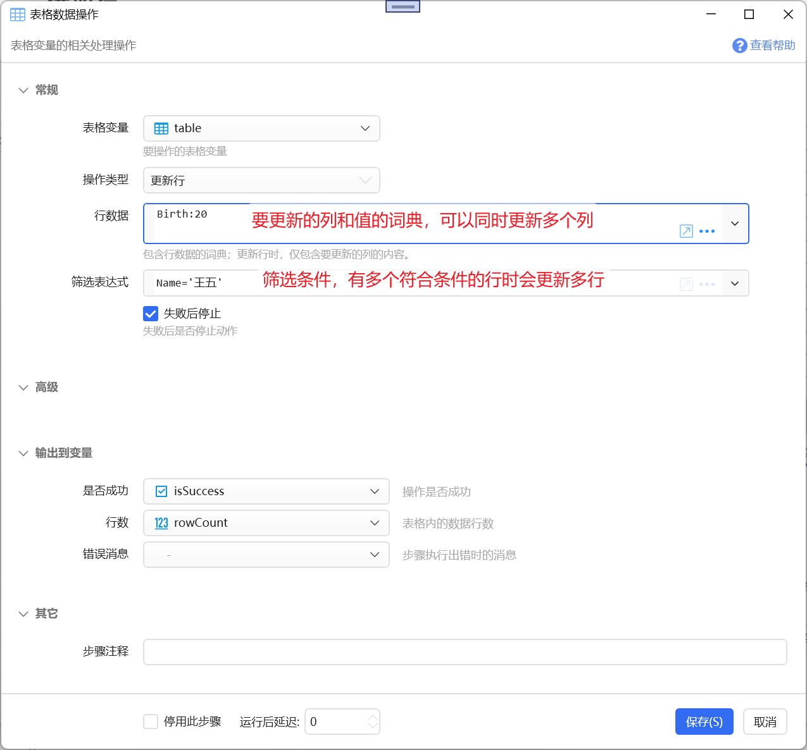

**输入**

【行数据】要更新的列和对应值的词典。可以同时更新多列。

【筛选表达式】用于确定更新哪些行。

**输出**

【行数】更新的行数。

### 查看或编辑数据

显示一个窗口，可用于查看或修改表格变量中的数据。

通过【只读模式】参数可以控制是否允许修改表格变量中的数据。

#### 只读模式

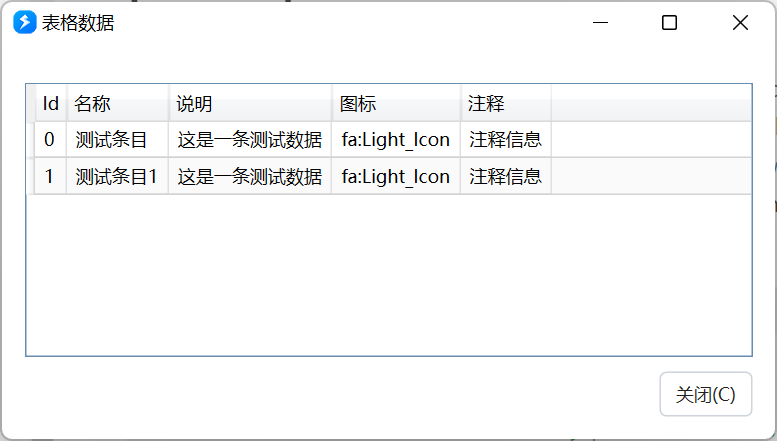

如果需要复制内容，可以鼠标拖动选中一个或多个单元格后Ctrl+C或使用右键菜单。

#### 编辑模式

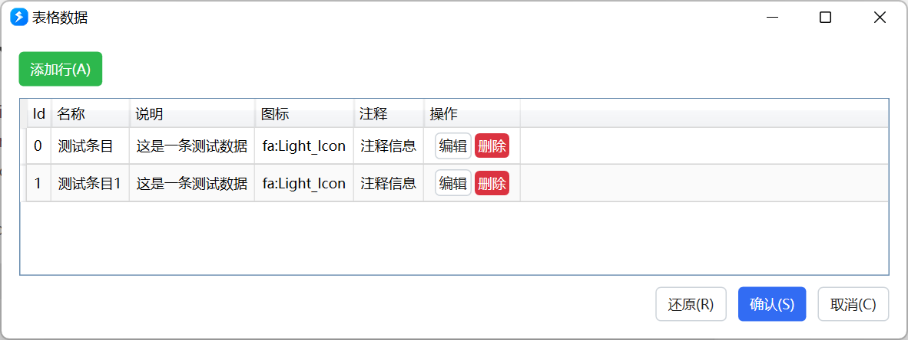

**注：需要事先在表格变量里定义每列的编辑方式。**

点击“添加行”按钮，可以打开表单窗口添加新的行。

双击一行中的单元格或点击后面的“编辑”按钮，可以编辑该行内容。

点击“删除”按钮可以删除一行。

点击“还原”可以将数据恢复到打开窗口时的状态。

### 查询或筛选行(Select)

使用[DataTable对象的Select()](https://docs.microsoft.com/en-us/dotnet/api/system.data.datatable.select?view=netframework-4.7.2)方法获取符合条件的行。

【筛选表达式】查询条件，语法请参考《[DataView RowFilter Syntax](https://www.csharp-examples.net/dataview-rowfilter/)》。

示例：

-   `Id = 10` `Id > 20` `Id in (1,2,3)`
-   `Name = '张三'` `Name <> '李四'` `Name in ('张三','李四','王五')`
-   `Date = #2022-12-27#`
-   `Name LIKE '*str*'` (通配符\*可以在最前面或/和最后面，不能在中间)
-   布尔操作符支持`AND``OR``NOT` 如：`NOT City = 'Tokyo' AND NOT City = 'Paris'`
-   支持使用`CONVERT`方法在比较的时候转换数据类型，[参考来源](https://stackoverflow.com/a/56853222/3335415)。例如：动态加载的表格，数字类型的列可能会被当做文本类型，此时如果要按数字比较，可以通过这样的方式转换：`**CONVERT(序号, System.Int32) > 3**`

【排序】可选。设定查询结果的排序方式，例如：

-   `Birth DESC`（按Birth列从大到小倒序排序）
-   `Id` (按ID从小到大正序排序）

输出：

【行数】符合筛选条件的结果行数。

【行列表】符合条件的行列表(类型为DataRow\[\])，可通过“每个”模块循环访问各行信息。

【第一行】第一条符合条件的行。

### 清除所有行

清除表格中的所有数据。

### 删除符合条件的行

删掉匹配指定筛选条件的行。

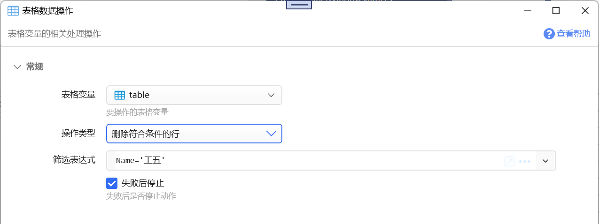

### 删除列

从表格删除掉指定的列。

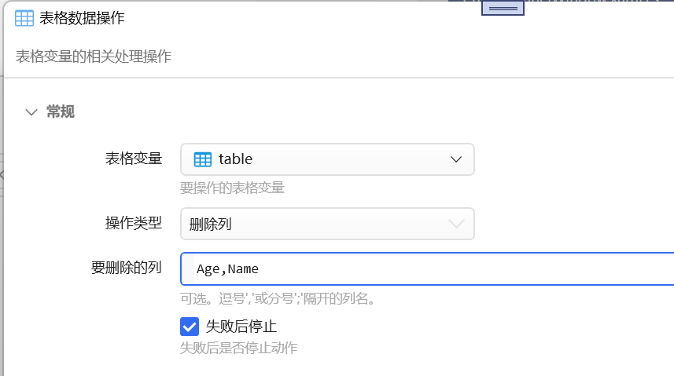

### 从CSV文本加载数据

从csv格式（逗号分隔）的文本加载数据到表格变量。可以在前面使用“[读取文件](/v2/xaction/modules/readfile)”模块将文件内如读取到文本变量中（csv文件在简体中文系统中通常使用GB2312编码保存），再在本模块中将变量输入到“文本数据”参数。

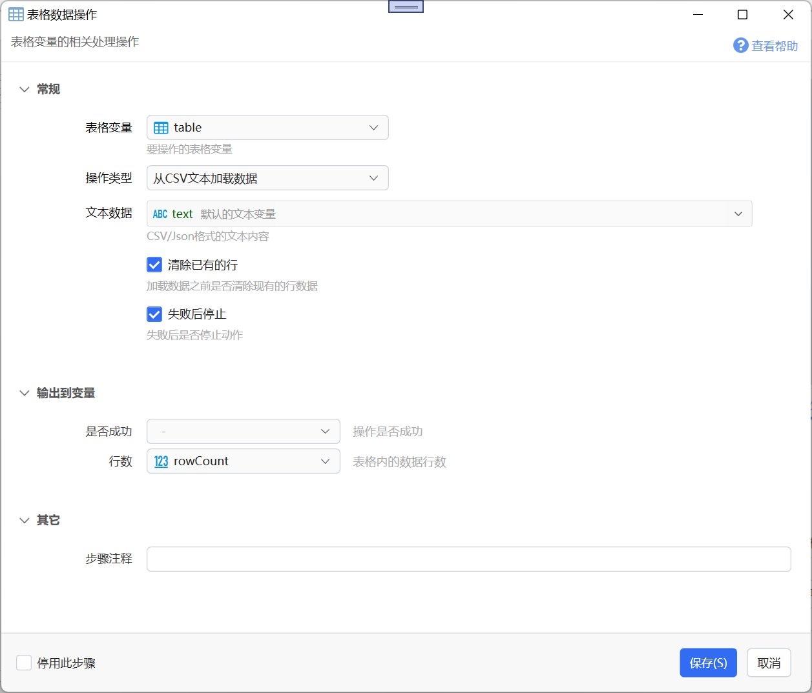

【文本数据】csv文本内容。第一行应该为标题行，内容为各列的列名。

【清除已有的行】是否清除已有的数据。

### 从JSON文本加载数据

从JSON数组文本中加载数据。

其它参数同上。

根据json数据内容的不同，分两种情况：

-   Json数组：数组中对象的key作为表的列名，对象的值作为作为每一行的对应key列的数据。如： `[{"name":"张三","age":20,'City':'BeiJing'},{"name":"李四","age":21,'City':'ShangHai'}]`，得到的表格为：
    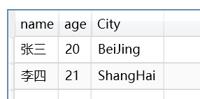
-   Json对象（1.35.38+版本）：自动生成Key和Value两列，存储json对象每个属性的名称和值。如： `{"name":"张三","age":20,'City':'BeiJing'}` ，得到的表格内容为：
    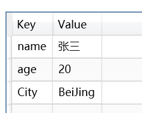

### 从Excel工作表加载数据

从Excel工作表加载数据。

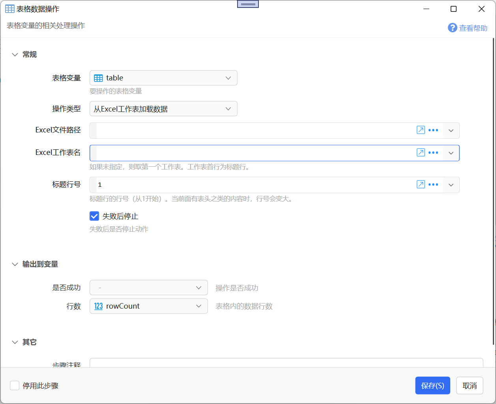

要读取的Excel工作表中应该有规范的二维表格数据。

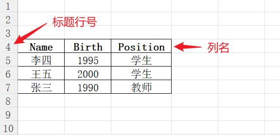

【Excel文件路径】Excel文件的完整路径。此文件当前不能被锁定（如在Excel中打开）。

【Excel工作表名】工作表名称。留空时读取第一个工作表。

【标题行号】列名所在行的行号（从1开始的数字，当前面有表头之类的内容时，会大于1）

注：如果遇到错误提示“Wrong Local header signature: 0xE011CFD0”说明您的excel文件后缀名和实际格式不匹配。xslx和xls是两种excel版本，不能混用。

### 导出文本数据

将表格变量内容导出为文本格式（CSV或Json）。

### 导出Excel文件

将表格内容输出到一个新建的Excel文档中。

【Excel文件路径】文件的保存路径。

【Excel工作表名】工作表名，留空时为“Sheet1”。

## 更新说明

-   20240227 增加查询筛选时转换数据类型的说明。
-   20240514 增加更新行、删除行、清空表格、删除列操作类型的说明。
