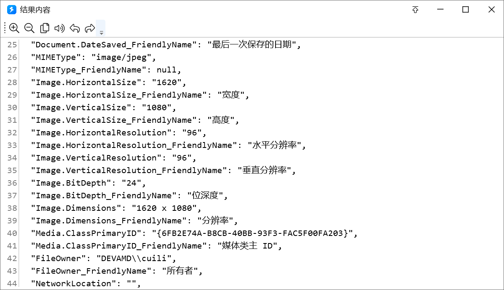

# 检查路径/获取文件信息

检查路径是否存在、是文件还是文件夹，并读取大小、时间、快捷方式目标和文件哈希。只要一段文本的 MD5 / SHA，用 [文本处理](/v2/xaction/modules/stringprocess) 或 [加密/解密/哈希](/v2/xaction/modules/enc)；算整个文件请用本模块，不要整文件读进内存。

## 当前模块定义

<XActionModuleMeta moduleKey="sys:checkPathExists" />

## 概述

<ModuleParamPreview moduleKey="sys:checkPathExists" />

## 参数说明

**路径**：要检查的文件或文件夹完整路径。

## 输出

- **路径是否存在**
- **是否为文件** / **是否为文件夹**
- **是否只读** / **是否隐藏** / **是否为系统文件**
- **文件长度**：仅文件，字节数
- **文件夹内文件个数** / **文件夹大小**：仅文件夹；需要扫描，目录大时较慢
- **创建时间** / **更新时间**：计算机本地时间；更新时间是最后写入时间
- **文件扩展信息**：词典。每种文件字段不同，如图片分辨率、视频时长。1.22.25 起提供
- **lnk目标路径** / **lnk命令行参数**：快捷方式的目标文件和参数。1.22.25 起提供
- **MD5 哈希值** / **SHA1 哈希值** / **SHA256 哈希值** / **CRC32 哈希值**：仅文件；大文件要扫一段时间。需 1.33.25+

### 文件扩展信息

每个属性通常有两项：

- `"属性名"`：值
- `"属性名_FriendlyName"`：中文友好名

例如图片可能出现 `Image.HorizontalSize` / `宽度`、`MIMEType` 为 `image/jpeg`。快捷方式还可通过词典键 `Link.TargetParsingPath` 取目标路径。

## 示例动作

选中文件后取出扩展信息，格式化成 JSON 再显示。

<StepProgramView example="fe04a515-508b-4238-645d-08d8ba8b34b3" />

<ShareLinkCard
  code="fe04a515-508b-4238-645d-08d8ba8b34b3"
  title="文件信息"
  description="使用系统接口获取文件信息示例"
  author="CL"
/>

## 限制与排障

- 文件夹个数和总大小要扫描整棵目录，大目录会卡住一段时间。
- 哈希只对文件有效，大文件同样要扫完全部内容。
- 扩展信息因文件类型而异，没有的键不要当必有字段用。

## 相关链接

<RelatedDocs
  items={[
    {
      href: '/v2/xaction/modules/enc',
      label: '加密/解密/哈希',
      description: '文本、密钥和 HMAC；整文件哈希用本页。',
    },
    {
      href: '/v2/xaction/modules/stringprocess',
      label: '文本处理',
      description: '只要一段文本的 MD5 / SHA。',
    },
    {
      href: '/v2/xaction/modules/fileoperation',
      label: '文件和目录操作',
      description: '确认存在后再复制或删除。',
    },
  ]}
/>

## 更新历史

- 20250120 更新文档，以匹配实际功能。
