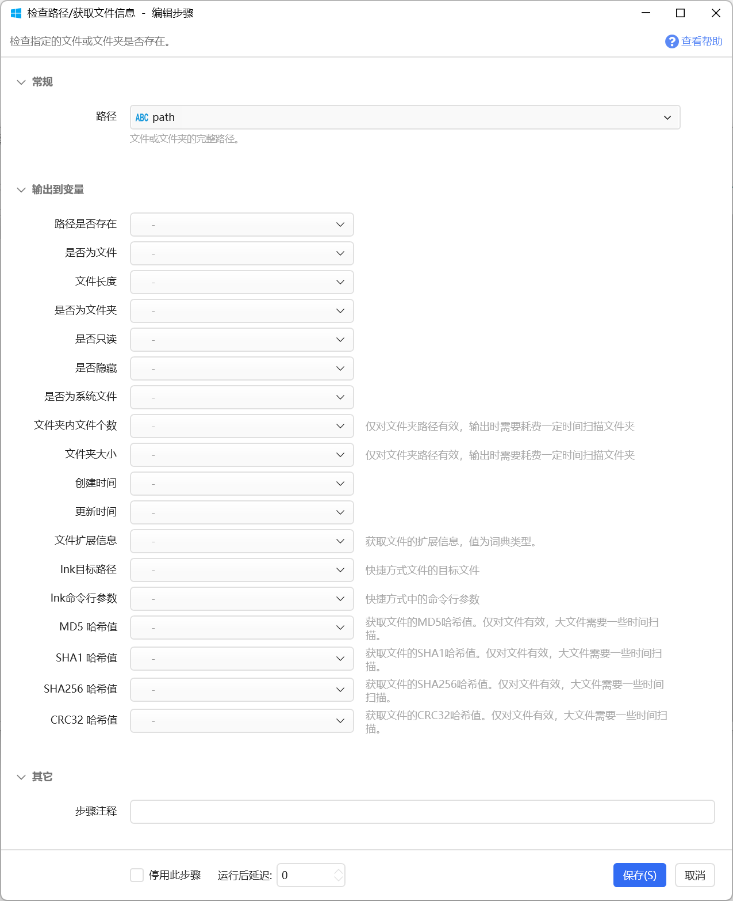

# 检查路径/获取文件信息

检查指定的文件或文件夹是否存在。

{/* xaction-metadata:start */}
## 当前模块定义

- 模块 Key：`sys:checkPathExists`
- 分类：系统操作（`Files`）
- 类型：`Action`
- 风险操作：否
- 专业版：否

## 输入参数

| Key | 名称 | 类型 | 默认值 | 必填 | 变量模式 | 条件 | 说明 |
| --- | --- | --- | --- | --- | --- | --- | --- |
| `path` | 路径 | `Text` |  | 是 | `UseVarOrInput` |  | 文件或文件夹的完整路径。 |

## 输出参数

| Key | 名称 | 类型 | 条件 | 说明 |
| --- | --- | --- | --- | --- |
| `isExists` | 路径是否存在 | `Boolean` |  |  |
| `isFile` | 是否为文件 | `Boolean` |  |  |
| `isFolder` | 是否为文件夹 | `Boolean` |  |  |
| `isReadonly` | 是否只读 | `Boolean` |  |  |
| `isHidden` | 是否隐藏 | `Boolean` |  |  |
| `isSystem` | 是否为系统文件 | `Boolean` |  |  |
| `fileLength` | 文件长度 | `Integer` |  |  |
| `fileCount` | 文件夹内文件个数 | `Integer` |  | 仅对文件夹路径有效，输出时需要耗费一定时间扫描文件夹 |
| `totalLength` | 文件夹大小 | `Integer` |  | 仅对文件夹路径有效，输出时需要耗费一定时间扫描文件夹 |
| `createTime` | 创建时间 | `DateTime` |  |  |
| `editTime` | 更新时间 | `DateTime` |  |  |
| `metaData` | 文件扩展信息 | `Dict` |  | 获取文件的扩展信息，值为词典类型。 |
| `lnkTarget` | lnk目标路径 | `Text` |  | 快捷方式文件的目标文件 |
| `lnkArguments` | lnk命令行参数 | `Text` |  | 快捷方式中的命令行参数 |
| `md5hash` | MD5 哈希值 | `Text` |  | 获取文件的MD5哈希值。仅对文件有效，大文件需要一些时间扫描。 |
| `sha1hash` | SHA1 哈希值 | `Text` |  | 获取文件的SHA1哈希值。仅对文件有效，大文件需要一些时间扫描。 |
| `sha256hash` | SHA256 哈希值 | `Text` |  | 获取文件的SHA256哈希值。仅对文件有效，大文件需要一些时间扫描。 |
| `crc32hash` | CRC32 哈希值 | `Text` |  | 获取文件的CRC32哈希值。仅对文件有效，大文件需要一些时间扫描。 |
{/* xaction-metadata:end */}

检查路径是否存在、是文件还是文件夹，获取文件的基本信息。

## 参数

### 输入

【路径】要检查的完整路径

### 输出

【路径是否存在】此路径的文件或文件夹是否存在。

【是否为文件夹】路径位置是否是一个文件夹。

【是否为文件】路径位置是否为一个文件。

【文件长度】如果是文件的话，文件长度字节数。

【是否只读】文件或文件夹是否只读。

【是否隐藏】文件或文件夹是否隐藏。

【是否为系统文件】文件或文件夹是否为操作系统的组成部分或被操作系统使用。

【文件夹内文件个数】路径为文件夹时，内部文件的个数。需要耗费一定的时间获取此信息。

【文件夹大小】路径为文件夹时，内部文件的总大小。需要耗费一定的时间获取此信息。

【创建时间】文件的创建时间（计算机本地时间）；

【更新时间】文件的最后写入时间（计算机本地时间）。

【文件扩展信息】以词典形式放回的文件各种元数据信息，如图片的分辨率、mp4文件的长度等。1.22.25版本增加。

【lnk目标路径】用于获取快捷方式文件的实际目标文件路径。1.22.25版本增加。

【lnk命令行参数】快捷方式为目标程序文件所传递的命令行参数。

【MD5 哈希值】文件内容的MD5哈希值。大文件扫描需要一些时间。 需1.33.25+版本。

【SHA1 哈希值】文件内容的SHA1哈希值。大文件扫描需要一些时间。

【SHA256 哈希值】文件内容的SHA256哈希值。大文件扫描需要一些时间。

【CRC32哈希值】文件内容的CRC32哈希值。大文件扫描需要一些时间。

#### 文件扩展信息

文件扩展信息每个属性返回2个条目：

-   "属性名": 属性值
-   "属性名\_FriendlyName": 属性名的友好名（通常是中文）

下图是一个图片文件扩展信息的示例（部分）

示例动作：[https://getquicker.net/sharedaction?code=fe04a515-508b-4238-645d-08d8ba8b34b3](https://getquicker.net/sharedaction?code=fe04a515-508b-4238-645d-08d8ba8b34b3)

每种文件的扩展信息不同。

对lnk快捷方式文件，可以通过返回词典的"Link.TargetParsingPath"键得到链接的目标文件。

## 更新历史

-   20250120 更新文档，以匹配实际功能。
