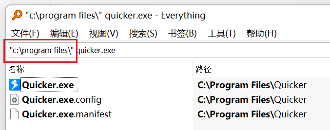
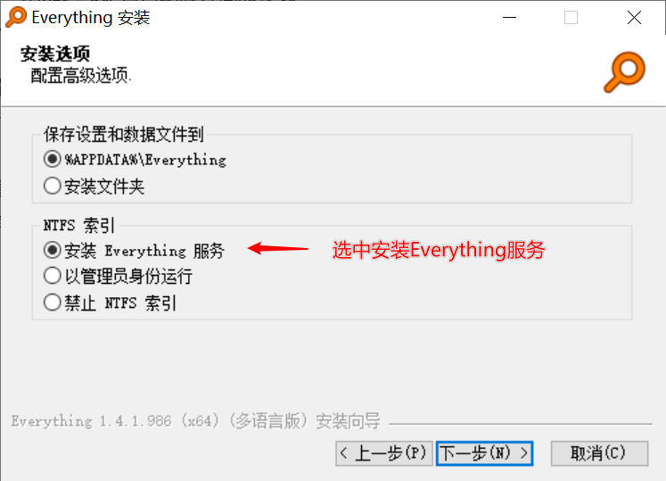
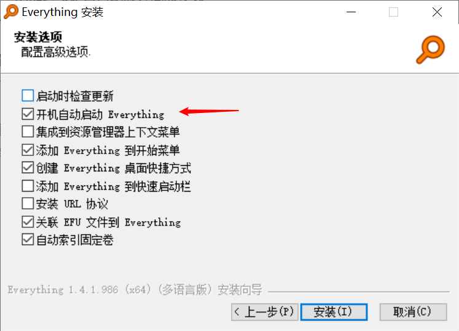
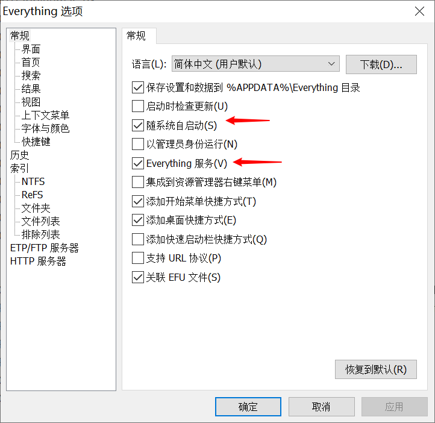

# 使用Everything搜索文件

调用本机 [Everything](https://www.voidtools.com/zh-cn/) 的接口搜索文件。需要已安装并正在运行 Everything 1.4.1.969 或更高版本。

2022-09-08 有传闻称 Everything 更新服务疑似被劫持，参见 [V2EX 讨论](https://www.v2ex.com/t/878475)。请关闭「启动时检查更新」，需要时到官网手动下载。

## 当前模块定义

<XActionModuleMeta moduleKey="sys:everythingsearch" />

## 概述

<ModuleParamPreview moduleKey="sys:everythingsearch" />

## 参数说明

**搜索内容**：关键词，语法与 Everything 软件本身相同，见 [官方搜索说明](https://www.voidtools.com/support/everything/searching/)。SDK 调用不支持 `exe:`、`doc:` 这类宏；筛选类型请用 `ext:mp3;aac` 或下面的 **扩展名**。

**限定目录**：只搜该目录（含子目录）。模块会把路径加到搜索内容前面，效果相当于在 Everything 里写成 `"c:\program files\" quicker.exe`。路径末尾必须带 `\`，否则会匹配所有以此开头的目录。多个目录请直接写进 **搜索内容**，例如 `"C:\Program Files"|"D:\Work\" 关键词`。

**扩展名**：半角分号分隔，如 `doc;docx;docm`。内部会追加 `ext:doc;docx;docm`。下拉里有可执行文件、文档、图片、视频、音频等预设。

**匹配完整文件名**：内部在搜索内容前加 `wfn:`，对整段搜索生效。

**匹配整个单词**：默认开启。搜 `quicker.exe` 时，也可能命中 `quicker.exe.config`。

**匹配路径**：关键词也匹配路径的一部分，不只文件名。

**匹配大小写**：是否区分大小写。默认关闭。

**使用正则匹配**：是否按正则搜索。默认关闭。

**最大结果数量**：最多返回多少条，默认 100；`-1` 表示不限制。

**排序方式**：点开下拉看当前全部选项。部分排序会影响速度，建议先试。

**失败后停止**：搜索失败是否中止动作。默认开启。

## 输出

- **是否成功**：是否完成搜索。
- **路径列表**：找到的文件路径。
- **结果个数**
- **原始结果**：对象列表，表达式里可继续用。每项常见字段：`FileName`（文件名）、`FilePath`（完整路径）、`Modified`（最后修改时间）、`Size`（大小）。

## 安装 Everything 的注意事项

1. 到 [https://www.voidtools.com/zh-cn/](https://www.voidtools.com/zh-cn/) 下载 **安装版 64 位** 或 **安装版 32 位**。
2. 安装时用默认选项，并勾选 **安装 Everything 服务**。
3. 建议勾选开机自动启动，这样 Quicker 调用时服务已在运行。

已经装好的，可在「工具 → 选项」里改同样两项：随系统自启动、Everything 服务。不要开「启动时检查更新」。

## 限制与排障

- Everything 没装、没运行，或版本低于 1.4.1.969，本模块会失败。
- 限定目录末尾漏了 `\`，会搜到其它以这段文字开头的路径。
- `exe:` / `doc:` 宏不可用，改用 `ext:` 或 **扩展名**。

## 相关链接

<RelatedDocs
  items={[
    {
      href: '/v2/xaction/modules/fileoperation',
      label: '文件和目录操作',
      description: '搜到路径后再复制、移动或列举。',
    },
    {
      href: '/v2/xaction/modules/getselectedfiles',
      label: '获取选择的文件(夹)/选择特定文件',
      description: '已经在资源管理器里选中时不必搜索。',
    },
  ]}
/>

## 更新历史

- 20240619 说明：限定目录需要以 `\` 结束。
