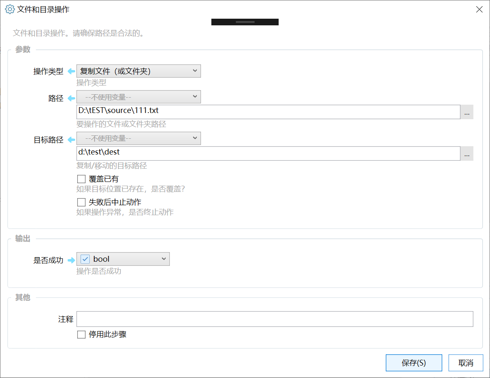

# 文件和目录操作

文件和目录操作。请确保路径是合法的。

## 当前模块定义

<XActionModuleMeta moduleKey="sys:fileOperation" />

**！！！警告：请在使用本模块进行移动、删除等操作之前备份好重要数据。**

本模块用于实现基本的文件和目录操作。

## 支持的操作类型

| **操作类型** | **说明** | 参数/备注 |
| --- | --- | --- |
| 复制到指定目录下 | 复制一个文件或文件夹到特定目录下。 | 路径：被复制的（单个）文件或文件夹的完整路径。 目标路径：目标文件夹的路径。 |
| 复制到指定目录下(Windows) | 使用windows内置方式复制文件或文件夹到指定位置。 效果类似于在资源管理器中复制。 | 路径：被复制的文件或文件夹的路径。**支持通过列表变量或多行文本传入多个文件或文件夹的路径。**可以在文件名中使用\*匹配多个文件。 目标路径：目标文件夹的路径。 |
| 复制为 | 指定复制的目标路径。 | 路径：被复制的文件或文件夹的路径。 目标路径：复制的结果路径。 |
| 移动到指定目录下 | 移动一个文件或文件夹到特定目录下。 | 路径：被复制的（单个）文件或文件夹的完整路径。 目标路径：目标文件夹的路径。 |
| 移动到指定目录下（Windows） | 使用windows内置方式移动文件或文件夹到指定位置。 效果类似于在资源管理器中移动或剪切。 | 路径：被移动的文件或文件夹的路径。**支持通过列表变量或多行文本传入多个文件或文件夹的路径。**可以在文件名中使用\*匹配多个文件。 目标路径：目标文件夹的路径。 |
| 移动/重命名为 | 指定完整的目标路径。 | 路径：移动或重命名的文件。 目标路径：移动或重命名的结果路径。 |
| 删除文件 |  | 路径：要删除文件的完整路径。 |
| 移入回收站 | 将文件或文件夹放入回收站。 | 路径：文件或文件夹的完整路径。注意：较大的文件或目录可能会被直接删除而不是移入回收站。 |
| 删除空文件夹 | 直接删除空的文件夹。 | 路径：要删除的文件夹路径。(v1.39.11版本增加） |
| 移入回收站(安静模式） | 将文件或文件夹放入回收站。 | 不显示任何界面，遇到无法回收的大文件或目录将会自动删除。 |
| 创建文件夹 |  | 路径：要创建的文件夹的完整路径。 如果已存在，则不进行操作。 |
| 创建空文件 | 根据指定的路径创建一个空的文件 | 路径：要创建文件的完整路径（包含文件名和扩展名）。 |
| 获取文件夹内的文件 | 返回文件夹内的所有文件 | 路径：要搜索的路径； 包含子目录：是否搜索子目录。 搜索内容：请参考本文后面的专门说明。 |
| 获取文件夹内的子文件夹 | 返回所有子文件夹的路径 | 路径：要搜索的路径； 搜索内容：要匹配的文件名。 支持[通配符](/v2/xaction/modules/filesystemwatch)。 包含子目录：是否搜索子目录。 |
| 【不建议使用】 复制文件（或文件夹） | 将文件或文件夹复制到目标位置。 | 路径：要复制的文件或文件夹路径。 如果此路径是文件路径，则作为文件复制，否则作为文件夹复制。 目标路径：复制文件时，可以为目标的完整路径（带文件名），也可以是目标文件夹的路径（此时文件名会被保持原名，从0.10.4版本开始支持）。 示例： -   复制文件d:\\dir1\\16.png到E:\\temp文件夹 -   路径：d:\\dir1\\16.png -   目标路径：e:\\temp  或 e:\\temp\\16.png -   复制文件夹d:\\dir1\\logos 到 e:\\temp下： -   路径：d:\\dir1\\logos -   目标路径：e:\\temp\\logos |
| 【不建议使用】 移动/重命名文件（或文件夹） | 移动或改名文件/文件夹。 | 路径：要移动/重命名的文件或文件夹的完整路径。 目标路径：完整的目标文件路径（包含文件名），如果是移动文件，也可用只提供目标文件夹的路径。如果是重命名文件，也可只提供目标文件名。 |

### 参数说明

【搜索内容】

获取文件夹内的文件时，指定返回文件所匹配的模式。支持如下几种形式：

-   包含普通字符和通配符`*`（任意多个字符）、`?`（一个任意字符）的字符串。如`202*年*月报表.xlsx`。（此方式仅支持一种匹配模式）
-   （1.35.38+版本）`regex:正则表达式`。如`regex:emp.*\.png`。此时会获取所有文件，然后对每个文件名进行匹配检查，文件较多时可能有一定的性能影响。
-   （1.35.38+版本）用`;`隔开的多个文件类型后缀的列表，如`.jpg;.png;.bmp;.gif`，以快速返回目录下指定类型的文件。

获取子文件夹时，支持如下几种格式：

-   包含普通字符和通配符`*`（任意多个字符）、`?`（一个任意字符）的字符串。如`202*年*月`。（此方式仅支持一种匹配模式）
-   （1.38.23+版本）`regex:正则表达式`。此时会获取所有子文件夹，然后对每个文件夹名称进行匹配检查。

## 示例动作

-   [文件分类](https://getquicker.net/Sharedaction?code=dd277f4e-50a4-4971-26fc-08d697a0f29b)
-   [创建模版目录](https://getquicker.net/Sharedaction?code=f28447de-e525-440e-5f9b-08d67b52833a)
-   [解散文件夹](https://getquicker.net/Sharedaction?code=6aaceddc-6917-41cf-721a-08d697a27161)
-   为同类文件归档
-   [示例：在当前文件夹下创建docx文件并打开](https://getquicker.net/sharedaction?code=b3c33c64-efd2-4999-0c74-08d7249f7b58)(演示了创建空文件的操作，需要1.0.11版本支持）

## 更新说明

-   20230628 1.38.23 获取子文件夹支持正则。
