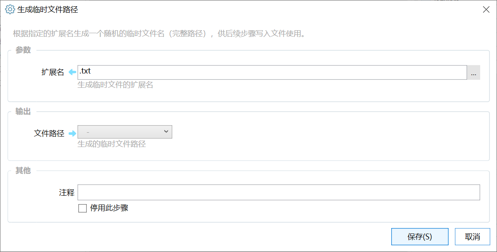

# 生成临时文件路径

根据指定的扩展名生成一个随机的临时文件名（完整路径），供后续步骤写入文件使用。

{/* xaction-metadata:start */}
## 当前模块定义

- 模块 Key：`sys:GenTempFilePath`
- 分类：系统操作（`Files`）
- 类型：`Action`
- 风险操作：否
- 专业版：否

## 输入参数

| Key | 名称 | 类型 | 默认值 | 必填 | 变量模式 | 条件 | 说明 |
| --- | --- | --- | --- | --- | --- | --- | --- |
| `ext` | 扩展名 | `Text` | .txt | 是 | `Input` |  | 生成临时文件的扩展名 |

## 输出参数

| Key | 名称 | 类型 | 条件 | 说明 |
| --- | --- | --- | --- | --- |
| `filePath` | 文件路径 | `Text` |  | 生成的临时文件路径 |
{/* xaction-metadata:end */}

根据指定的后缀名，生成一个合法路径用于存储临时文件。

## 参数

### 输入

【扩展名】要生成的文件名后缀。

### 输出

【文件路径】生成的临时文件完整路径。
