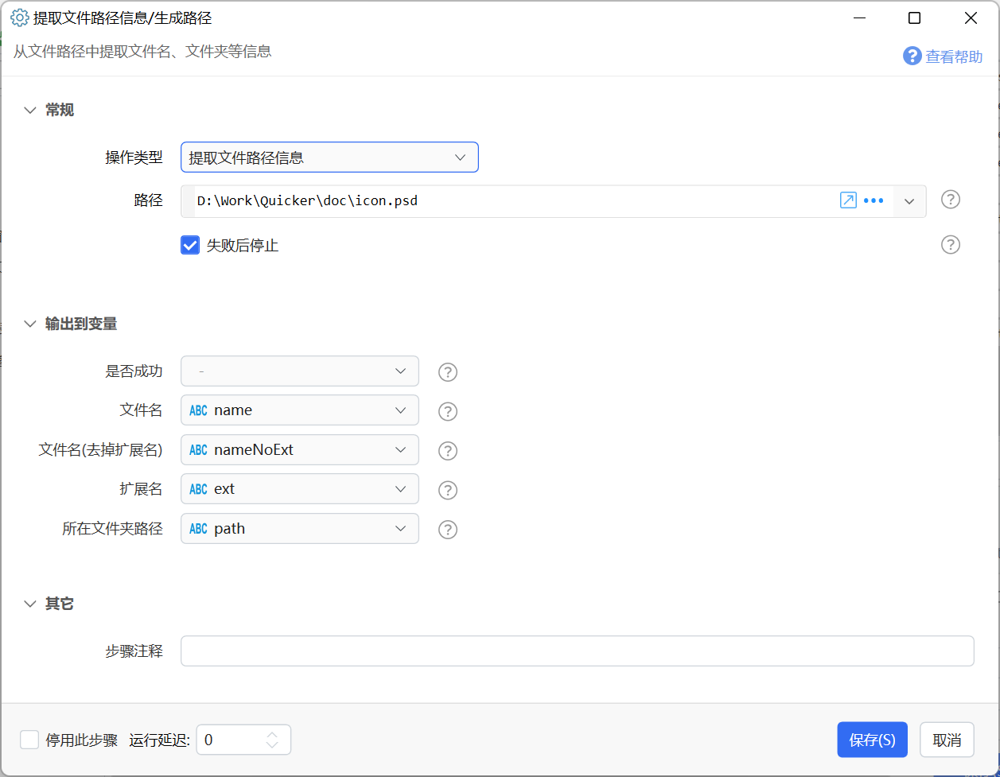
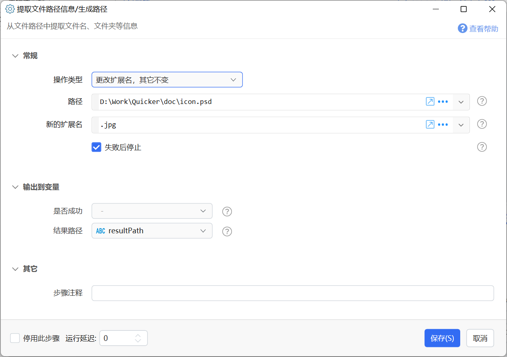
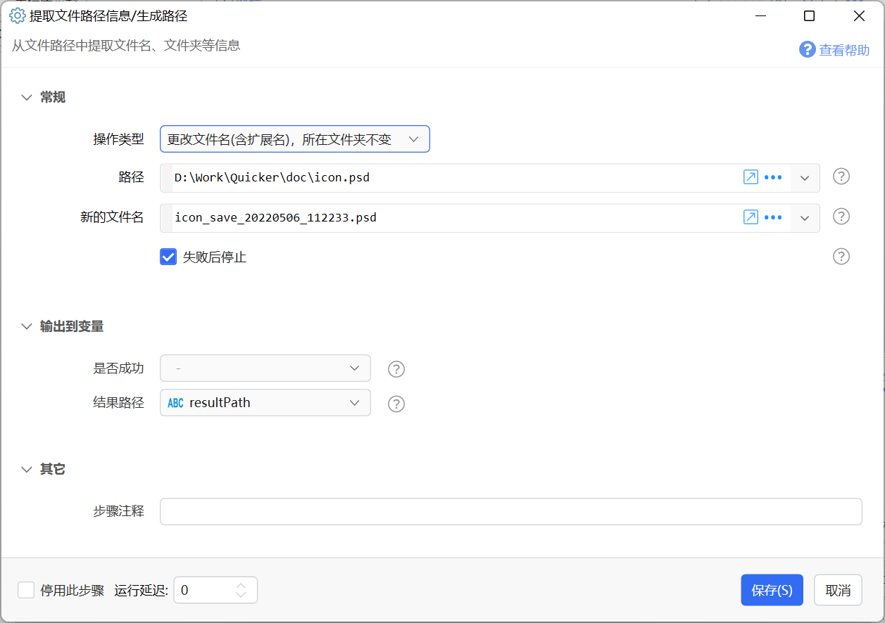
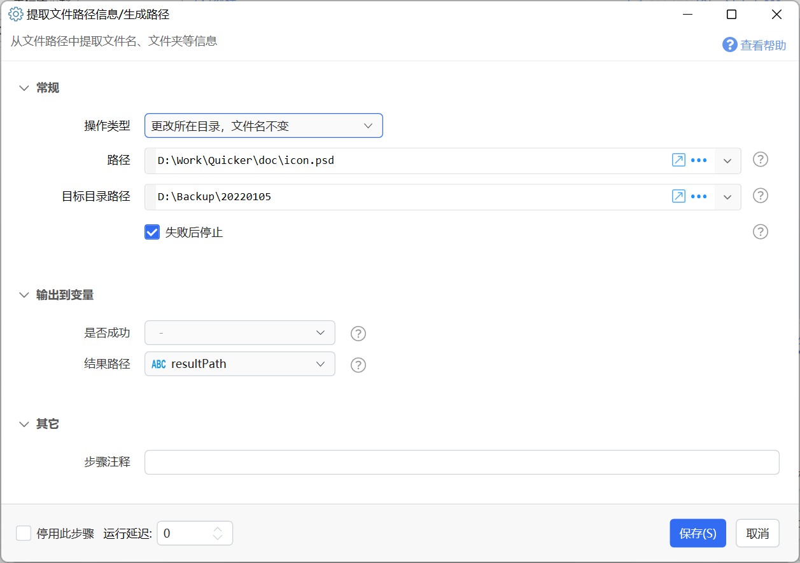
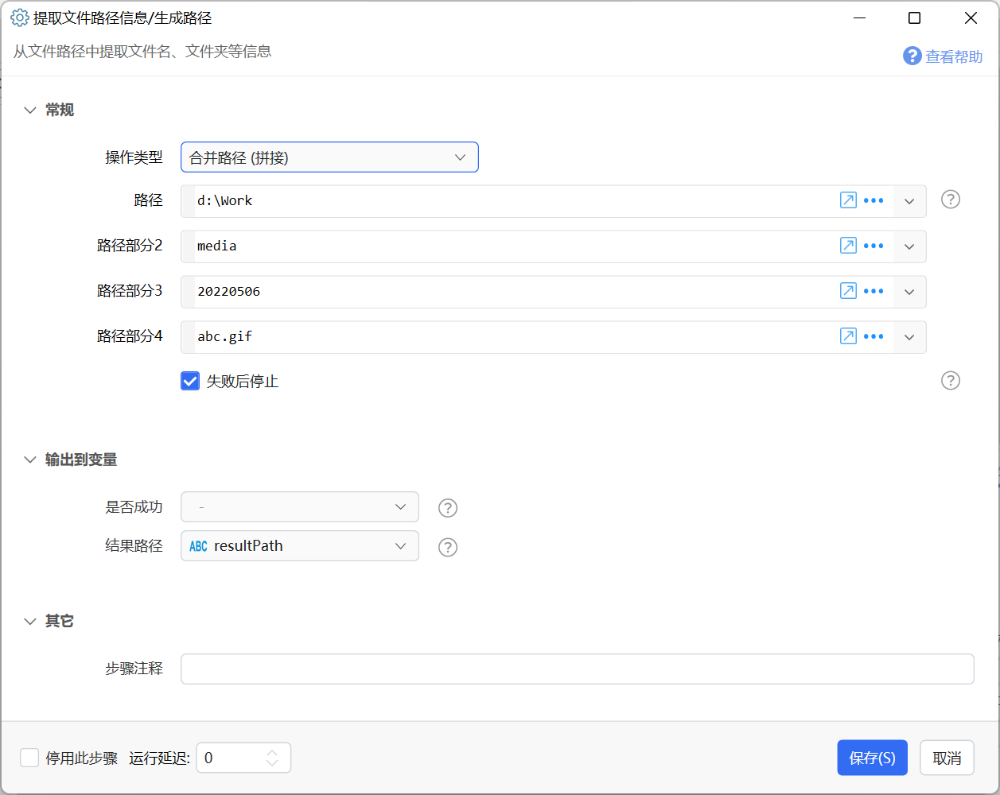

# 提取文件路径信息/生成路径

从文件路径中提取文件名、文件夹等信息

{/* xaction-metadata:start */}
## 当前模块定义

- 模块 Key：`sys:pathExtraction`
- 分类：系统操作（`Files`）
- 类型：`Action`
- 风险操作：否
- 专业版：否

## 输入参数

| Key | 名称 | 类型 | 默认值 | 必填 | 变量模式 | 条件 | 说明 |
| --- | --- | --- | --- | --- | --- | --- | --- |
| `operation` | 操作类型 | `Enum` | getInfo | 是 | `Input` |  |  |
| `path` | 路径 | `Text` |  | 是 | `UseVarOrInput` | 仅：getInfo, changeExt, changeName, changeNameWithoutExt, changeDir, combine | 待处理或拼接的路径 |
| `newExtension` | 新的扩展名 | `Text` |  | 是 | `UseVarOrInput` | 仅：changeExt | 新的扩展名，如：.png |
| `newFileName` | 新的文件名 | `Text` |  | 是 | `UseVarOrInput` | 仅：changeName | 新的文件名，如：abcd.png |
| `newFileNameWithoutExt` | 新的文件名 | `Text` |  | 是 | `UseVarOrInput` | 仅：changeNameWithoutExt | 新的文件名(不包含扩展名），如：newfile |
| `newDir` | 目标目录路径 | `Text` |  | 是 | `UseVarOrInput` | 仅：changeDir | 目标存储路径，如：d:\Work\Test |
| `path2` | 路径部分2 | `Text` |  | 是 | `UseVarOrInput` | 仅：combine |  |
| `path3` | 路径部分3 | `Text` |  | 是 | `UseVarOrInput` | 仅：combine |  |
| `path4` | 路径部分4 | `Text` |  | 是 | `UseVarOrInput` | 仅：combine |  |
| `stopIfFail` | 失败后停止 | `Boolean` | true | 否 | `Input` |  | 失败后是否停止动作 |

## 输出参数

| Key | 名称 | 类型 | 条件 | 说明 |
| --- | --- | --- | --- | --- |
| `isSuccess` | 是否成功 | `Boolean` |  | 提取过程是否没有遇到异常 |
| `resultPath` | 结果路径 | `Text` | 仅：changeExt, changeDir, changeName, changeNameWithoutExt, combine | 生成的结果路径 |
| `name` | 文件名 | `Text` | 仅：getInfo | 去除路径的文件名 |
| `nameNoExt` | 文件名(去掉扩展名) | `Text` | 仅：getInfo | 去除扩展名的文件名 |
| `path` | 所在文件夹路径 | `Text` | 仅：getInfo | 父目录路径 |
| `ext` | 扩展名 | `Text` | 仅：getInfo | 文件的扩展名 |

## 选项值

### `operation` 操作类型

| Value | 名称 | 说明 |
| --- | --- | --- |
| `getInfo` | 提取文件路径信息 |  |
| `changeExt` | 更改扩展名，其它不变 |  |
| `changeName` | 更改文件名(含扩展名)，所在目录不变 |  |
| `changeNameWithoutExt` | 更改文件名(不含扩展名和所在目录) |  |
| `changeDir` | 更改所在目录，文件名不变 |  |
| `combine` | 合并路径 (拼接) |  |
{/* xaction-metadata:end */}

提取路径中的信息，以及计算生成新的路径。

根据选择的“操作类型”不同，实现不同的功能。

## 提取路径信息

从完整的文件、文件夹路径中提取文件名、扩展名等信息。

**输入**

【完整路径】要提取信息的完整路径。

**输出**

【文件名】路径中的文件名信息。

【文件名（去掉扩展名）】去掉扩展名的文件名。

【路径】文件所在的文件夹路径。

【扩展名】文件的后缀。

**示例：**

输入：

-   路径：`D:\Work\Quicker\doc\icon.psd`

输出：

-   文件名：`icon.psd`
-   文件名（去掉扩展名）：`icon`
-   扩展名：`.psd`
-   所在文件夹路径：`D:\Work\Quicker\doc`

## 更改扩展名，其它不变

基于现有的文件路径，生成一个**仅修改文件扩展名**的新路径。 (需Quicker 1.33.25+)

**输入**

【路径】现有的文件完整路径或文件名。

【新的扩展名】目标扩展名。

**输出**

【结果路径】生成的结果路径。

**示例**

输入：

-   路径：`D:\Work\Quicker\doc\icon.psd`
-   新的扩展名：`.jpg`

输出：

-   结果路径：`D:\Work\Quicker\doc\icon.jpg`

## 更改文件名(含扩展名)，所在目录不变

基于现有的文件路径，生成一个**相同目录下**的新文件名的完整路径。

**输入**

【路径】现有的文件完整路径。

【新的文件名】目标文件名。

**输出**

【结果路径】生成的结果路径。

**示例**

输入：

-   路径：`D:\Work\Quicker\doc\icon.psd`
-   新的文件名： `icon_save_20220506_112233.psd`

输出：

-   结果路径：`D:\Work\Quicker\doc\icon_save_20220506_112233.psd`

## 更改所在目录，文件名不变

根据现有文件的名称和目标路径生成新的文件路径。

**输入**

【路径】现有的文件完整路径。

【目标目录路径】目标目录的完整路径。

**输出**

【结果路径】生成的结果路径。

**示例**

输入：

-   路径：`D:\Work\Quicker\doc\icon.psd`
-   目标目录路径：`D:\Backup\20220105`

输出：

-   结果路径：`D:\Backup\20220105\icon.psd`

## 生成路径

根据根路径和更多路径片段生成一个完整路径。

**输入**

【路径】某个磁盘分区的根目录或根目录开始的文件夹路径。

【路径部分2-4】路径的中间层次或文件名。如果某个参数值为空，将被忽略。

**输出**

【结果路径】生成的结果路径。

**示例**

输入：

-   路径：`D:\Work`
-   路径部分2：`Media`
-   路径部分3：`202205`
-   路径部分4：`abc.gif`

输出：

-   结果路径：`D:\Work\Media\20220506\abc.gif`

## 示例动作

-   [https://getquicker.net/Sharedaction?code=7e0ffda7-cbc9-4e31-2462-08da4d582a20](https://getquicker.net/Sharedaction?code=7e0ffda7-cbc9-4e31-2462-08da4d582a20)
