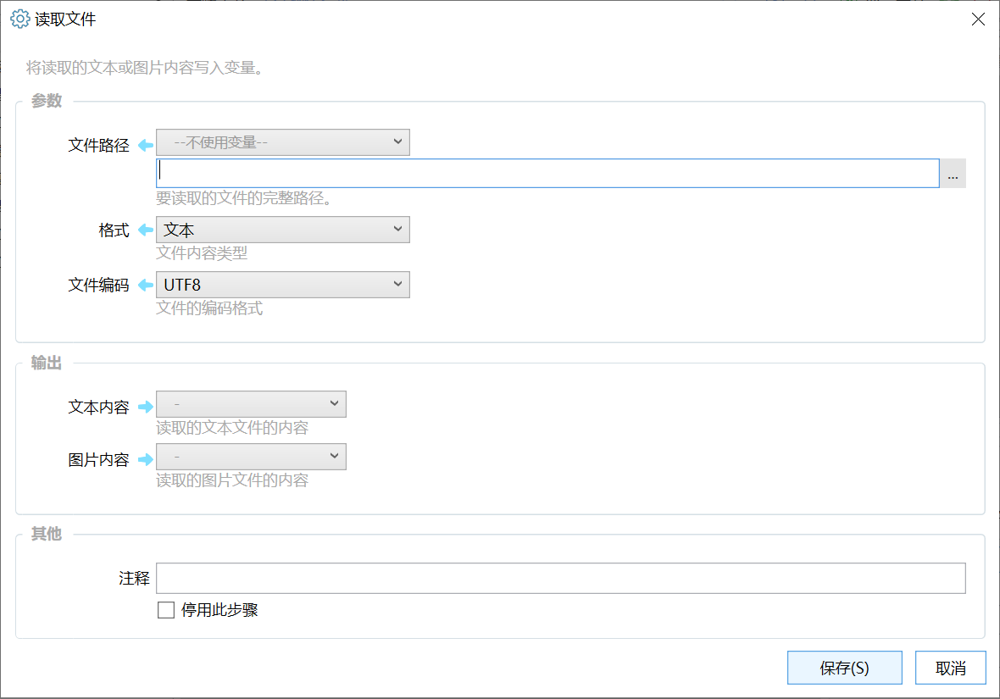

# 读取文件

将读取的文本或图片内容写入变量。

{/* xaction-metadata:start */}
## 当前模块定义

- 模块 Key：`sys:readFile`
- 分类：系统操作（`Files`）
- 类型：`Action`
- 风险操作：否
- 专业版：否

## 输入参数

| Key | 名称 | 类型 | 默认值 | 必填 | 变量模式 | 条件 | 说明 |
| --- | --- | --- | --- | --- | --- | --- | --- |
| `path` | 文件路径 | `Text` |  | 是 | `UseVarOrInput` |  | 要读取的文件的完整路径。 |
| `type` | 格式 | `Enum` | text | 是 | `Input` |  | 文件内容类型 |
| `encoding` | 文件编码 | `Enum` | utf-8 | 是 | `Input` | 仅：text | 文件的编码格式 |
| `stopIfFail` | 失败后停止 | `Boolean` | true | 否 | `Input` |  | 失败后是否停止动作 |

## 输出参数

| Key | 名称 | 类型 | 条件 | 说明 |
| --- | --- | --- | --- | --- |
| `isSuccess` | 是否成功 | `Boolean` |  | 操作是否成功 |
| `txt` | 文本内容 | `Text` | 仅：text | 读取的文本文件的内容 |
| `image` | 图片内容 | `Image` | 仅：image | 读取的图片文件的内容 |

## 选项值

### `type` 格式

| Value | 名称 | 说明 |
| --- | --- | --- |
| `text` | 文本 |  |
| `image` | 图片 |  |

### `encoding` 文件编码

| Value | 名称 | 说明 |
| --- | --- | --- |
| `utf-8` | UTF8 |  |
| `utf-16` | UTF-16 LE |  |
| `utf-16BE` | UTF-16 BE |  |
| `us-ascii` | ASCII |  |
| `utf-7` | UTF7 |  |
| `utf-32` | UTF32 |  |
| `default` | 系统默认(gb2312) |  |
| `auto` | 自动（BOM/UTF/ANSI） |  |
{/* xaction-metadata:end */}

读取指定文件的内容。目前支持文本文件和图片文件的读取。

## 参数

### 输入

【文件路径】要读取文件的完整路径。

【格式】文件内容格式，可选“文本”“图片”。 格式为“图片”时，支持的文件类型：.jpg, .png, .bmp, .tiff。

【文件编码】如果是读取的文本文件，可选文本编码格式。

### 输出

【文本内容】读取的文本文件内容。

【图片内容】读取的图片。
