# 状态存取

存取状态数据；更新动作的徽标文字；设置附加的动作右键菜单项

{/* xaction-metadata:start */}
## 当前模块定义

- 模块 Key：`sys:stateStorage`
- 分类：系统操作（`Files`）
- 类型：`Action`
- 风险操作：否
- 专业版：否

## 输入参数

| Key | 名称 | 类型 | 默认值 | 必填 | 变量模式 | 条件 | 说明 |
| --- | --- | --- | --- | --- | --- | --- | --- |
| `type` | 操作类型 | `Enum` | readActionState | 是 | `Input` |  |  |
| `key` | 名称 | `Text` |  | 否 | `Input` | 仅：readActionState, saveActionState, readGlobalState, saveGlobalState | 存储或读取的状态条目名称。 |
| `value` | 值 | `Text` |  | 否 | `UseVarOrInput` | 仅：saveActionState, saveGlobalState | 要保存的状态值。使用"*NULL*"删除此状态的存储。 |
| `defaultValue` | 默认值 | `Text` |  | 否 | `Input` | 仅：readActionState, readGlobalState | 读取失败的时候返回的值 |
| `inputIfEmpty` | 为空时请用户输入 | `Boolean` | false | 否 | `Input` | 仅：readActionState, readGlobalState | 如果读到的状态值为空，则弹出对话框请用户输入值。启用此选项时，请保持默认值为空。 |
| `prompt` | 用户输入提示 | `Text` |  | 否 | `UseVarOrInput` | 仅：readActionState, readGlobalState | 需要用户输入变量内容时，给用户的输入提示。 |
| `overlayIcon` | 徽标图标 | `Text` |  | 否 | `UseVarOrInput` | 仅：UpdateOverlyIcon | 使用内置矢量图标："fa:图标名称:图标颜色"。如："fa:Solid_Circle:#FF0000" |
| `badgeText` | 徽标文字 | `Text` |  | 否 | `UseVarOrInput` | 仅：UpdateActionBadge | 在动作右上角显示的提示文字 |
| `badgeColor` | 徽标颜色 | `Text` |  | 否 | `UseVarOrInput` | 仅：UpdateActionBadge | 在动作右上角显示的徽标底色。留空表示透明。 |
| `badgeTextColor` | 徽标文字颜色 | `Text` |  | 否 | `UseVarOrInput` | 仅：UpdateActionBadge |  |
| `actionContextMenu` | 附加的右键菜单项 | `Text` |  | 否 | `UseVarOrInput` | 仅：UpdateContextMenu | 附加的动作右键菜单，格式请参考文档 |
| `stopIfFail` | 失败后停止 | `Boolean` | true | 否 | `Input` |  | 失败后是否停止动作 |

## 输出参数

| Key | 名称 | 类型 | 条件 | 说明 |
| --- | --- | --- | --- | --- |
| `isSuccess` | 是否成功 | `Boolean` | 仅：readActionState, readGlobalState | 是否成功获取了値 |
| `value` | 值 | `Any` | 仅：readActionState, readGlobalState | 读取到的值 |
| `isEmpty` | 是否为空 | `Boolean` | 仅：readActionState, readGlobalState | 读取到的值是否为空 |

## 选项值

### `type` 操作类型

| Value | 名称 | 说明 |
| --- | --- | --- |
| `readActionState` | 读取动作状态 |  |
| `saveActionState` | 写入动作状态 |  |
| `UpdateActionBadge` | 设置徽标文字 |  |
| `UpdateOverlyIcon` | 设置徽标图标 |  |
| `UpdateContextMenu` | 设置附加的右键菜单项 |  |
| `readGlobalState` | 【谨慎使用】读取全局状态 |  |
| `saveGlobalState` | 【谨慎使用】写入全局状态 |  |
{/* xaction-metadata:end */}

状态存取模块包含这几类功能：

-   存取保存在计算机上的状态数据 ；
-   更新动作的“修饰”（如徽标图标/徽标文字）；
-   为动作设置附加的右键菜单；

注意事项：

-   状态使用缓存机制，在没有任何状态写入后2秒再写入磁盘。所以请不要在死循环内部写入状态。

## 存取状态数据

用于保存某项数据在本地电脑上，在下次执行动作的时候可以读取使用。就好比很多软件都会有一个.ini的配置文件保存一些用户设置一样。

一个动作可以使用多个状态项，他们以“键”-“值”对的形式保存。

注：状态值以文本形式保存。普通的简单变量类型（如数字/布尔），Quicker可以自动转换，所以可以通过状态存取保存和加载它们的值。 但是动态对象类型（对应于C#里的object类型），Quicker并不能从文本获取它的原始类型的信息，也没法从文本恢复对象，所以无法支持。

**常用场景**

比如可以用于如下情况：

-   存储软件在本机的路径。当一个动作依赖于软件路径时，如果将文件路径写死在动作里，这个动作在另外一个电脑上可能就会因为路径改变的问题无法正常运行。
-   每次点击动作执行不同的操作。比如第一次点击执行A，第二次点击执行B。
-   其他需要将信息保留到下次执行动作的情况等。

【版本1.3.0+】 如果不需要控制读取和写入状态的时间，也可以直接将变量设置为“作为状态使用”。在动作执行之前从状态加载变量值，在动作执行后将变量值保存在状态中。请参考：[/v2/xaction/concepts/variables#4e0f2f58](/v2/xaction/concepts/variables)

### 读取状态

读取某个状态的值。

在【操作类型】中选择“读取动作状态”。

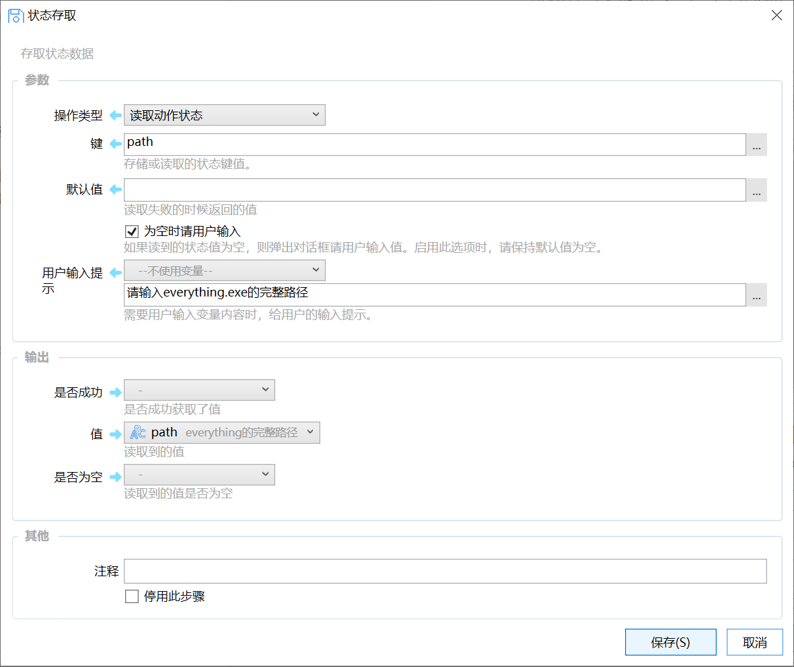

参数说明：

【名称 / 键】状态的条目名称。类似于变量名。

【默认值】如果之前没有存储状态，读取时候返回的默认值。

【为空时请用户输入】如果之前没有存储状态，并且默认值也为空，这时候是否提示用户输入这个状态的值。

【用户输入提示】弹窗输入状态值的时候，输入窗口的标题，主要是为了给用户提示要输入的内容。

输出参数：

【是否成功】是否读取成功。

【值】读取到的状态值。

【是否为空】读取的值是否为空。有时候方便使用为空

### 写入状态

向某个状态写入值。

在操作类型中选择“写入动作状态”。在表单中输入状态名和要写入的值即可。

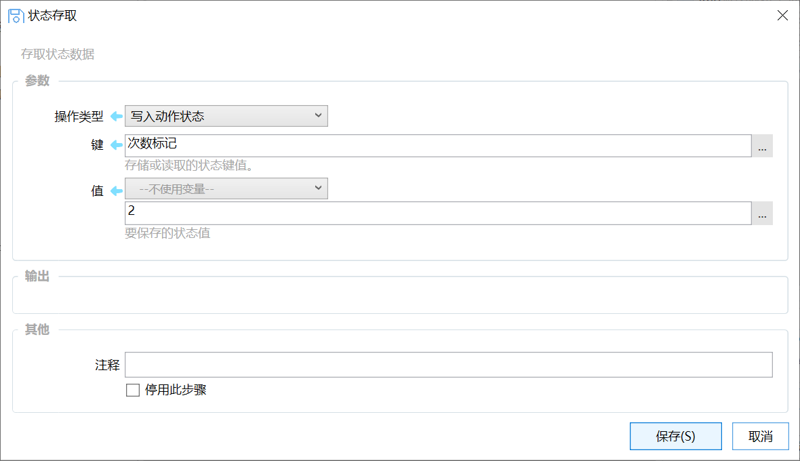

如果写入的状态值为**\*NULL\***，则删除此状态数据。

### 读取全局状态，写入全局状态

允许在不同动作中访问的一个全局存储的状态。

注意：

-   谨慎使用此功能。全局状态可以被所有动作读取和写入，会造成额外的冲突可能。
-   仅在自己使用的动作中使用，不要分享使用了全局状态的动作。
-   避免Key名称冲突。
-   避免保存大量内容。

### 状态数据的存储

一个动作的所有状态使用json格式保存在 C:\\Users\\用户名\\AppData\\Local\\Quicker\\states 目录下，文件名为 "state\_*动作ID*.json"。

#### 清理状态数据

如果动作保存了状态数据，可以在动作上点右键，在上下文菜单里选择“信息”-&gt;“动作数据”-&gt;“删除动作数据”。

如果希望查看或手动编辑状态数据文件，可以按Shift点击删除状态数据菜单。

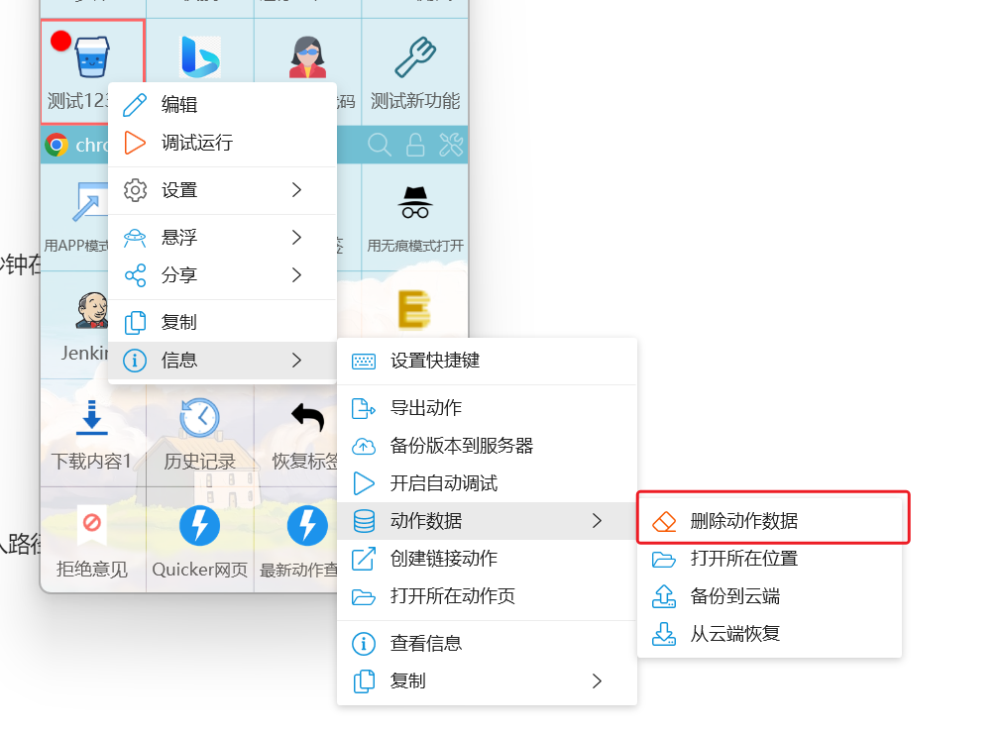

#### 如何同步状态数据

专业版1.38.28 版本支持自动备份状态数据功能（仅备份，不是同步），需要自行开启相关选项。[参考文档](/v2/xaction/modules/statestorage)

免费版用户可以使用第三方工具如onedrive、坚果云等同步状态数据。

请参考：[https://getquicker.net/KC/Kb/Article/187](https://getquicker.net/KC/Kb/Article/187)

### 状态数据的缓存机制

为提升性能，在写入状态时并不会马上更新到状态文件中，而是先写入到内存缓存中，等2秒钟在没有新的写入状态操作时才写入到文件。

读取状态时，也不会直接从状态文件读取，而是从缓存中读取。

### 示例动作

-   [搜索Everything](https://getquicker.net/sharedaction?code=85f82b64-b24c-4e46-ba2c-08d6db3483c9) 使用状态存储everything软件的路径。在第一次运行时弹窗提示用户输入路径，下次就可以直接读取使用了。
-   [示例：切换执行操作](https://getquicker.net/Sharedaction?code=80dae94c-de3c-4a50-dbe6-08d7053e26bb) 第一次打开软件A，第二次打开软件B
-   [示例：循环切换](https://getquicker.net/sharedaction?code=8af98895-ef82-46d1-dbe7-08d7053e26bb)  循环切换列表中的内容
-   [示例：状态存储](https://getquicker.net/Sharedaction?code=531248a5-f5ac-4ae5-75bd-08d709af9122) 文件名每次加1

## 变量作为状态使用

让变量的值在动作结束后自动保存到状态中，并在下次运行动作时自动加载上次保存的值。

如果是第一次运行，则使用默认值。

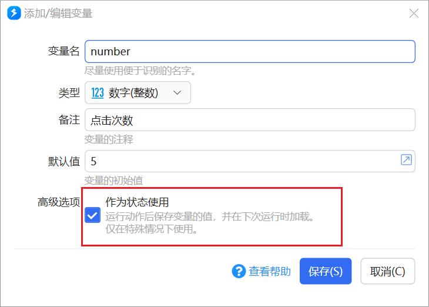

使用此选项可以大幅度减少状态存取操作。 比如使用一些变量保存动作设置，可以直接用表单修改变量本身的值即可，不需要再进行其它操作。

### 示例动作

-   [示例：计数器](https://getquicker.net/sharedaction?code=acdba4d6-1c7a-4546-a11f-08d92725bcba) 每点击一次动作，计数加1
-   [截图到桌面](https://getquicker.net/sharedaction?code=2214ddb5-d718-4da5-2c60-08d6c8ffb643) 用变量保存截图的保存位置。右键菜单可以打开设置位置的界面。

### 注意事项

**避免修改作为状态使用的变量的名称。**这种情况下，状态是和变量名对应的。如果修改了变量名，状态就丢失关联了，再次运行动作时会造成无法读取状态值。

变量对应的状态将在下面的情况下被更新：

-   在通过模块输出参数或表单步骤更新变量时；
-   在动作结束时；

动作启动时，根据状态中的存储内容更新变量值。 之后是变量到状态的单向更新，直至动作结束。

如果动作有多个实例同时运行，后结束的动作的变量值会最终写入到状态中。

## 更新动作修饰

以下功能自1.9.13版本开始提供。

在动作按钮上显示徽标文字（靠右）或徽标图标（靠左），也可以同时显示。

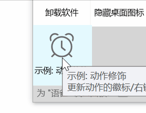

设置的动作徽标信息会一直存在（即便动作已停止），除非在动作中将其设置为空。所以它和状态具有类似的性质，通常也会和状态一起使用：将某个信息（如控制动作功能的选项）保存在状态中，同时设置徽标，在动作上直接展示该信息。

### 设置徽标图标

显示在动作左上角的图标。

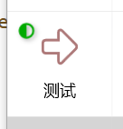

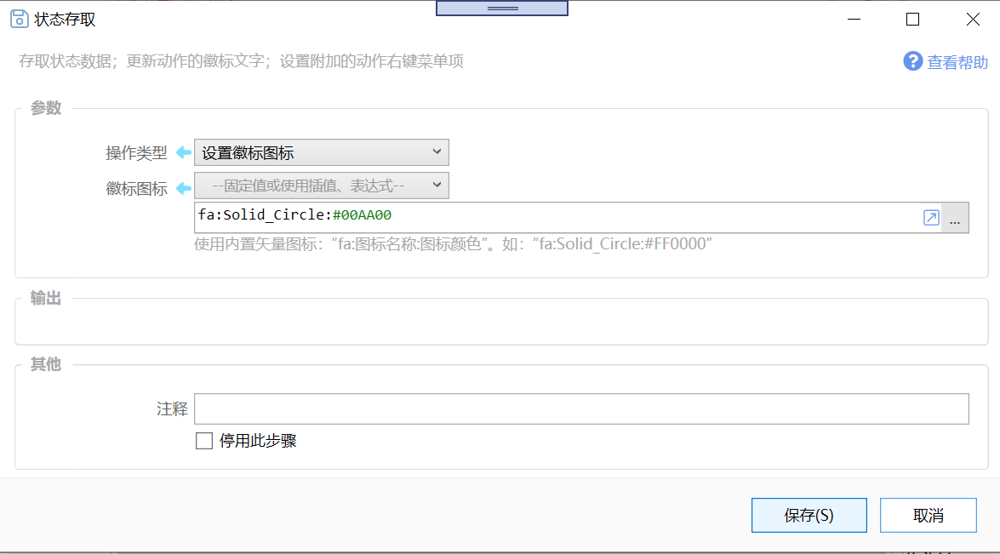

参数：

【徽标图标】使用 **fa:图标名称:图标颜色** 的格式设置图标。图标名称为Quicker内置[矢量图标](https://getquicker.net/kc/manual/doc/svg-icon)的名称，可以在图标管理窗口中查看。颜色使用#RRGGBB格式。参数内容为空时，会去除图标。

### 设置徽标文字

显示在动作按钮右上角位置的文字内容。可以控制底色/文字颜色和文字内容。

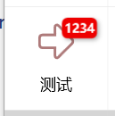

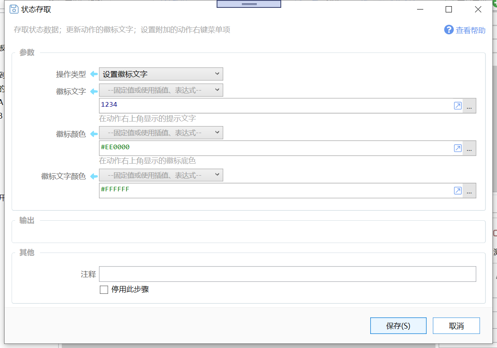

参数：

【徽标文字】要显示的文字内容。参数内容为空时去除徽标。请使用尽量简单的字母或数字。在低分辨率的屏幕上，因为文字较小，可能不容易分辨。

【徽标颜色】底色，使用#RRGGBB格式的颜色值。默认为红色。

【徽标文字颜色】文字颜色，使用#RRGGBB的格式指定。 默认为白色。

### 去除动作徽标

除了在动作中将徽标文字和徽标图标清空，也可以使用动作菜单将徽标内容和动作状态一起清空：

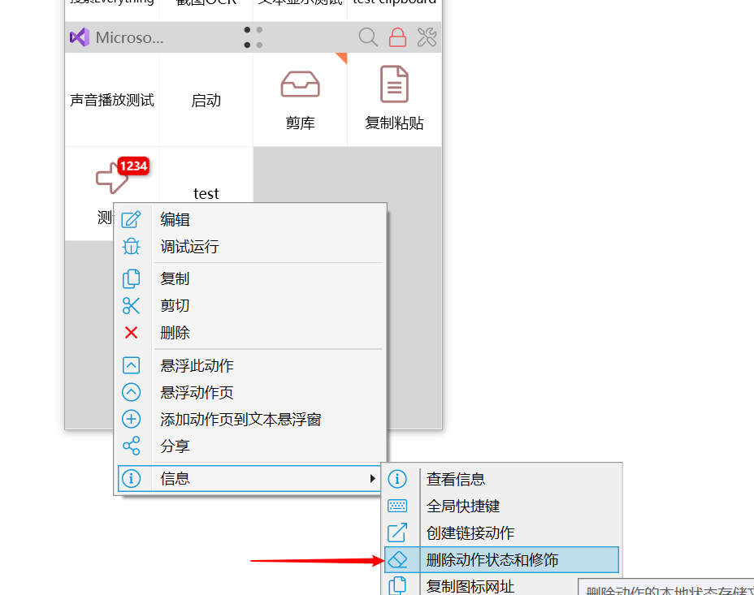

### 设置附加的右键菜单

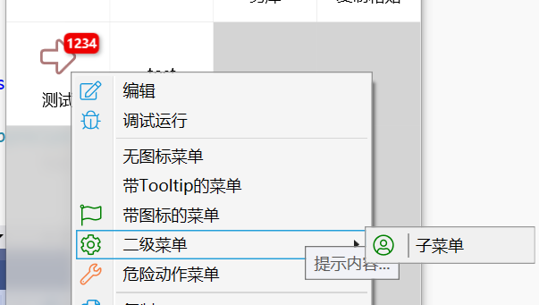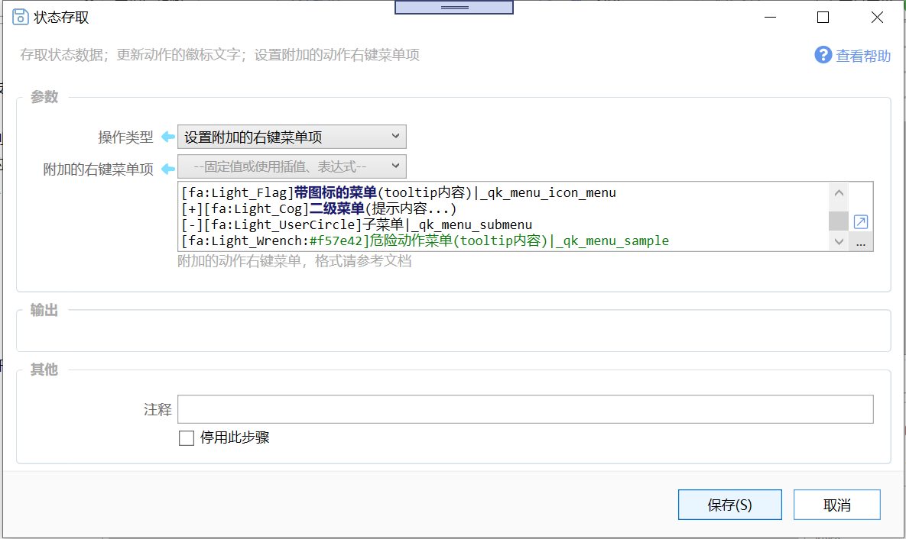

本功能提供了一个在动作中更新右键菜单的渠道。

右键菜单数据的格式请参考：[/v2/xaction/concepts/action-custom-context-menu](/v2/xaction/concepts/action-custom-context-menu)

注：通过本模块设置的右键菜单条目将显示在动作选项中设置的右键菜单条目下方。

可以结合2这两个设置右键菜单的功能：

-   在动作选项中，设置固定的右键菜单条目。
-   用本模块设置需要变化的右键菜单条目。

示例动作：

-   [https://getquicker.net/sharedaction?code=4aaaaf6c-1883-4c3a-9ed6-08d85d9ed340](https://getquicker.net/sharedaction?code=4aaaaf6c-1883-4c3a-9ed6-08d85d9ed340)

### 修饰数据的存储

动作的修饰数据保存在\_action\_adorn.json文件中，位于状态数据文件夹下（C:\\Users\\用户名\\AppData\\Local\\Quicker\\states）。

## 状态数据的备份和恢复

自1.38.28+版本开始试验性提供动作状态的自动和手动备份、恢复功能。

**注意事项：**

-   仅限专业版使用；
-   需手动开启设置；
-   自动备份：每一小时备份一次发生变化的状态数据；
-   只备份状态文件小于1000KB的状态数据；
-   状态数据会使用gzip压缩+以当前用户身份信息为秘钥的AES加密后发送到服务器进行存储；
-   自动备份有效期为30天，手动备份有效期为365天，过期自动删除；

**自动备份**

请在这里开启自动备份功能。

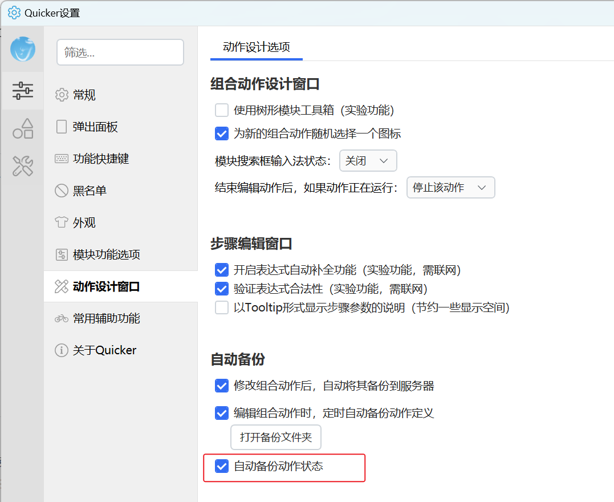

**手动备份**

动作右键菜单-信息-动作数据-备份到云端。

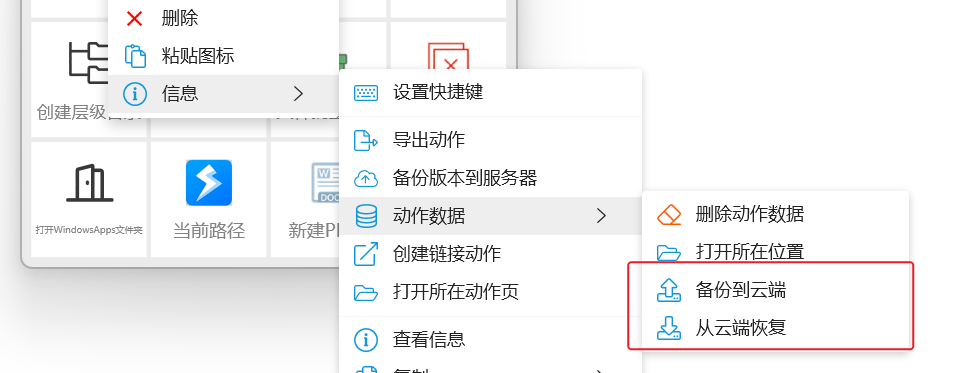

点击后，可输入备份说明。

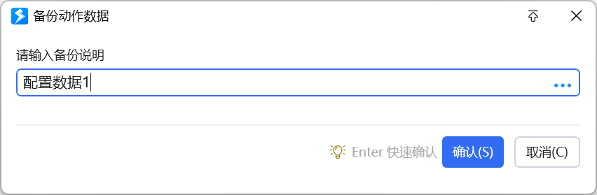

**恢复历史备份**

动作右键菜单-信息-动作数据-从云端恢复。

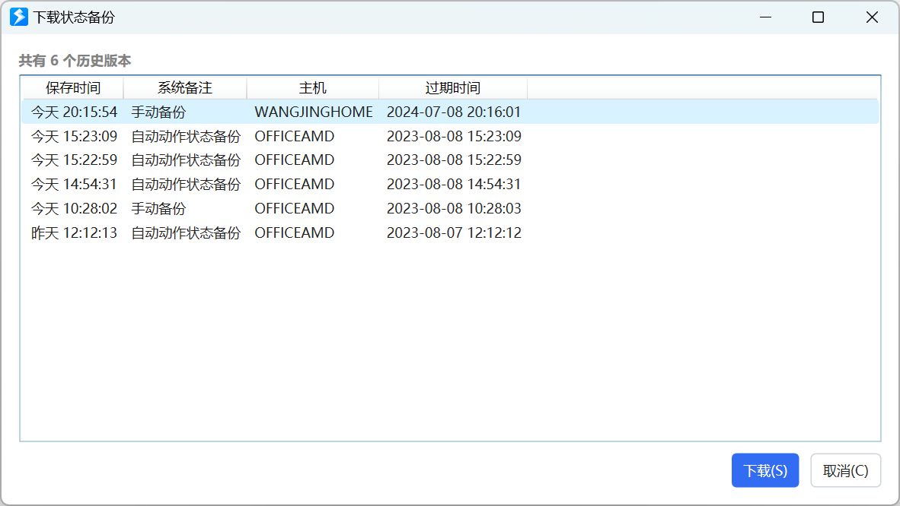

选择一个备份后，点击“下载”按钮，即可将状态数据恢复到此时间。
