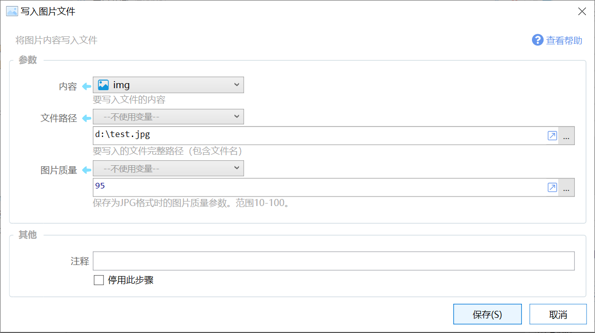

# 写入图片文件

将图片内容写入文件

{/* xaction-metadata:start */}
## 当前模块定义

- 模块 Key：`sys:WriteImageFile`
- 分类：系统操作（`Files`）
- 类型：`Action`
- 风险操作：否
- 专业版：否

## 输入参数

| Key | 名称 | 类型 | 默认值 | 必填 | 变量模式 | 条件 | 说明 |
| --- | --- | --- | --- | --- | --- | --- | --- |
| `content` | 图片 | `Image` |  | 是 | `UseVar` |  | 要写入文件的图片（变量） |
| `filePath` | 文件路径 | `Text` |  | 是 | `UseVarOrInput` |  | 要写入的文件完整路径（包含文件名） |
| `quality` | 图片质量 | `Text` | 95 | 是 | `UseVarOrInput` |  | 保存为JPG格式时的图片质量参数。范围10-100。 |
| `stopIfFail` | 失败后停止 | `Boolean` | true | 否 | `Input` |  | 失败后是否停止动作 |

## 输出参数

| Key | 名称 | 类型 | 条件 | 说明 |
| --- | --- | --- | --- | --- |
| `isSuccess` | 是否成功 | `Boolean` |  | 操作是否成功 |
{/* xaction-metadata:end */}

将图片写入文件。

支持的图片格式类型：.jpg, .png, .bmp, .tiff

## 参数

### 输入

【内容】要写入文件的图片。

【文件路径】完整的图片文件路径。必须使用包含完整文件名的路径。Quicker将根据后缀名判断保存文件的格式。

【图片质量】当保存格式为jpg格式时，指定图片质量，可选范围 10-100。数字越小，图片压缩程度越高，文件越小，图片质量越差。(1.5.7之后加入)

## 更改历史

-   1.5.7 增加图片质量参数。
