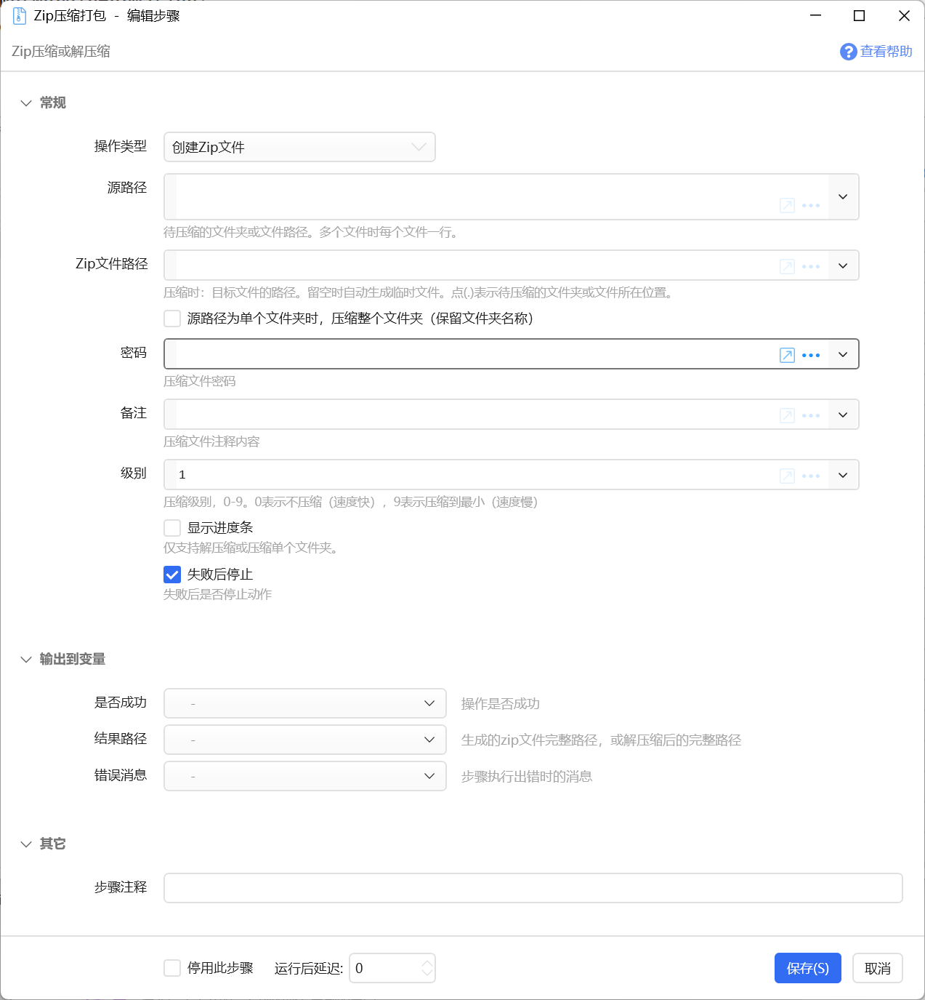
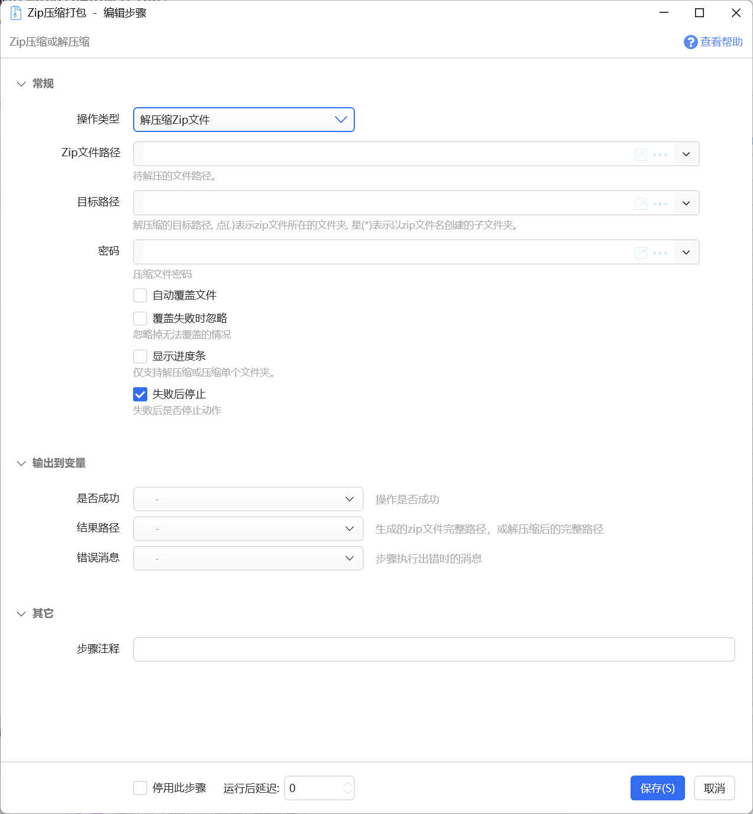

# Zip压缩打包

Zip压缩或解压缩

## 当前模块定义

<XActionModuleMeta moduleKey="sys:zip" />

## 概要

本模块支持2个功能：

-   将文件夹或多个文件打包成一个zip文件；
-   解压缩一个zip文件到指定文件夹；

注：

本模块适用于需要将几个文件打包发送给他人等轻量级使用场景，不适合压缩大文件或大量文件，不适合解压缩大文件。

本模块从1.8.2版本开始提供。

## 操作：创建zip文件

将指定的文件夹或多个文件压缩为一个zip文件。

### 输入参数

【源路径】

需要压缩打包的内容，可以为如下几种：

-   1个文件夹路径
-   1个文件
-   同一文件夹下的多个文件或子文件夹

【Zip文件路径】

生成的目标zip文件路径。可以按如下格式指定：

-   完整的zip文件路径，如：d:\\backup\\20200618\_work.zip
-   留空，自动在Windows临时目录中生成文件。并将生成的zip文件路径从【结果路径】参数中输出。
-   英文句点“.”,待压缩的文件或文件夹所在路径，文件名自动生成，从【结果路径】参数中输出。

【源文件为单个文件夹时，压缩整个文件夹】

单个文件夹时，是否将文件夹本身也打包到zip中。 不选择时，会将文件夹内的内容压缩，而不包含文件夹自身。

【密码】 设置zip文件的密码。

【备注】 压缩文件中保存的备注文字。

【级别】 压缩级别，越大，压缩率越高，文件越小，但是也会越慢。

【显示进度条】 压缩时是否显示进度条。

### 输出参数

【是否成功】是否成功完成了操作。

【结果路径】生成的zip文件的完整路径。

## 操作：解压缩zip文件

将zip文件解压缩到指定文件夹。

### 输入参数

【zip文件路径】要解压缩的zip文件完整路径。

【目标路径】要解压缩到的位置，支持如下格式：

-   目标文件夹的完整路径
-   英文句点“.”，将文件解压缩到zip文件所在的文件夹。
-   星号“\*”，解压缩到以zip文件名创建的子文件夹中。

【密码】 zip文件的密码。

【自动覆盖文件】 解压缩时覆盖已有文件。

【覆盖失败时忽略】 如果无法覆盖已有文件，是否忽略错误继续解压缩其它文件。

【显示进度条】 解压缩时显示进度条。
