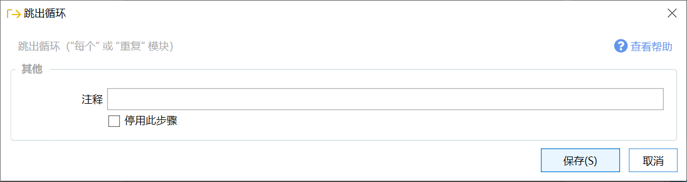

# 跳出循环(break)

跳出循环（"每个" 或 "重复" 模块）

## 当前模块定义

<XActionModuleMeta moduleKey="sys:break" />

在循环模块（如“[每个](/v2/xaction/modules/each)”，“[重复](/v2/xaction/modules/repeat)”等）中，**跳过后面的步骤** 并 **结束循环**。

类似于编程语言中的**break**语句。

如：总共需要循环100次，在第10次时跳出循环，则后面的90次不会再执行。

## 示例

-   示例：跳出循环 [https://getquicker.net/sharedaction?code=0a14cda4-a4e6-4b50-75b9-08d709af9122](https://getquicker.net/sharedaction?code=0a14cda4-a4e6-4b50-75b9-08d709af9122)
