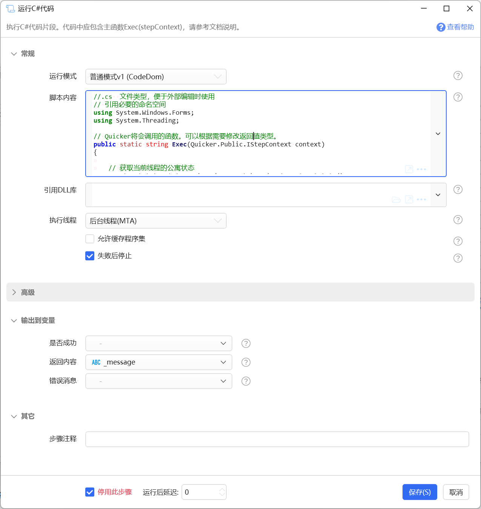

# 运行C#代码

执行C#代码片段。代码中应包含主函数Exec(stepContext)，请参考文档说明。

{/* xaction-metadata:start */}
## 当前模块定义

- 模块 Key：`sys:csscript`
- 分类：程序流程（`Flow`）
- 类型：`Action`
- 风险操作：是
- 专业版：否

## 输入参数

| Key | 名称 | 类型 | 默认值 | 必填 | 变量模式 | 条件 | 说明 |
| --- | --- | --- | --- | --- | --- | --- | --- |
| `mode` | 运行模式 | `Enum` | normal_roslyn | 是 | `Input` |  | 普通模式：在Quicker进程中执行；低权限模式：在单独的进程中执行，可用于COM操作。 |
| `script` | 脚本内容 | `Text` | //.cs  文件类型，便于外部编辑时使用<br />// 引用必要的命名空间<br />using System.Windows.Forms;<br /><br />// Quicker将会调用的函数。可以根据需要修改返回值类型。<br />public static void Exec(Quicker.Public.IStepContext context)<br />&#123;<br />    //var oldValue = context.GetVarValue("varName");  // 读取动作里的变量值<br />    //MessageBox.Show(oldValue as string);<br />    //context.SetVarValue("varName", "从脚本输出的内容。"); // 向变量里输出值<br />    MessageBox.Show("Hello World!");<br />&#125;<br /> | 是 | `UseVarOrInput` | 仅：normal_roslyn | 要运行的脚本内容 |
| `scriptForLp` | 脚本内容 | `Text` | //.cs  文件类型，便于外部编辑时使用<br />// 引用必要的命名空间<br />using System.Windows.Forms;<br /><br />// Quicker将会调用的函数<br />public static string Exec(string paramValue)<br />&#123;<br />    System.Windows.Forms.MessageBox.Show("Hello World!");<br />    return "Hello World!";<br />&#125;<br /> | 是 | `UseVarOrInput` | 仅：low_permission_roslyn | 要运行的脚本内容 |
| `scriptForAssembly` | 脚本内容 | `Text` | //.cs  文件类型，便于外部编辑时使用<br />// 引用必要的命名空间<br />using System.Windows.Forms;<br /><br />namespace MyNamespace<br />&#123;<br />    // Quicker将会调用的函数<br />    public static class MyClass<br />    &#123;<br />        public static string Exec(string paramValue)<br />        &#123;<br />            System.Windows.Forms.MessageBox.Show("Hello World!");<br />            return "Hello World!";<br />        &#125;<br />    &#125;<br />&#125;<br /> | 是 | `UseVarOrInput` | 仅：generate_assembly | 要运行的脚本内容 |
| `paramValue` | 参数值 | `Text` |  | 是 | `UseVarOrInput` | 仅：low_permission_roslyn | 传递给Exec的参数 |
| `reference` | 引用DLL库 | `Text` |  | 否 | `Input` |  | 要引用的DLL文件，每行一个。也可以在代码中使用 #r 指令。 |
| `enableCache` | 开启磁盘缓存 | `Boolean` | true | 否 | `Input` | 仅：normal_roslyn, low_permission_roslyn | 是否将编译结果缓存到磁盘。关闭后仍会按最终脚本内容在当前进程内自动复用；脚本使用 $= 表达式或 $$ 插值动态生成时，会自动关闭磁盘缓存。 |
| `runOnUiThread` | 执行线程 | `Enum` | auto | 否 | `Input` | 仅：normal_roslyn | 是否在界面线程上运行代码。如果在脚本中使用了wpf窗口，请选中此项。 |
| `waitResp` | 等待返回 | `Boolean` | true | 否 | `Input` | 仅：low_permission_roslyn | 是否等待脚本返回结果 |
| `waitMs` | 最长等待时间(ms) | `Number` | 10000 | 是 | `Input` | 仅：low_permission_roslyn | 最长的等待返回结果的，毫秒数 |
| `stopIfFail` | 失败后停止 | `Boolean` | true | 否 | `Input` |  | 失败后是否停止动作 |

## 输出参数

| Key | 名称 | 类型 | 条件 | 说明 |
| --- | --- | --- | --- | --- |
| `isSuccess` | 是否成功 | `Boolean` |  | 操作是否成功 |
| `resp` | 返回内容 | `Text` | 仅：low_permission_roslyn | 脚本执行返回的结果文本 |
| `rtn` | 返回内容 | `Any` | 仅：normal_roslyn | Exec方法的返回值 |
| `rtnAssembly` | 程序集对象 | `Object` | 仅：generate_assembly | 生成的Assembly对象（已经加载） |
| `assemblyPath` | 程序集路径 | `Text` | 仅：generate_assembly | 生成的Assembly路径 |

## 选项值

### `mode` 运行模式

| Value | 名称 | 说明 |
| --- | --- | --- |
| `normal_roslyn` | 普通模式 |  |
| `low_permission_roslyn` | 低权限模式 |  |
| `generate_assembly` | 生成程序集 |  |

### `runOnUiThread` 执行线程

| Value | 名称 | 说明 |
| --- | --- | --- |
| `auto` | 自动 |  |
| `ui` | UI线程 |  |
| `background` | 后台线程(MTA) |  |
| `sta` | 后台线程(STA) |  |
| `staLongRun` | 后台线程(STA独立线程) |  |
{/* xaction-metadata:end */}

**【注意】请勿设计任何可能侵犯Quicker软件或第三方权益的代码或其他恶意代码。如有违反将直接停用Quicker帐号，请知悉。**


通过运行C#代码实现更高级的功能。

此功能仅限对C#熟悉的用户谨慎使用。

-   普通模式和低权限模式（v1版本）使用cs-script组件实现，参考：[https://github.com/oleg-shilo/cs-script.net-framework](https://github.com/oleg-shilo/cs-script.net-framework) 为减小安装包，仅引用了CS-Script.lib，支持C#5.0语法。
-   普通模式和低权限模式v2版本使用Roslyn引擎，支持较新的c#语法。


注：

-   编译c#时，会根据c#代码的内容生成程序集。内容相同，可以复用已有程序集，内容不同则会生成新的程序集。因此，c#代码应尽量保持不变，应该避免使用文本插值方式生成脚本代码。
-   一些通过Interop控制Office软件的代码，因.net底层库的问题，可能出现编译失败、运行出错的情况，此时请使用 v2版本（普通模式v2或低权限模式v2）。
-   从第三方网页中复制的代码可能会有不可见字符，如遇到奇怪的编译错误可考虑此因素的可能性。


## 运行模式


**普通模式v1 (CodeDOM)**

C# 代码在Quicker的进程中执行，可以访问动作的变量等信息。

因为Quicker会自动提权运行，所以在Quicker进程中，有可能无法通过Com接口访问和控制第三方程序。

**普通模式v2 (Roslyn)**

使用Roslyn引擎编译和执行c#脚本，支持较新的c#语法。整个Quicker中，第一次使用此模块编译(冷启动)需要耗费较长时间。程序集会被自动缓存。

**低权限模式v1 (CodeDOM)** （*1.33.26+版本增加*）

C# 代码传入一个低权限模式运行的代理进程 （LPAgent）中执行。 这时候因为跨越进程，无法访问Quicker动作中的变量等信息，只能进行简单的文本变量传递。

**低权限模式v2 (Roslyn)**

使用Roslyn引擎编译和执行c#脚本，支持较新的c#语法。

请注意，普通模式和低权限模式的Exec方法的声明不同，不支持混用。

**生成程序集**

编译c#代码，并生成和加载程序集。

## 普通权限模式

代码直接在Quicker进程中执行。这时候可以通过context参数访问动作变量。



### 参数

#### **模块输入**

【脚本内容】要运行的c#代码。

C#代码中必须包含一个Exec静态函数，接受`IStepContext`类型的参数，有或无返回值，参考如下示例：


```
// 引用必要的命名空间
using System.Windows.Forms;

// Quicker将会调用的函数
public static void Exec(Quicker.Public.IStepContext context){
  var oldValue = context.GetVarValue("varName");  // 读取动作里的变量值
  MessageBox.Show(oldValue as string);
  context.SetVarValue("varName", "从脚本输出的内容。"); // 向变量里输出值
}
```


该方法可根据需要修改为带有返回值，并从【返回内容】输出参数中得到结果。

```
//.cs  文件类型，便于外部编辑时使用
// 引用必要的命名空间
using System.Windows.Forms;
using System.Threading;

// Quicker将会调用的函数。可以根据需要修改返回值类型。
public static string Exec(Quicker.Public.IStepContext context)
{
  // 获取当前线程的公寓状态
  ApartmentState state = Thread.CurrentThread.GetApartmentState();

  // 将公寓状态转换为字符串
  string message = state == ApartmentState.STA ? "STA" : "MTA";

  return message;
}
```


【引用DLL库】脚本内容需要引用（reference）的其他.Net库文件的完整路径。 每行写一个。

【允许缓存程序集】是否允许缓存代码编译后的程序集，以方便下次运行时直接加载程序集，提升启动速度。

-   程序集缓存每次升级版本会丢弃。
-   缓存目录为Windows临时文件目录。


【执行线程】选择执行此c#代码的线程。

-   自动：Quicker根据一定的规则自动判断需要使用哪个线程。
-   UI线程：Quicker程序的主界面线程。需要避免在此线程中执行有可能产生停顿的代码。
-   后台线程（MTA）：如果代码不涉及界面、COM操作，请使用此选项，避免可能造成的卡顿或内存无法释放问题。
-   后台线程（STA）：当在代码中使用COM互操作、剪贴板等情况时，有可能需要在STA公寓模型的线程中执行代码。此选项会使用一个共享的STA线程执行代码，适合于可快速执行完毕的代码。
-   后台线程（STA独立线程）：当代码中需要长时间等待，并且需要在STA公寓模型线程中执行代码时使用。此选项会创建一个新的STA线程用于执行目标代码。


【失败后停止】c#运行错误时，停止当前动作。


#### **模块输出**

【是否成功】代码是否正常执行完毕，没有遇到异常抛出。

【返回内容】当代码中的`Exec`方法带有返回值时，从此输出得到返回的值。（注意，普通模式v1方式从1.40.16+之后的版本才支持输出此值）。


### 调用


#### IStepContext 接口

Exec函数需要接收一个IStepContext接口类型的参数，从而实现Quicker动作变量的读写。

接口的声明如下：

```
namespace Quicker.Public
{
    /// <summary>
    /// 脚本参数接口
    /// </summary>
    public interface IStepContext
    {
        /// <summary>
        /// 获取变量值
        /// </summary>
        /// <param name="varName">变量名</param>
        /// <returns>返回的结果类型，根据需要进行类型转换。</returns>
        object GetVarValue(string varName);

        /// <summary>
        /// 设置变量值
        /// </summary>
        /// <param name="varName">变量名</param>
        /// <param name="value">值，需要根据变量的类型传入合适类型的值</param>
        void SetVarValue(string varName, object value);
    }
}
```


GetVarValue读取变量值，SetVarValue输出变量值。请在必要时进行类型转换。 词典，列表，不需要


#### 错误处理

如果遇到了错误，直接抛出异常即可。


### 引用外部dll文件


```
//css_reference office.dll;
//css_reference  C:\Program Files ((x86))\TestProj\PInvoke.Kernel32.dll
```


所有// css\_ \*指令都应通过将分隔符加倍来转义任何内部CS-Script分隔符。 例如，''script(today).cs'的// css\_include应该转义为括号，因为它们是指令定界符。 因此，正确的语法应如下所示：'//css\_include script((today)).cs'


.NET 自带的库通常应该可以直接通过using 命名空间的方式使用。 如果遇到找不到名称的问题，可以使用如下代码从系统GAC（应用程序集缓存）中加载。

```
//css_dir C:\Windows\Microsoft.NET\assembly\GAC_MSIL\**
//css_ref UIAutomationClient.dll //<---要引用的DLL
```


关于更多的指令说明文档，请参考：[https://www.cs-script.net/cs-script/help-legacy/Directives.html](https://www.cs-script.net/cs-script/help-legacy/Directives.html)


### 带有界面的C#脚本注意事项

-   如果在c#代码中使用WPF窗体：

-   应该选择使用“前台线程”运行脚本；
-   脚本中如果使用ShowDialog()以模态方式显示窗体，将会暂时不能操作其它Quicker窗口。

-   如果在c#代码中使用Winform窗体：

-   应该选择使用“后台线程”运行脚本。
-   如果使用前台线程运行，可能会出现奇怪的现象：输入框无法输入汉字。


## 低权限运行模式

代码将传送到LPAgent进程中执行。此时因为跨进程，代码中无法访问动作中的其它变量，只能传递简单的文本参数和返回值。


#### 输入参数

【脚本内容】

要执行的脚本内容。

需要在代码中声明`public static string Exec(string paramValue)`方法。

该方法的`paramValue`用于接收当前步骤中“参数值”中传入的内容。返回的值将通过“返回内容”输出到步骤。

```
//.cs  文件类型，便于外部编辑时使用
// 引用必要的命名空间

// Quicker将会调用的函数
public static string Exec(string paramValue)
{
    return "要返回的内容";
}
```


【参数值】

传递给`Exec(string paramValue)`方法的`paramValue`参数。

【引用库】

需要在c#中额外引用的dll文件的路径，每行一个。（已加入全局程序集缓存(GAC)的，可以直接写dll文件名，否则写dll文件的完整路径。）

【等待返回】

是否等到`Exec(string paramValue)`方法执行完毕，并获取其返回值（从“返回内容”中输出）。 如果不等待，则“返回内容”输出为空。

#### 输出参数

【返回内容】在启用“等待返回”选项时，输出`Exec(string paramValue)`方法的返回值。

## 更新说明

-   20230406 增加v2版本说明。
-   20230731 增加网页复制代码可能带有不可见字符的说明。
-   20231130 执行线程参数增加STA相关选项，以解决动作线程改为MTA公寓模型可能产生的兼容性问题。 普通模式v1 增加支持返回值。
-   20250120 更新文档标题，以匹配实际功能。
