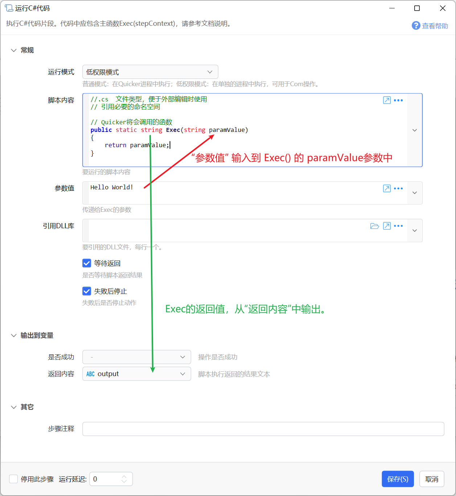

# 运行C#代码

执行 C# 代码。普通模式可直接写语句（纯脚本），也可继续使用完整的 `Exec(context)`；低权限模式与生成程序集模式仍需按各自入口方法声明编写。

## 当前模块定义

<XActionModuleMeta moduleKey="sys:csscript" />

**【注意】请勿设计任何可能侵犯Quicker软件或第三方权益的代码或其他恶意代码。如有违反将直接停用Quicker帐号，请知悉。**

通过运行 C# 代码实现更高级的功能。此功能仅限对 C# 熟悉的用户谨慎使用。

- 普通模式和低权限模式（v1 版本）使用 cs-script 组件实现，参考：[https://github.com/oleg-shilo/cs-script.net-framework](https://github.com/oleg-shilo/cs-script.net-framework)。为减小安装包，仅引用了 CS-Script.lib，支持 C# 5.0 语法。
- 普通模式和低权限模式 v2 版本使用 Roslyn 引擎，支持较新的 C# 语法。**直接编写纯脚本**仅适用于普通模式（Roslyn）。

注：

- 编译 C# 时，会根据代码内容生成程序集。内容相同可复用已有程序集，内容不同则会生成新的程序集。因此代码应尽量保持不变，避免用文本插值动态拼出整段脚本。
- 一些通过 Interop 控制 Office 的代码，因 .NET 底层库问题，可能出现编译失败、运行出错，此时请使用 v2 版本（普通模式 v2 或低权限模式 v2）。
- 从第三方网页复制的代码可能会有不可见字符；若遇到奇怪的编译错误，可优先排查这一点。

## 运行模式

**普通模式 v1 (CodeDOM)**

C# 代码在 Quicker 进程中执行，可以访问动作的变量等信息。因为 Quicker 会自动提权运行，有可能无法通过 COM 接口访问和控制第三方程序。

**普通模式 v2 (Roslyn)**

使用 Roslyn 引擎编译和执行 C# 脚本，支持较新的 C# 语法。整个 Quicker 中，第一次使用此模块编译（冷启动）需要较长时间。程序集会被自动缓存。支持下文的「直接编写脚本」。

**低权限模式 v1 (CodeDOM)**（*1.33.26+ 版本增加*）

C# 代码传入低权限代理进程（LPAgent）中执行。跨进程时无法访问动作变量，只能进行简单的文本传递。

**低权限模式 v2 (Roslyn)**

使用 Roslyn 引擎编译和执行 C# 脚本。请注意：普通模式与低权限模式的入口方法声明不同，不支持混用。低权限模式仍需手写 `Exec(string paramValue)`。

**生成程序集**

编译 C# 代码，并生成和加载程序集。

## 普通权限模式

代码直接在 Quicker 进程中执行，可通过 `context` 访问动作变量。

<ModuleParamPreview moduleKey="sys:csscript" />

### 直接编写脚本（推荐）

不必再写 `public static void Exec(...)`。在 **脚本内容** 里直接写语句即可；Quicker 会在运行前自动包一层入口，并注入名为 `context` 的步骤上下文。

适用于：**普通模式（Roslyn）**。低权限模式、生成程序集模式请继续使用各自的完整入口方法。

#### 最短示例

```csharp
//.cs  文件类型，便于外部编辑时使用
using System.Windows.Forms;

// 末行表达式即返回值，会出现在步骤输出「返回内容」
MessageBox.Show("Hello World!");
"done"
```

#### 读写动作变量

```csharp
using System.Windows.Forms;

var oldValue = context.GetVarValue("varName");
MessageBox.Show(oldValue as string);
context.SetVarValue("varName", "从脚本输出的内容。");
```

#### 末行表达式作为返回值

最后一行若是**表达式**（不是以分号结尾的普通语句），会当作返回值，写入模块输出 **返回内容**（`rtn`）。

```csharp
var name = context.GetVarValue("name") as string ?? "";
$"Hello, {name}"
```

也可以显式 `return`：

```csharp
return DateTime.Now.ToString("O");
```

若末行是 `MessageBox.Show(...)` 这类本身没有可用返回值的调用，编译器会按「无返回值」处理；需要同时弹窗并返回文本时，把返回值单独放在最后一行（见最短示例）。

#### 使用 await

脚本中出现 `await` 时，宿主会按异步方式编译并**等待完成**后再继续后续步骤。返回 `Task` / `ValueTask`（以及带结果的泛型形式）时，**返回内容** 取等待完成后的解包结果。

```csharp
await Task.Delay(200);
context.SetVarValue("ready", true);
"ok"
```

#### 何时仍应写完整 Exec

以下情况不会按「纯脚本」包装，请继续用完整入口（或类成员）写法：

- 已经声明了 `static Exec(...)` 或 `static Run(...)`；
- 代码里包含 `class` / `struct` / `namespace` 等类型声明；
- 使用了 `public` / `private` 等访问修饰符声明成员（例如辅助方法）。

注释里写到 `Exec` 或 `public` **不会**妨碍纯脚本；只有真正出现在代码里的声明才会切换回传统路径。

### 完整 Exec 写法

也可以继续手写 `Exec`。接受 `IStepContext` 参数，可有可无返回值：

```csharp
using System.Windows.Forms;

public static void Exec(Quicker.Public.IStepContext context)
{
    var oldValue = context.GetVarValue("varName");
    MessageBox.Show(oldValue as string);
    context.SetVarValue("varName", "从脚本输出的内容。");
}
```

带返回值时，从 **返回内容** 输出参数取得结果：

```csharp
using System.Windows.Forms;
using System.Threading;

public static string Exec(Quicker.Public.IStepContext context)
{
    ApartmentState state = Thread.CurrentThread.GetApartmentState();
    return state == ApartmentState.STA ? "STA" : "MTA";
}
```

### 参数

#### 模块输入

【脚本内容】要运行的 C# 代码。普通模式（Roslyn）推荐使用上文「直接编写脚本」；也可使用完整 `Exec`。

【引用 DLL 库】脚本需要引用的其他 .NET 库文件的完整路径，每行一个。

【允许缓存程序集】是否允许缓存编译后的程序集，以便下次直接加载、加快启动。

- 程序集缓存在每次升级版本后会丢弃。
- 缓存目录为 Windows 临时文件目录。

【执行线程】选择执行此 C# 代码的线程。

- 自动：Quicker 按规则自动判断。
- UI 线程：主界面线程。避免在此线程执行可能停顿的代码。
- 后台线程（MTA）：不涉及界面、COM 时优先使用，减少卡顿或内存无法释放。
- 后台线程（STA）：COM 互操作、剪贴板等可能需要 STA。使用共享 STA 线程，适合很快结束的代码。
- 后台线程（STA 独立线程）：需要长时间等待且必须在 STA 中执行时使用，会新建 STA 线程。

【失败后停止】C# 运行出错时，是否停止当前动作。

#### 模块输出

【是否成功】代码是否正常执行完毕（未抛出异常）。

【返回内容】纯脚本末行表达式 / `return` 的值，或 `Exec` 方法的返回值。若返回 `Task` / `ValueTask`，则为等待完成后的解包结果。（普通模式 v1 自 1.40.16+ 起支持该输出。）

### 调用

#### IStepContext 接口

纯脚本中的 `context`，以及 `Exec` 的参数，类型均为 `IStepContext`，用于读写动作变量：

```csharp
namespace Quicker.Public
{
    /// <summary>
    /// 脚本参数接口
    /// </summary>
    public interface IStepContext
    {
        /// <summary>
        /// 获取变量值
        /// </summary>
        /// <param name="varName">变量名</param>
        /// <returns>返回的结果类型，根据需要进行类型转换。</returns>
        object GetVarValue(string varName);

        /// <summary>
        /// 设置变量值
        /// </summary>
        /// <param name="varName">变量名</param>
        /// <param name="value">值，需要根据变量的类型传入合适类型的值</param>
        void SetVarValue(string varName, object value);
    }
}
```

`GetVarValue` 读取变量，`SetVarValue` 写入变量。必要时自行做类型转换。

#### 错误处理

遇到错误时直接抛出异常即可。

### 引用外部 dll 文件

```csharp
//css_reference office.dll;
//css_reference  C:\Program Files ((x86))\TestProj\PInvoke.Kernel32.dll
```

所有 `//css_*` 指令中，若路径含有 CS-Script 分隔符，需将分隔符加倍转义。例如对 `script(today).cs` 的 include，应将括号写成 `((today))`。

.NET 自带的库通常可直接 `using` 命名空间。若找不到名称，可从系统 GAC 加载：

```csharp
//css_dir C:\Windows\Microsoft.NET\assembly\GAC_MSIL\**
//css_ref UIAutomationClient.dll //<---要引用的DLL
```

更多指令说明见：[https://www.cs-script.net/cs-script/help-legacy/Directives.html](https://www.cs-script.net/cs-script/help-legacy/Directives.html)

### 带有界面的 C# 脚本注意事项

- 若使用 WPF 窗体：
  - 应选择在前台 / UI 线程运行；
  - 若使用 `ShowDialog()` 以模态显示，将暂时无法操作其它 Quicker 窗口。
- 若使用 WinForms 窗体：
  - 应选择后台线程运行；
  - 若在前台线程运行，可能出现输入框无法输入汉字等异常现象。

## 低权限运行模式

代码将传送到 LPAgent 进程中执行。跨进程时无法访问动作中的其它变量，只能传递简单的文本参数和返回值。



#### 输入参数

【脚本内容】

要执行的脚本内容。需要声明 `public static string Exec(string paramValue)`。

`paramValue` 接收当前步骤「参数值」中的内容；返回值通过「返回内容」输出。

```csharp
//.cs  文件类型，便于外部编辑时使用

public static string Exec(string paramValue)
{
    return "要返回的内容";
}
```

【参数值】

传递给 `Exec(string paramValue)` 的 `paramValue`。

【引用库】

额外引用的 dll 路径，每行一个。（已在 GAC 中的可只写文件名，否则写完整路径。）

【等待返回】

是否等到方法执行完毕并获取返回值。不等待时，「返回内容」为空。

#### 输出参数

【返回内容】在启用「等待返回」时，输出 `Exec(string paramValue)` 的返回值。

## 更新说明

- 20230406 增加 v2 版本说明。
- 20230731 增加网页复制代码可能带有不可见字符的说明。
- 20231130 执行线程参数增加 STA 相关选项；普通模式 v1 增加支持返回值。
- 20250120 更新文档标题，以匹配实际功能。
- 20260811 普通模式（Roslyn）支持直接编写纯脚本：末行表达式作返回值、可用 `context`、支持 `await` / Task 等待；完整 `Exec` 仍兼容。
