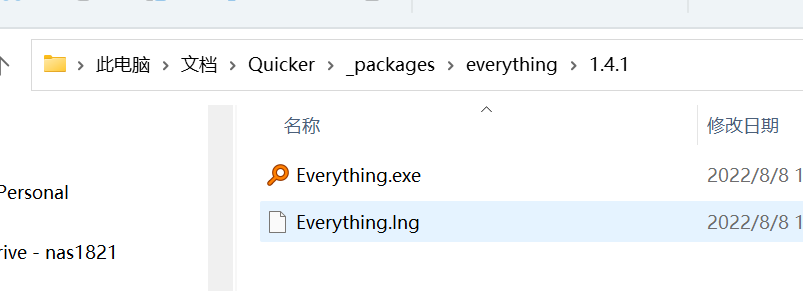

# 检查和下载依赖

从 Quicker 网站下载动作所需的第三方组件，并返回解压后的本地路径。需 Quicker 1.34.19+。

## 当前模块定义

<XActionModuleMeta moduleKey="sys:dependencycheck" />

## 概述

依赖包下载后会自动解压到：

`我的文档\Quicker\_packages\依赖包名\版本号`

<ModuleParamPreview
  moduleKey="sys:dependencycheck"
  values={{packageName: 'everything'}}
  outputVars={{packagePath: 'packagePath'}}
/>

## 参数说明

**依赖包名**：已经在官网上发布的依赖包名称。

**依赖包版本**：留空表示任意版本即可；写具体版本（如 `1.2.3`）表示最低版本。

**失败后停止**：失败后是否停止动作。默认开启。

## 输出

- **是否成功**：操作是否成功。
- **依赖包路径**：解压后的目录。路径里可能有空格（例如「我的文档」），后续拼命令行或传给外部程序时要加引号或转义。

## 依赖包的上传和管理

依赖包列表：[https://getquicker.net/share/depd/index](https://getquicker.net/share/depd/index)

目前上传权限只向一部分用户开放。其他用户如有需求，请联系 CL 代为上传。

依赖包应满足这些条件：

- 仅用于 Quicker 动作。请勿将下载地址公布到第三方网站（流量成本较高）。
- 不包含任何恶意内容、病毒，或不被第三方许可允许使用的文件。
- 小于 3MB。
- 打包为 zip（Quicker 会自动解压到目录）。
- 如果 x64 和 x86 需要不同文件，请打两个 zip 包，并保持相同的内部文件名和子目录结构，方便后续动作用同一路径调用。

## 相关链接

<RelatedDocs
  items={[
    {
      href: '/v2/xaction/modules/everythingsearch',
      label: '使用Everything搜索文件',
      description: '常见依赖包 everything 的用法。',
    },
  ]}
/>
