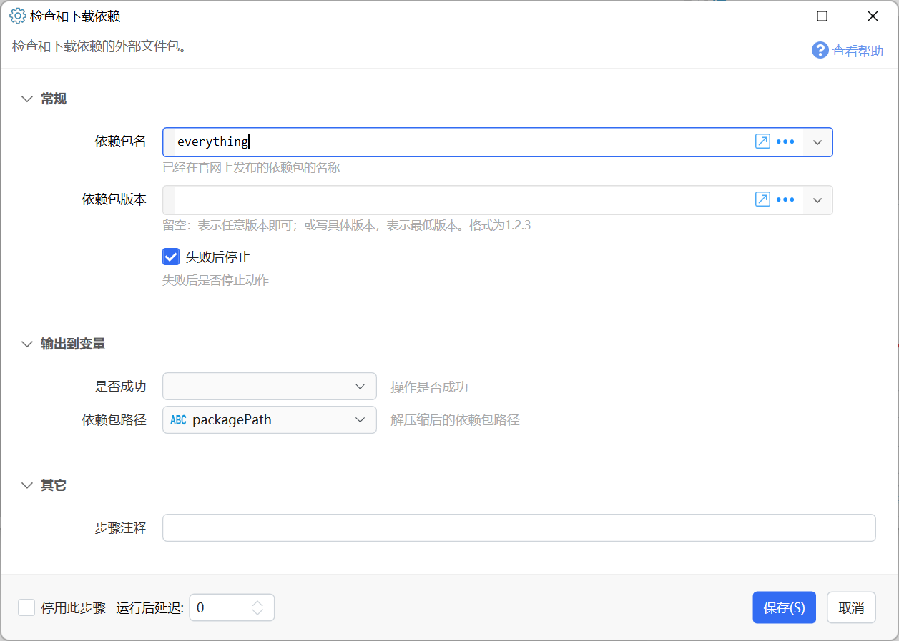

# 检查和下载依赖

检查和下载依赖的外部文件包。

{/* xaction-metadata:start */}
## 当前模块定义

- 模块 Key：`sys:dependencycheck`
- 分类：程序流程（`Flow`）
- 类型：`Action`
- 风险操作：否
- 专业版：否

## 输入参数

| Key | 名称 | 类型 | 默认值 | 必填 | 变量模式 | 条件 | 说明 |
| --- | --- | --- | --- | --- | --- | --- | --- |
| `packageName` | 依赖包名 | `Text` |  | 是 | `UseVarOrInput` |  | 已经在官网上发布的依赖包的名称 |
| `packageVersion` | 依赖包版本 | `Text` |  | 是 | `UseVarOrInput` |  | 留空：表示任意版本即可；或写具体版本，表示最低版本。格式为1.2.3 |
| `stopIfFail` | 失败后停止 | `Boolean` | true | 否 | `Input` |  | 失败后是否停止动作 |

## 输出参数

| Key | 名称 | 类型 | 条件 | 说明 |
| --- | --- | --- | --- | --- |
| `isSuccess` | 是否成功 | `Boolean` |  | 操作是否成功 |
| `packagePath` | 依赖包路径 | `Text` |  | 解压缩后的依赖包路径 |
{/* xaction-metadata:end */}

从Quicker网站自动下载依赖组件，并返回其路径。

为了更方便的使用一些常用的第三方组件，Quicker网站提供了一个简单的组件托管服务。

依赖包下载到本地后，将自动解压缩到此目录中：`我的文档\Quicker\_packages\依赖包名\版本号`

## 依赖包的上传和管理

依赖包列表页面：[https://getquicker.net/share/depd/index](https://getquicker.net/share/depd/index)

目前上传依赖包的权限向一部分用户开放。其他用户如有需求，请联系CL代为上传。

依赖包应满足这些条件：

-   仅用于Quicker动作。请勿将下载地址公布到第三方网站。（流量成本太高了）
-   不包含任何恶意内容、病毒，或侵犯第三方权利、不被第三方许可允许使用的文件。
-   小于3MB。
-   将文件打包为zip文件（Quicker会自动将zip解压缩到目录）。
-   如果x64和x86系统需要不同的文件，请打两个zip包，并且它们应具有相同的内部文件名称和子目录结构（方便后续动作中使用相同的路径进行调用）。

## 模块使用

需Quicker 1.34.19+版本。

参数：

【依赖包名】已在quicker网站上传的依赖包的包名。

【依赖包版本】最低要求的依赖包版本号。留空表示不限制版本。

输出：

【是否成功】本操作是否成功。

【依赖包路径】下载并解压缩后生成的依赖包路径。如：`d:\mydocuments\Quicker\_packages\依赖包名\版本号`。注意，根据您的电脑设置，此路径中可能存在空格，在后续使用时需考虑其影响。
