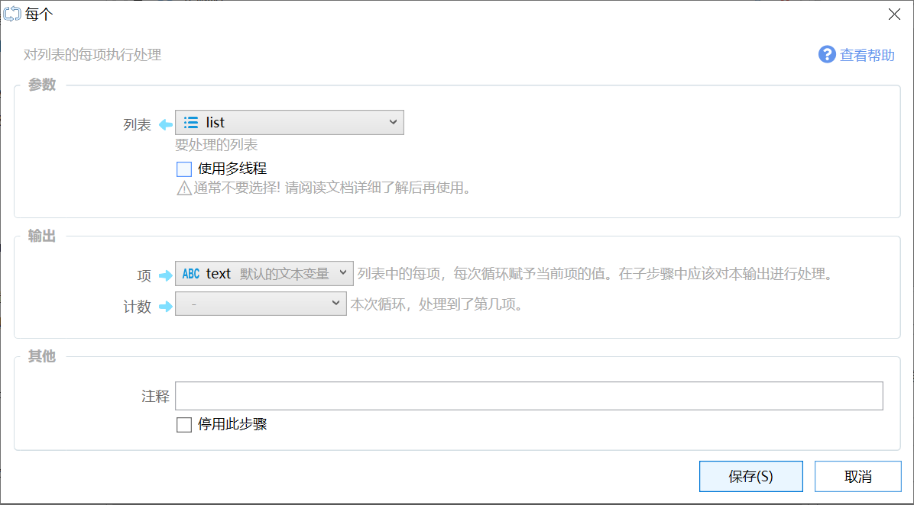

# 每个

对列表的每项执行处理

{/* xaction-metadata:start */}
## 当前模块定义

- 模块 Key：`sys:each`
- 分类：程序流程（`Flow`）
- 类型：`Loop`
- 风险操作：否
- 专业版：否

## 输入参数

| Key | 名称 | 类型 | 默认值 | 必填 | 变量模式 | 条件 | 说明 |
| --- | --- | --- | --- | --- | --- | --- | --- |
| `input` | 列表 | `List` |  | 是 | `UseVarOrInput` |  | 要处理的列表 |
| `useMultiThread` | 线程模式 | `Enum` | 0 | 否 | `Input` |  | ⚠通常不要选择! 请阅读文档详细了解后再使用。 |
| `threadDelay` | 线程启动间隔 | `Integer` | 5 | 否 | `Input` | 仅：1 | 多线程运行时，每个线程之间的启动时间间隔毫秒数。 |
| `concurrentThreadNum` | 同时线程数 | `Integer` | 4 | 否 | `Input` | 仅：1 | 最多同时启动的线程数，请根据电脑配置和任务内容设置。 |
| `timeoutMs` | 超时毫秒数 | `Integer` | -1 | 否 | `Input` | 仅：1 | 所有线程开启后，等待的超时时间，单位：毫秒。-1:不设置超时时间 |
| `waitAny` | WaitAny模式 | `Boolean` | false | 否 | `Input` | 仅：1 | 任意一个线程结束即可。 |
| `cancelRemainingOnWaitAny` | WaitAny模式下自动取消其它分支 | `Boolean` | false | 否 | `Input` | 仅：1 | 启用WaitAny时，任一分支完成后请求取消其它未完成分支，并阻止其执行后续步骤。取消为协作式取消，不保证立即终止正在执行的步骤。 |
| `useLocalContext` | 为线程创建独立上下文 | `Boolean` | false | 否 | `Input` | 仅：1 | 此时只能读取变量，不能更新变量（词典、列表等引用传递的除外） |
| `progressBarTitle` | 进度条标题 | `Text` |  | 否 | `UseVarOrInput` | 仅：0 | 如果设置了此参数，则在循环过程中会显示一个进度条，标题为此参数的值。仅单线程支持。 |
| `stopIfFail` | 失败后停止 | `Boolean` | true | 否 | `Input` |  | 失败后是否停止动作 |

## 输出参数

| Key | 名称 | 类型 | 条件 | 说明 |
| --- | --- | --- | --- | --- |
| `isSuccess` | 是否成功 | `Boolean` |  | 操作是否成功 |
| `item` | 项 | `Any` |  | 列表中的每项，每次循环赋予当前项的值。在子步骤中应该对本输出进行处理。 |
| `count` | 计数 | `Integer` |  | 本次循环，处理到了第几项。 |

## 选项值

### `useMultiThread` 线程模式

| Value | 名称 | 说明 |
| --- | --- | --- |
| `0` | 单线程（顺序执行） |  |
| `1` | 多线程（同时执行） |  |
{/* xaction-metadata:end */}

循环处理列表中的每一项。

是循环的一种，另外一种循环模块是“重复”。

演示视频链接：[在组合动作中使用循环](https://www.bilibili.com/video/BV1ty4y1S7AK)

## 参数

【列表】要循环处理的列表变量。

【使用多线程】（1.7.4中增加）使用多线程同步处理列表里的项。基本的处理过程为：

-   循环处理列表中的每一项：

-   将项的值和计数 赋值到设定的变量；
-   开启一个新的线程执行循环中的子步骤；在这些步骤中，应该立即读取保存项值的变量（如上面截图中的text），否则50ms后循环到下一个项的时候，这个变量的内容就会被覆盖为下一项的值了。
-   等待50ms（为了让线程中的代码可以读取保存项值的变量）；
-   处理下一项；

【为线程创建独立上下文】(1.39.11) 为每个线程创建一个独立上下文，避免多线程时数据冲突(参考[问题](https://getquicker.net/QA/Question/20294))。

-   每个线程中读取到的“项”和“计数”的值都是准确的。
-   每个线程步骤中，对值类型的变量（如文本、数字）的读写，是操作变量在该线程中的副本，线程之间互不影响，不会更新到动作本身的变量中。（因此，如果步骤比较简单可以不需要再封装子程序了）
-   对于以引用方式传递的词典、列表等对象类型，当修改它们的内容时（如为词典增加键值对、更新列表的某一项等），会在整个动作范围内生效。

### 多线程使用提示

-   警告！在多线程运行的代码中更新相同的变量可能会产生冲突。
-   为避免log格式混乱，同步执行时调试运行log会被关闭。
-   一些跳转处理将会失效（如停止动作/停止循环等，具体需测试）。
-   可能存在其他潜在问题，请多测试动作。

## 输出

输出项将在每次循环时更新。 所以在循环内部，每次运行取到的变量是这次循环所对应的值。

【项】本次循环所要处理的列表元素的值。

【计数】当前是第几次循环，从0开始。

## 示例

-   [示例：每个](https://getquicker.net/sharedaction?code=d5470b3f-cae1-4388-75b8-08d709af9122)
-   [示例：多线程测试（需1.7.4版本）](https://getquicker.net/sharedaction?code=1aefbbd1-cca2-42e6-c4e0-08d7f7cf8b53)

## 更新说明

-   20230828 增加【为线程创建独立上下文】参数。
