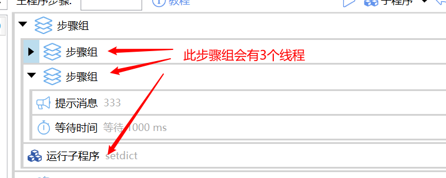

# 步骤组

把逻辑上相关的步骤收成一组，方便折叠、整体禁用、整体拖放。也可以用多线程同时跑组内的直接子步骤。

## 当前模块定义

<XActionModuleMeta moduleKey="sys:group" />

## 概述

从工具箱拖入步骤组，再把其它模块拖进组里。已有步骤可以多选后右键 **放入... → 步骤组**。

<ModuleParamPreview moduleKey="sys:group" />

<ContextMenuPreview
  openPath={['放入...(_F)', '步骤组(_G)']}
  items={[
    {label: '复制(_C)', icon: 'fa:Light_Copy:#6aaded'},
    {label: '剪切(_X)', icon: 'fa:Light_Cut:#6aaded'},
    {type: 'separator'},
    {
      label: '插入延时(_T)',
      icon: 'fa:Light_Clock:#6aaded',
    },
    {
      label: '放入...(_F)',
      icon: 'fa:Light_ObjectGroup:#6aaded',
      children: [
        {label: '步骤组(_G)', icon: 'fa:Light_LayerGroup:#6aaded'},
        {label: '循环：每个(_E)', icon: 'fa:Light_Repeat:#6aaded'},
        {label: '循环：重复(_R)', icon: 'fa:Light_Repeat:#6aaded'},
        {label: '如果/否则 的 “如果” 分支(_I)', icon: 'fa:Light_ProjectDiagram:#6aaded'},
        {label: '如果/否则 的 “否则” 分支(_F)', icon: 'fa:Light_ProjectDiagram:#6aaded'},
        {label: '如果(_S)', icon: 'fa:Light_ProjectDiagram:#6aaded'},
      ],
    },
    {label: '转换成子程序(_S)', icon: 'fa:Light_Cube:#6aaded'},
    {label: '运行(_R)', icon: 'fa:Light_Play:#f5b042'},
    {label: '停用/取消停用(_P)', icon: 'fa:Light_Ban:#E00000'},
  ]}
>
  <StepProgramView
    selectedIndexes={[1, 2, 3]}
    data={{
      steps: [
        {key: 'sys:getWindowTitle'},
        {key: 'sys:notify', inputs: {msg: '111'}},
        {key: 'sys:delay', inputs: {delayMs: '1000'}},
        {key: 'sys:notify', inputs: {msg: '222'}},
      ],
    }}
  />
</ContextMenuPreview>

多选时按住 Shift，点第一个和最后一个。

## 参数说明

**忽略错误**：组内步骤出错（包括用了[停止](/v2/xaction/modules/stop)）时，仍继续执行此步骤组后面的模块。

**调试运行时不输出调试内容**：忽略组内步骤的调试输出。

**使用多线程**：通常不要选。用多线程同时跑组内的**直接**子步骤。这些步骤应彼此独立。若子步骤本身是步骤组 / 如果等，它们内部的下一级仍按顺序执行。

<ModuleParamPreview
  moduleKey="sys:group"
  focusKeys={['useMultiThread', 'waitAny', 'cancelRemainingOnWaitAny']}
  values={{useMultiThread: 'true', waitAny: 'false'}}
/>

**多线程使用WaitAny模式**：任意一个线程结束即可向后继续。其它未完成的步骤仍会跑，但不会被等待。

**WaitAny模式下自动取消其它分支**：启用 WaitAny 时，任一分支完成后请求取消其它未完成分支，并阻止其执行后续步骤。取消是协作式的，不保证立刻停掉正在跑的步骤。

## 输出

- **是否成功**：内部步骤是否运行成功。
- **错误消息**：失败时的消息。

## 限制与排障

多线程时不要同时改同一个变量。同步执行时调试 log 会关掉。停止动作、跳出循环等跳转在多线程里可能失效，需要实测。

## 示例动作

<StepProgramView example="1aefbbd1-cca2-42e6-c4e0-08d7f7cf8b53" />

<ShareLinkCard
  code="1aefbbd1-cca2-42e6-c4e0-08d7f7cf8b53"
  title="多线程测试"
  description="步骤组和每个模块的多线程选项"
  author="CL"
/>

## 相关链接

<RelatedDocs
  items={[
    {
      href: '/v2/xaction/modules/each',
      label: '每个',
      description: '按列表循环；也可以开多线程。',
    },
    {
      href: '/v2/xaction/modules/stop',
      label: '停止(return)',
      description: '组内开了「忽略错误」时，默认停止不会中断组外步骤。',
    },
    {
      href: '/v2/xaction/modules/subprogram',
      label: '运行子程序',
      description: '比步骤组更独立的封装。',
    },
  ]}
/>

## 更新历史

- 1.7.4 增加多线程支持。
- 20240327 增加多线程 WaitAny 模式的说明。
