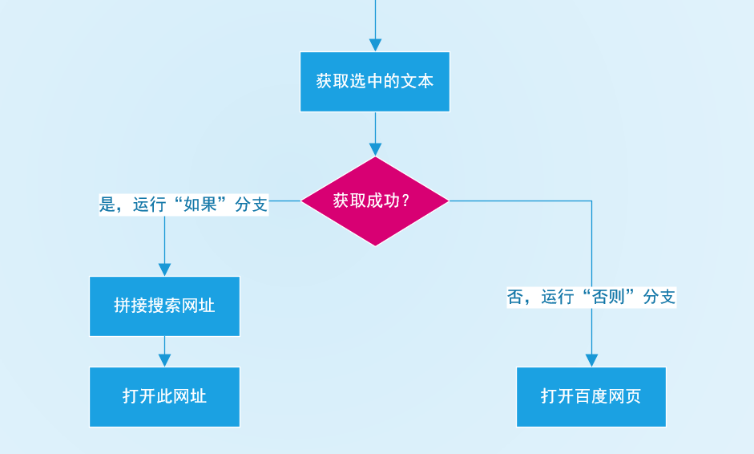
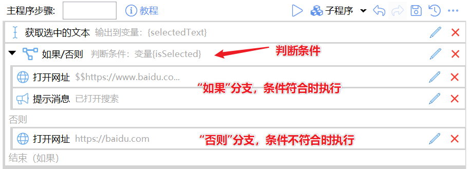
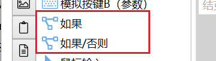
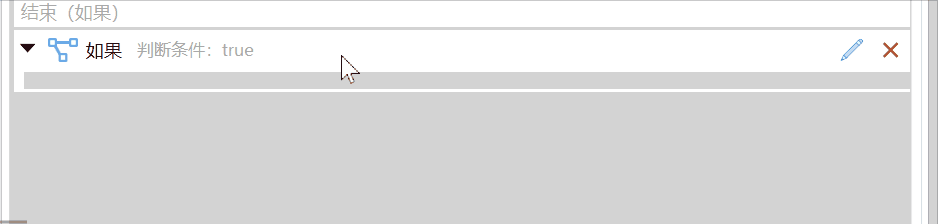
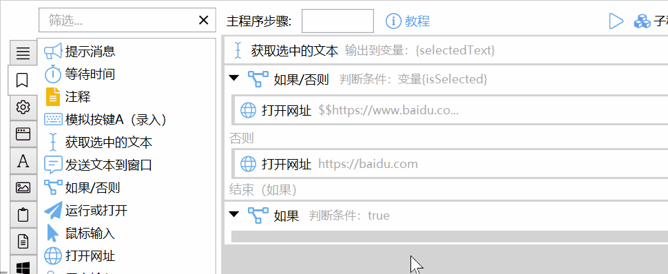
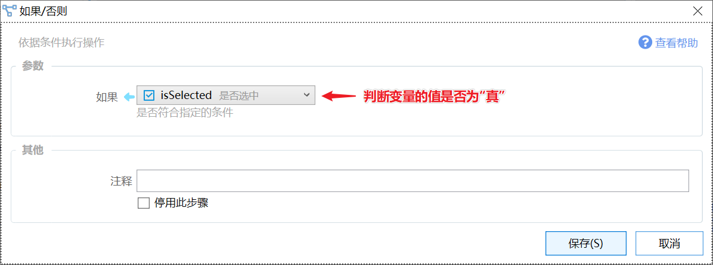
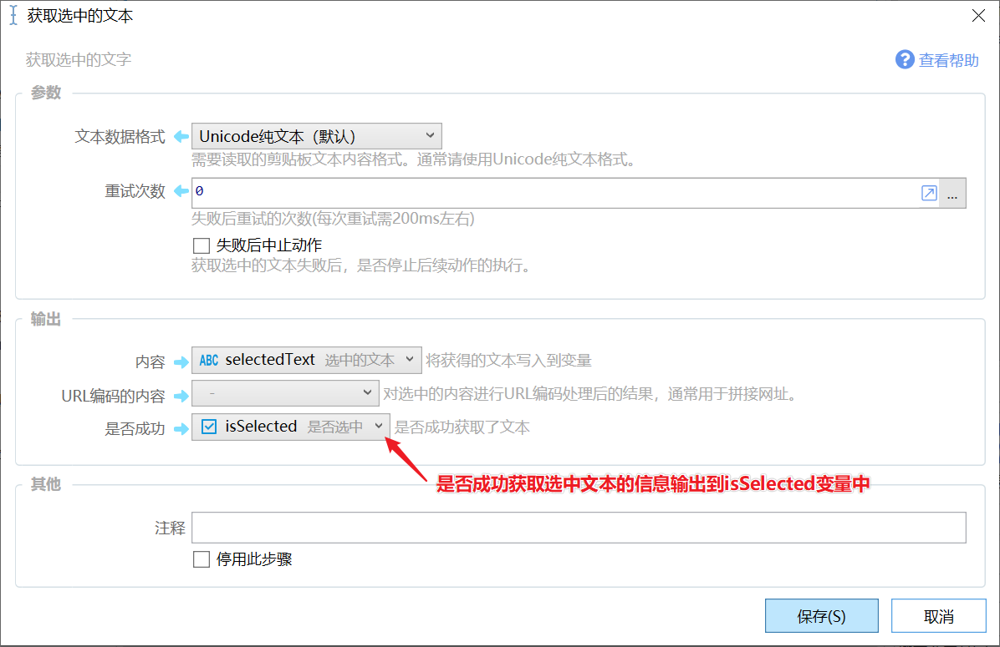
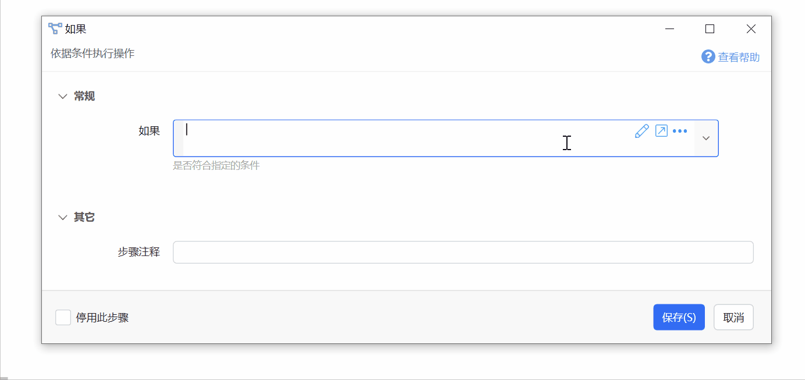
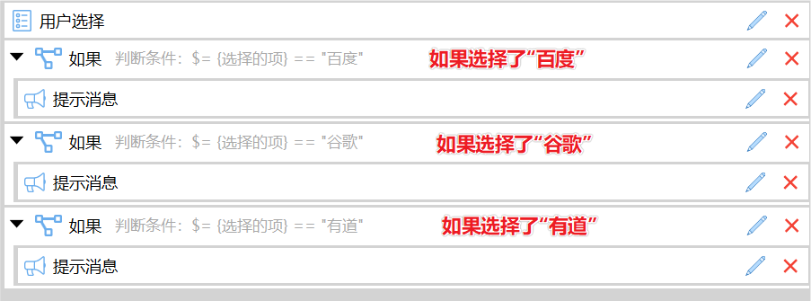
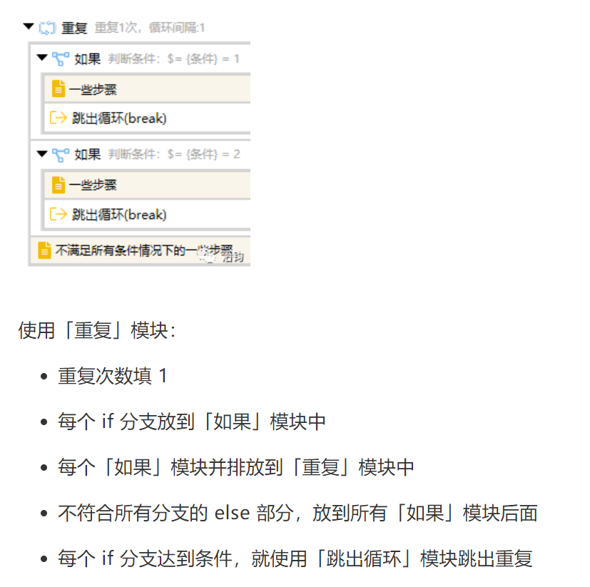

# 如果/否则

依据条件执行操作

{/* xaction-metadata:start */}
## 当前模块定义

- 模块 Key：`sys:if`
- 分类：程序流程（`Flow`）
- 类型：`If`
- 风险操作：否
- 专业版：否

## 输入参数

| Key | 名称 | 类型 | 默认值 | 必填 | 变量模式 | 条件 | 说明 |
| --- | --- | --- | --- | --- | --- | --- | --- |
| `condition` | 如果 | `Boolean` |  | 否 | `UseVarOrInput` |  | 是否符合指定的条件 |

## 输出参数

无。
{/* xaction-metadata:end */}

## 概述

根据是否符合某个判断条件，执行一组步骤（或另一组步骤）。

这类场景非常常见，如在用百度搜索选中文字的时候：如果成功获取了选择的文本，则搜索选中的文本，否则打开百度主页。

基本的步骤定义如下：

### 2个模块的区别

Quicker提供了2个模块实现此功能，他们是：

-   **如果**：仅有一个分支，条件符合的时候执行这些步骤，不符合的时候跳过这些步骤。
-   **如果/否则**：有两个分支。条件符合的时候执行第一组分支步骤，不符合的时候执行第二组分支步骤。

“如果/否则”模块包含了“如果”模块的功能。提供单独的“如果”模块主要是编辑的时候减少模块占用的空间。

这两个模块之间可以在步骤列表中使用右键转换类型。

### 将步骤添加到分支

从模块工具箱拖动模块到“如果”或“否则”分支的“槽”内松开即可。

## 判断条件

可以通过两个方式指定判断条件：

-   通过直接指定布尔类型的变量
-   通过表达式指定

### 通过变量指定判断条件

在“如果”参数中直接选择要判断的布尔类型变量即可。

这些变量的值通常是在其他模块中返回的。例如，在“获取选中的文本”中，将“是否成功”的结果返回到isSelected变量中。

### 通过表达式语句指定判断条件

在参数框中以 **$=** 开始，直接写判断条件。

更详细的表达式内容请参考：[/v2/xaction/concepts/expression](/v2/xaction/concepts/expression)

#### 使用布尔表达式助手

在需要使用表达式写判断条件时，可使用Quicker提供的布尔表达式助手工具。 点击输入框后面的铅笔图标即可打开。

#### 一些常用的判断语句

**数字的判断**

等于：`$= {数字变量} == 3`

不等于：`$= {数字变量} != 3`

大于：`$= {数字变量} > 3`

大于等于： `$= {数字变量} >= 0`

小于：`$= {数字变量} < 0`

在两个值之间：`$= {数字变量} >= 0 && {数字变量} <= 100`

**文本的判断**

为空：`$= {文本变量} == ""` 或 `$= String.IsNullOrEmpty({文本变量})`

不为空：`$= {文本变量} != ""` 或 `$= !String.IsNullOrEmpty({文本变量})`

为指定的内容：`$= {文本变量} == "值"`

包含指定的内容：`$= {文本变量}.Contains("值")`

长度大于某个值：`$= {文本变量}.Length > 10`

**布尔类型的判断**

条件为假：`$= !{布尔变量}` 或 `$= {布尔变量} == false`

#### 组合多个条件

需要两个或多个条件都同时满足（“与/AND”关系）：

`$= 条件1 **&&** 条件2 **&&** 条件3 ...`

如果两个或多个条件任意一个满足（“或/OR”关系）：

`$= 条件1 **||** 条件2 **||** 条件3 ....`

可以使用英文括号组合一些条件（下面的表达式表示同时满足条件1和条件2，或者同时满足条件3和条件4）：

`$= **(**条件1 && 条件2**)** || **(**条件3 && 条件4**)**`

使用 **!** 可以对条件取反。

`$= **!**条件` （条件不成立的情况）

`$= **!**(条件1 && 条件2)` （两个条件中任何一个不成立，效果等于 `$= !条件1 || !条件2`）

## 其他

### 实现类似switch语句的结构

根据一个变量的不同值分别执行相应操作的场景，可以使用多个连续的“如果”模块。每个模块负责判断值是某个指定的值的时候要执行的操作。

### 实现类似于elseif效果的方式

@治钧分享的方法：[https://mp.weixin.qq.com/s/nR7n21i3gKOxARDgYj32SQ](https://mp.weixin.qq.com/s/nR7n21i3gKOxARDgYj32SQ)

## 参考

-   表达式文档 [/v2/xaction/concepts/expression](/v2/xaction/concepts/expression)
