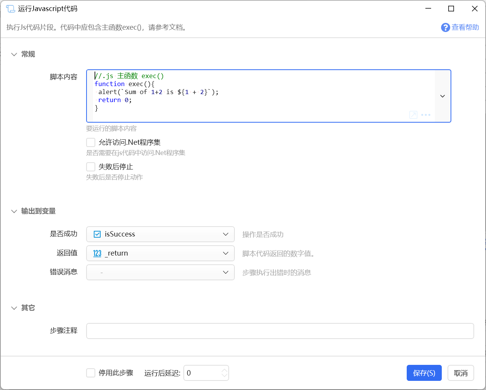

# 运行Javascript代码

执行Js代码片段。代码中应包含主函数exec()，请参考文档。

{/* xaction-metadata:start */}
## 当前模块定义

- 模块 Key：`sys:jsscript`
- 分类：程序流程（`Flow`）
- 类型：`Action`
- 风险操作：否
- 专业版：否

## 输入参数

| Key | 名称 | 类型 | 默认值 | 必填 | 变量模式 | 条件 | 说明 |
| --- | --- | --- | --- | --- | --- | --- | --- |
| `script` | 脚本内容 | `Text` | //.js 主函数 exec()<br />function exec()&#123;<br /> var localName = quickerGetVar('text');  // 读取text变量值, (text 是动作里的变量)<br /> quickerSetVar('text', 'Hello, ' + localName ); //输出修改后的值到text变量中。<br /> return 0; //返回0表示成功。返回其他数字表示失败。<br />&#125;<br /> | 是 | `UseVarOrInput` |  | 要运行的脚本内容 |
| `allClr` | 允许访问.Net程序集 | `Boolean` | false | 否 | `Input` |  | 是否需要在js代码中访问.Net程序集 |
| `stopIfFail` | 失败后停止 | `Boolean` | true | 否 | `Input` |  | 失败后是否停止动作 |

## 输出参数

| Key | 名称 | 类型 | 条件 | 说明 |
| --- | --- | --- | --- | --- |
| `isSuccess` | 是否成功 | `Boolean` |  | 操作是否成功 |
| `return` | 返回值 | `Integer` |  | 脚本代码返回的数字值。 |
{/* xaction-metadata:end */}

运行js脚本。

脚本应包含exec()全局函数，并**返回0**表示成功，返回其他数字表示失败。


本功能 1.43.7+ 版本使用 Jint 库实现（[https://github.com/sebastienros/jint](https://github.com/sebastienros/jint)），支持更全面的js语法，请参考该库的官网了解详情。1.43.6 及更早版本使用Jurassic库(网址：[https://github.com/paulbartrum/jurassic](https://github.com/paulbartrum/jurassic)) 实现（仅支持ECMAScript 3 、ECMAScript 5语法与功能）。

示例脚本：


```
// 主函数 exec()
function exec(){
 var localName = quickerGetVar('name');  // 读取name变量值, (name 是动作里的变量)
 quickerSetVar('name', 'Hello, ' + localName ); //输出修改后的值到name变量中。
 return 0; //返回0表示成功。返回其他数字表示失败。
}
```





## 模块参数

### 输入

-   【脚本内容】要运行的js脚本代码。
-   【允许访问 .Net 程序集】选中此项时，初始化jint引擎会调用`var engine = new Engine(cfg => cfg.AllowClr());`以允许在js代码中访问.net基本类库。请参考jint类库官网文档了解详情。（v1.43.7+）
-   【失败后停止】失败后是否停止动作。

### 输出

-   【是否成功】脚本是否没有遇到运行错误并最终返回0.
-   【返回值】脚本返回的值。


## 脚本


#### 主函数

Quicker将调用 `exec` 主函数。

如果执行正常，请**返回数字0**，否则返回一个非0值表示遇到了问题。


js代码中支持以下预置的方法（v1.43.7+）：

-   `log('text')`输出调试信息（仅调试运行时会输出）；
-   `alert('text')`显示提示消息；


#### 读取动作中的变量值

使用 `quickerGetVar` 全局函数读取动作中的变量的值。仅支持一部分变量类型，具体请参考jurassic文档。


```
var localVar = quickerGetVar('动作里的变量名');
```


#### 输出到变量

使用 `quickerSetVar` 函数将新的值写入变量中。仅支持一部分变量类型，具体请参考jurassic文档。


```
quickerSetVar('动作里的变量名', 新的值);
```


#### 返回值

返回0表示成功，其他数字表示失败。 可以在【返回值】输出中读取此返回值供其他模块使用。


#### 其他

Quicker的列表类型和词典类型在js脚本中使用时是创建的副本，在js中修改这些对象不会影响Quicker变量中的值。如果需要修改变量中的值，需要使用quickerSetVar将整个变量写回。


## 参考动作

-   [https://getquicker.net/sharedaction?code=acd50dea-9df0-4ed6-a3cf-08d7c216a695](https://getquicker.net/sharedaction?code=acd50dea-9df0-4ed6-a3cf-08d7c216a695)


## 更新历史

-   1.1.13 开始提供此模块。
-   20240702 改为Jint库，支持更新的js语法；js代码中支持log('text')输出调试信息（调试运行时）；支持使用alert('text')显示提示消息。（感谢@小布丁的大布丁）
