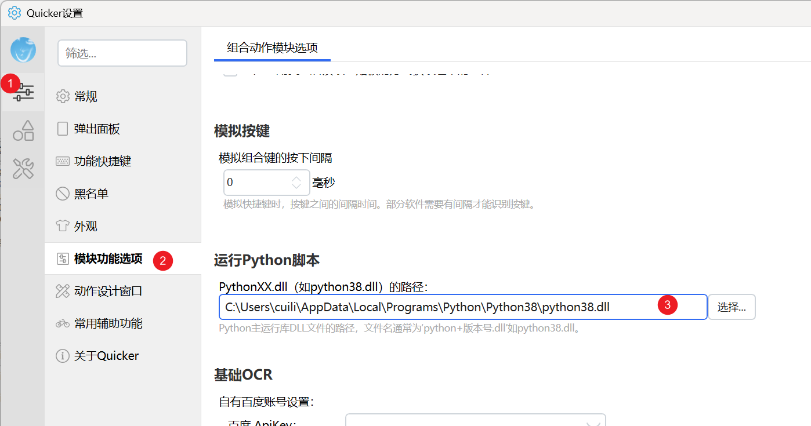

# 运行Python代码

在动作里执行一段 Python 3 代码。通过 `quicker.context` 读写动作变量。

## 当前模块定义

<XActionModuleMeta moduleKey="sys:pythonscript" />

## 概述

本模块用 [pythonnet](https://github.com/pythonnet/pythonnet) 接入，只支持 Python 3。64 位 Windows 请装 64 位 Python，32 位装 32 位。

<ModuleParamPreview moduleKey="sys:pythonscript" />

## 参数说明

**脚本内容**：要执行的 Python。用 `quicker.context.GetVarValue('变量名')` 读动作变量，用 `quicker.context.SetVarValue('变量名', value)` 写回。

**Python环境路径**：可选。`PythonXXX.dll` 所在目录。留空时使用全局设置（**Quicker 设置 → 模块功能选项 → 运行Python脚本**）。



未在模块里指定、全局也留空时，Quicker 会尝试从 PATH 里找目录名带版本号的环境（例如 `...\python39`，且目录内有匹配的 `python39.dll`）。

**失败后停止**：失败后是否停止动作。默认开启。

## 输出

- **是否成功**：操作是否成功。

## 从 Python 返回内容

简单值可以直接 `SetVarValue`。1.35.37+ 也可以这样返回文本列表和简单词典：

```python
##.py
quicker.context.SetVarValue('text', 'hello world')
quicker.context.SetVarValue('list', ['hello1','hello2','hello3'])
quicker.context.SetVarValue('dict', {'a':1, 'b':2, 'day':'2022-1-1'})
```

不要返回更复杂的数据类型（从 Python 转到 C# 可能出奇怪问题）。尽量在 Python 里处理完，只把简单值交回动作。

## 限制与排障

- 请使用 [python.org](https://www.python.org/downloads/windows/) 官方安装包。第三方发行版可能跑不起来。
- 目前支持 Python 3.7–3.12（见 [pythonnet](https://pythonnet.github.io/)）。
- 尽量只访问数字、文本等简单类型。列表、词典等复杂类型有概率导致闪退。
- 脚本在 Quicker 进程里执行，权限高于普通非管理员程序，因此不能用 COM 去控制第三方软件（例如 `Word.Application`）。

## 示例动作

<StepProgramView example="e4ec073a-1f86-449c-8001-08da66cce8dc" />

<ShareLinkCard
  code="e4ec073a-1f86-449c-8001-08da66cce8dc"
  title="python测试"
  description="测试"
  author="CL"
/>

## 相关链接

<RelatedDocs
  items={[
    {
      href: '/v2/xaction/modules/jsscript',
      label: '运行Javascript代码',
      description: '不依赖本机 Python 的脚本片段。',
    },
    {
      href: '/v2/xaction/modules/csscript',
      label: '运行C#代码',
      description: '需要 COM 时改用低权限模式的 C#。',
    },
    {
      href: '/v2/xaction/modules/runscript',
      label: '运行脚本',
      description: '写成临时文件再交给外部解释器。',
    },
  ]}
/>

## 更新历史

- 1.35.37 可直接指定 Python 主运行库路径；可用 `SetVarValue` 返回列表和简单词典。
- 20230215 增加注意事项。
