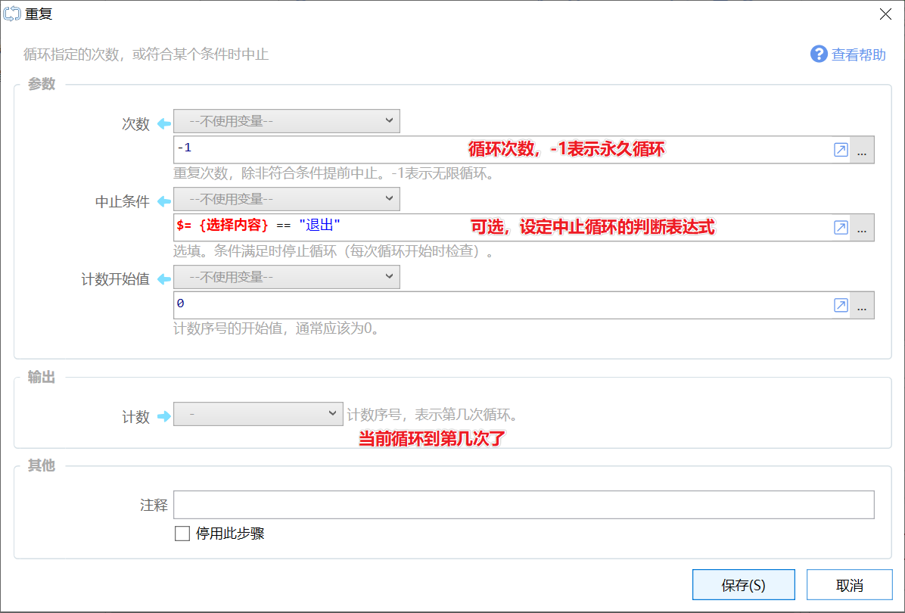
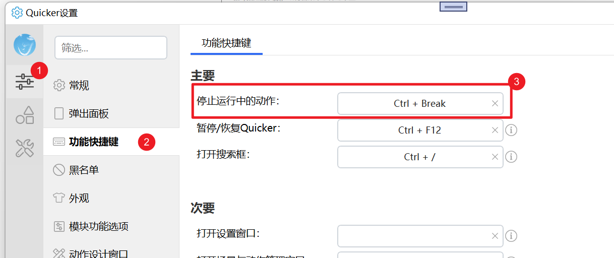
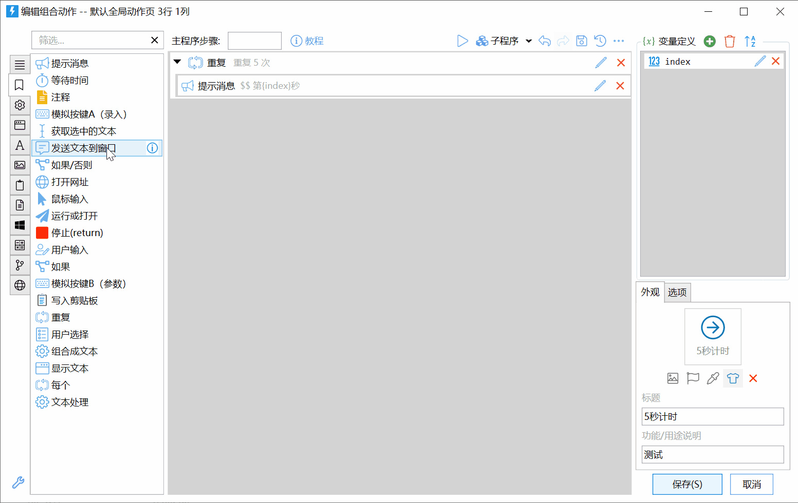

# 重复

循环指定的次数，或符合某个条件时中止

## 当前模块定义

<XActionModuleMeta moduleKey="sys:repeat" />

循环指定的次数。

循环中通常应增加“等待时间”，以避免耗费大量计算机资源。

演示视频链接：[在组合动作中使用循环](https://www.bilibili.com/video/BV1ty4y1S7AK)

请事先设置好停止动作运行的快捷键，以避免出现循环开始后无法停止的尴尬局面。

## 参数

【次数】循环执行的总次数。-1 表示无限循环。

【中止条件】非必填。设定一个布尔变量或表达式，在每次循环时进行判断如果其结果为真则中止循环。

也可以在循环内部使用“跳出循环”模块来中止循环。请参考“[如果](/v2/xaction/modules/if)”模块的说明编写表达式。

【计数开始值】一般在计算机语言中次数或序号都是从0开始，0表示第一次、第一项。为方便用户的日常习惯，如果您需要给用户显示当前是第几次循环，可以在这里设置循环开始值为1。

## 输出

【计数】当前是第几次循环，从“计数开始值”开始计算。

## 设置要重复的内容

将需要重复执行的步骤拖放到“重复”模块中中间的“槽”中即可。

## 停止循环中的动作

如果希望中间停止较长时间的循环，可以有2个方式：

-   在配置窗口中设置“停止运行中动作”的快捷键。在需要的时候按下此快捷键。
    
-   在托盘右键菜单中停止运行中动作。

## 更新历史

-   1.1.1 重复次数为0时为无限循环。
-   1.1.2 重复次数为-1时表示无限循环。

## 示例动作

-   [重复示例](https://getquicker.net/Sharedaction?code=d9eb6be1-6185-4d6e-8459-08db738638c3)：重复5次，合并输出两个列表中的每一项。
