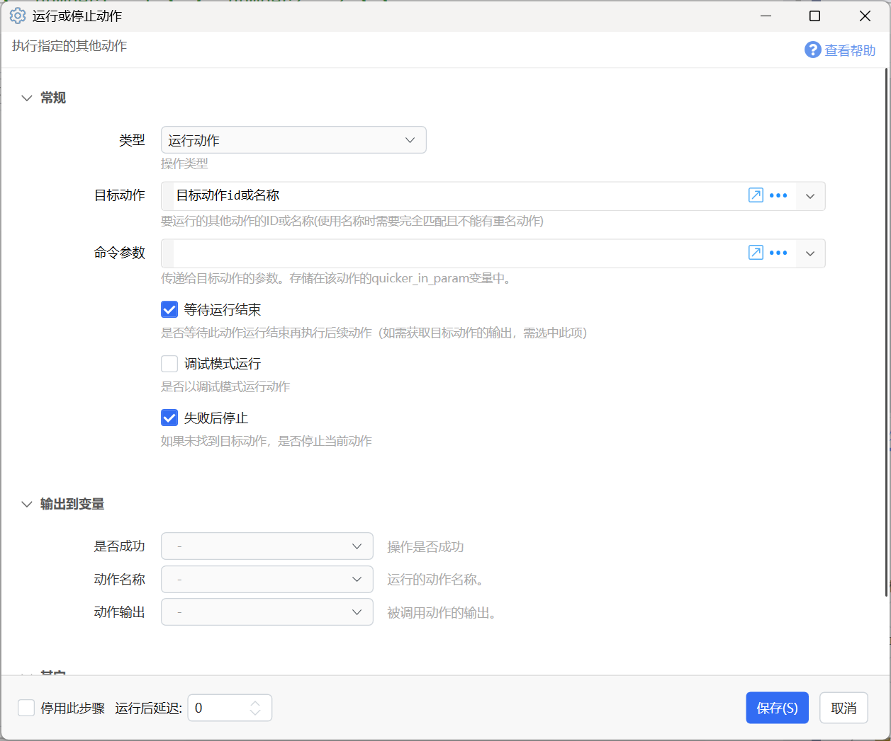
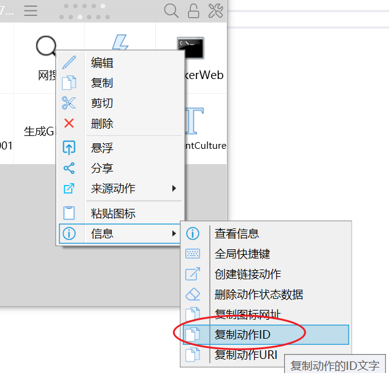
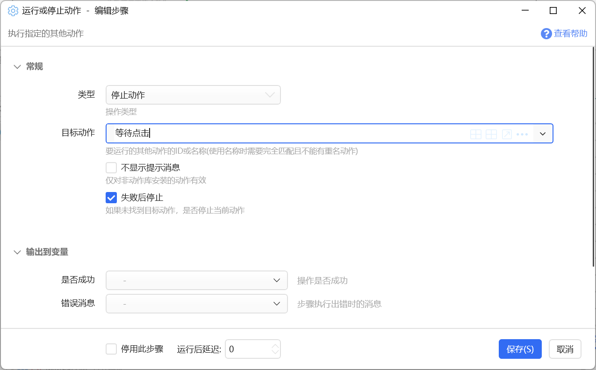
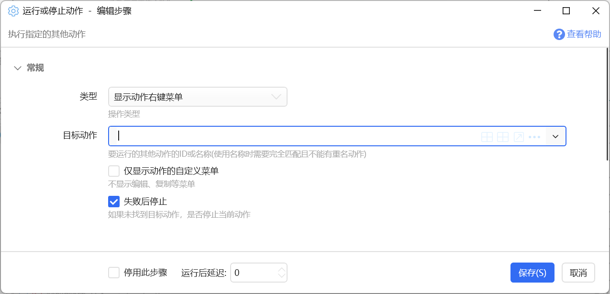
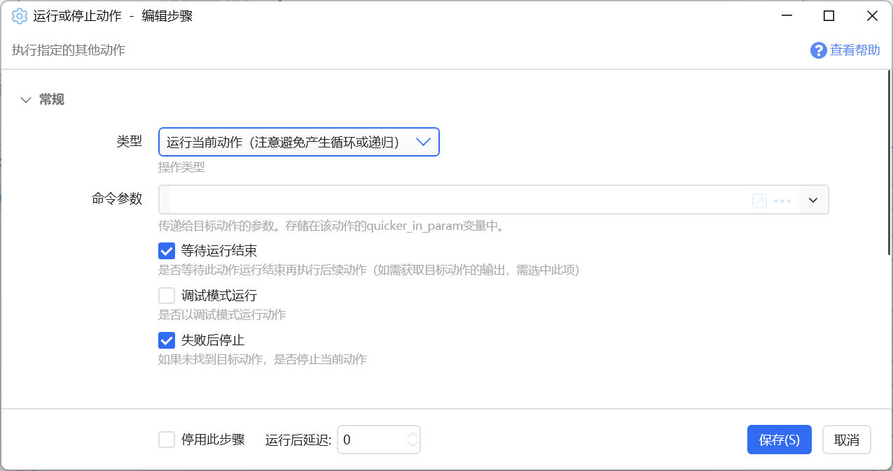

# 运行或停止动作

执行指定的其他动作

{/* xaction-metadata:start */}
## 当前模块定义

- 模块 Key：`sys:runAction`
- 分类：程序流程（`Flow`）
- 类型：`Action`
- 风险操作：否
- 专业版：否

## 输入参数

| Key | 名称 | 类型 | 默认值 | 必填 | 变量模式 | 条件 | 说明 |
| --- | --- | --- | --- | --- | --- | --- | --- |
| `type` | 类型 | `Enum` | StartAction | 是 | `Input` |  | 操作类型 |
| `actionId` | 目标动作 | `Text` |  | 是 | `UseVarOrInput` | 仅：StartAction, StopAction, ShowActionContextMenu, GetRunningActionCount | 要运行的其他动作的ID或名称(使用名称时需要完全匹配且不能有重名动作) |
| `onlyCustomMenu` | 仅显示动作的自定义菜单 | `Boolean` | false | 否 | `Input` | 仅：ShowActionContextMenu | 不显示编辑、复制等菜单 |
| `wait` | 等待运行结束 | `Boolean` | true | 否 | `Input` | 仅：StartAction, StartCurrentAction | 是否等待此动作运行结束再执行后续动作（如需获取目标动作的输出，需选中此项） |
| `inputParam` | 命令参数 | `Text` |  | 是 | `UseVarOrInput` | 仅：StartAction, StartCurrentAction | 传递给目标动作的参数。存储在该动作的quicker_in_param变量中。 |
| `debug` | 调试模式运行 | `Boolean` | false | 否 | `Input` | 仅：StartAction, StartCurrentAction | 是否以调试模式运行动作 |
| `hideMessage` | 不显示提示消息 | `Boolean` | false | 否 | `Input` | 仅：StopAction | 仅对非动作库安装的动作有效 |
| `stopIfFail` | 失败后停止 | `Boolean` | true | 否 | `Input` |  | 如果未找到目标动作，是否停止当前动作 |

## 输出参数

| Key | 名称 | 类型 | 条件 | 说明 |
| --- | --- | --- | --- | --- |
| `isSuccess` | 是否成功 | `Boolean` |  | 操作是否成功 |
| `actionTitle` | 动作名称 | `Text` | 仅：StartAction | 运行的动作名称。 |
| `output` | 动作输出 | `Text` | 仅：StartAction, StartCurrentAction | 被调用动作的输出。 |
| `count` | 运行个数 | `Number` | 仅：GetRunningActionCount | 动作正在运行的个数 |

## 选项值

### `type` 类型

| Value | 名称 | 说明 |
| --- | --- | --- |
| `StartAction` | 运行动作 |  |
| `StopAction` | 停止动作 |  |
| `ShowActionContextMenu` | 显示动作右键菜单 |  |
| `StartCurrentAction` | 运行当前动作（注意避免产生循环或递归） |  |
| `StopOtherInstance` | 停止当前动作的其它实例 |  |
| `GetRunningActionCount` | 获取动作运行个数（自己编写动作时可用） |  |
{/* xaction-metadata:end */}

运行或停止指定的动作。

## 操作类型

【类型】操作类型，可选：

-   运行动作：运行指定的动作（根据ID或名称）
-   停止动作：停止指定的动作
-   显示动作右键菜单：显示指定动作的右键菜单
-   运行当前动作
-   停止当前动作的其它实例
-   获取动作运行个数：获取某个自己编写的动作的运行实例数。

### 运行动作

运行指定的动作

【目标动作】指定要运行或停止的动作，可以为如下的值：

-   动作的ID。是一个GUID格式的编码（类似：7521f699-fcab-43b9-9686-560de2c8aa92），可以在动作上点右键-》信息-》复制动作ID得到。

-   动作的名称。动作名称唯一的时候才可使用。
-   动作在动作库中的ID，（仅在运行动作操作时生效）。分为两种情况：

-   从动作库安装的动作。
-   本地分享到动作库的动作（1.5.27版本支持）。

【命令参数】需要传递给动作的参数。可以参考：[为动作传递参数](/v2/xaction/concepts/quicker_in_param)

【等待运行结束】等待此动作运行完成后再执行后续的模块。不选中的话，在启动此动作以后马上开始运行后续的模块。

【调试模式运行】是否以调试模式运行动作。（可以比较方便的调试动作的右键菜单项）

【失败后停止】如果未找到要运行的动作，是否停止执行当前动作的后续步骤。

**输出**

【是否成功】是否操作成功。

【动作名称】运行动作时，如果是指定的动作ID，可以在这里得到该动作的名称（通常用于向用户提示XX动作运行成功之类的消息）。

【动作输出】当以“等待运行结束”方式运行动作时，可以用于获取被运行动作中返回的结果。被运行的动作中需要使用“停止”模块设定返回值。

### 停止动作

停止某个正在运行的动作。

【目标动作】请参考“运行动作”操作类型中的说明。

【不显示提示消息】是否隐藏“动作已停止”的消息。

### 显示动作右键菜单

显示某个动作的右键菜单。

【仅显示动作的自定义菜单】仅显示动作自身定义的右键菜单项。参考：[为动作设计自定右键菜单](/v2/xaction/concepts/action-custom-context-menu)。

### 运行当前动作

再次运行当前动作。请避免循环调用或无法结束的递归。

【调试模式运行】是否以调试模式运行当前动作。

【命令参数】为动作传递的参数。

### 停止当前动作的其它实例

停止当前动作的其它实例。

### 获取动作运行个数

获取指定动作的当前运行实例个数。基于安全考虑，仅支持获取自己开发动作的实例个数，不支持获取动作库安装动作的实例个数。

## 更新历史

-   20250120 完善文档以匹配实际功能。
