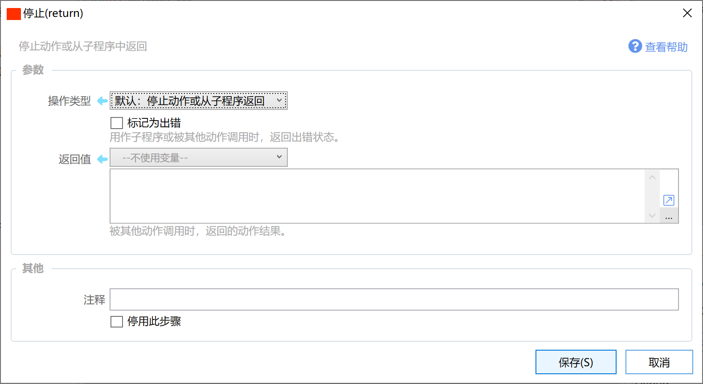
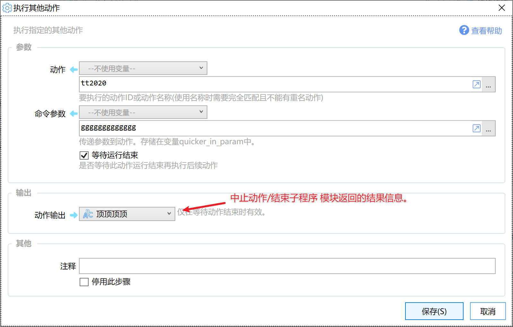

# 停止(return)

停止动作或从子程序中返回

{/* xaction-metadata:start */}
## 当前模块定义

- 模块 Key：`sys:stop`
- 分类：程序流程（`Flow`）
- 类型：`Action`
- 风险操作：否
- 专业版：否

## 输入参数

| Key | 名称 | 类型 | 默认值 | 必填 | 变量模式 | 条件 | 说明 |
| --- | --- | --- | --- | --- | --- | --- | --- |
| `method` | 操作类型 | `Enum` | default | 是 | `Input` |  |  |
| `isError` | 标记为出错 | `Boolean` | false | 否 | `Input` |  | 用作子程序或被其他动作调用时，返回出错状态。 |
| `return` | 返回值 | `Any` |  | 否 | `UseVarOrInput` |  | 被其他动作调用时，返回的动作结果。 |
| `showMessage` | 提示消息 | `Text` |  | 否 | `UseVarOrInput` |  | 显示的提示信息。 |

## 输出参数

无。

## 选项值

### `method` 操作类型

| Value | 名称 | 说明 |
| --- | --- | --- |
| `default` | 默认：停止动作或从子程序返回 |  |
| `forcestop` | 停止动作：停止整个动作(即使在子程序中) |  |
{/* xaction-metadata:end */}

停止动作或从子程序中返回。类似于编程语言中的**return**语句。

## 操作类型

**默认：**​

-   如果在主程序中：停止当前动作。
-   如果在启用了“忽略错误”选项的[步骤组](/v2/xaction/modules/group)中：只跳过后面的步骤，不停止动作，从此步骤组下面的模块开始执行。
-   如果在子程序中：结束当前子程序，返回到主程序中。

**​停止动作：**​

-   停止动作，即便是在子程序中使用，也会停止整个动作。

## 参数

**【标记为出错】**

用于中止子程序时，标记为子程序出错。此时如果在“[运行子程序](/v2/xaction/concepts/subprogram)”模块中选择了“失败后停止”选项，则会停止动作。

**【返回值】**

当动作被其他动作调用时，也可用于向其他动作返回执行结果信息。

当从子程序返回时，如果选择了“标记为出错”选项，则用以传递错误消息。
