# 运行子程序

运行子程序

{/* xaction-metadata:start */}
## 当前模块定义

- 模块 Key：`sys:subprogram`
- 分类：程序流程（`Flow`）
- 类型：`SubProgram`
- 风险操作：否
- 专业版：否

## 输入参数

| Key | 名称 | 类型 | 默认值 | 必填 | 变量模式 | 条件 | 说明 |
| --- | --- | --- | --- | --- | --- | --- | --- |
| `subProgram` | 子程序 | `Text` |  | 是 | `UseVarOrInput` |  | 调用哪个子程序 |
| `summary` | Summary | `Text` |  | 否 | `UseVarOrInput` | 仅：NO_SHOW | 内部使用 |
| `skipDebugOutput` | 跳过调试输出 | `Boolean` | false | 否 | `UseVarOrInput` |  | 调试运行动作时，不输出子程序内部调试信息 |
| `stopIfFail` | 失败后停止 | `Boolean` | true | 否 | `Input` |  | 子程序运行失败后是否停止动作 |

## 输出参数

| Key | 名称 | 类型 | 条件 | 说明 |
| --- | --- | --- | --- | --- |
| `isSuccess` | 是否成功 | `Boolean` |  | 子程序是否运行成功 |
{/* xaction-metadata:end */}

## 概述

**子程序**类似于编程语言中的“**函数**”。

它用于将一些**步骤**和**变量**封装在一起，变成一个新的具有更强大功能的**“自定义模块”**。

一般只在设计比较复杂的动作的时候才需要用到子程序。

子程序有这些用处：

-   在动作中复用一部分功能。
-   将大的功能拆分成多个较为独立的小的功能，把复杂的问题分解为小的简单的问题。

1.10.x版本对子程序进行了比较大的修改，本文适用于最新版本。

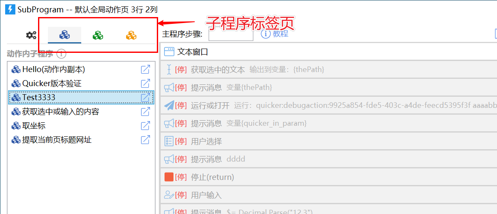

### 子程序的类别

根据可复用范围和实际存储位置，可以将子程序分为三类：

-   **动作内子程序**：仅在当前动作内部使用，存储在动作内。比1.10.x更早版本的子程序都是这类子程序。
-   **公共子程序**：可以在您的任意动作中使用，存储在动作外部，支持自动同步。
-   **网络共享子程序**：Quicker网站子程序库中的子程序，可以通过关键字搜索后直接拖放到步骤中使用。

### 通用的使用方法

子程序的使用方法和普通的模块基本一致。找到目标子程序后，按住并拖放到步骤列表的合适位置即可。

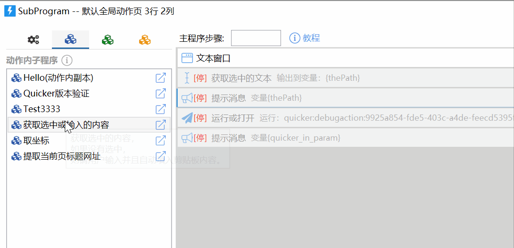

然后在步骤参数设置窗口中为子程序设定好输入和输出。

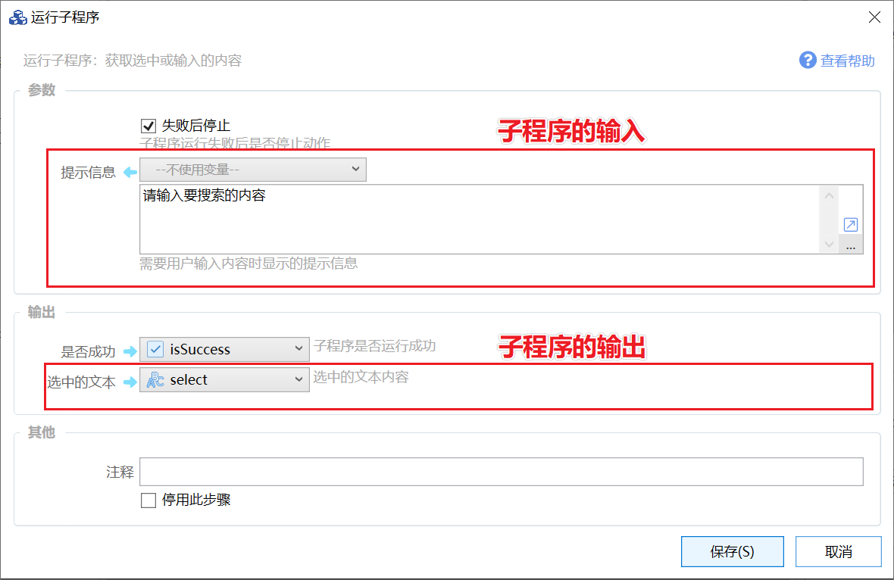

### 子程序的定义

子程序和组合动作一样，由步骤和变量组成。

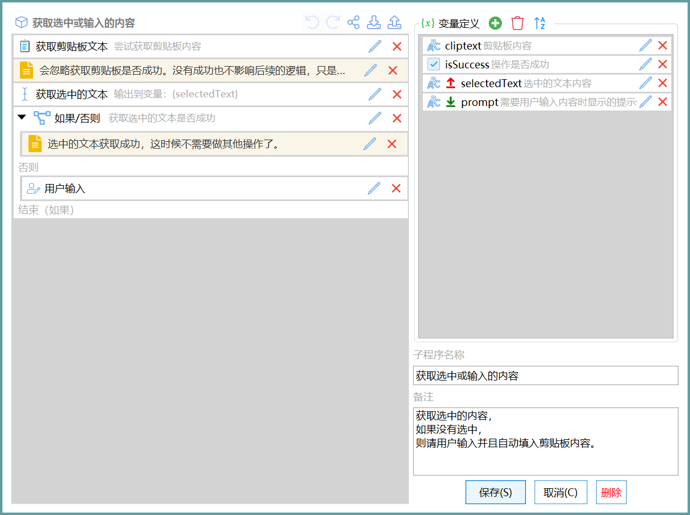

子程序中的变量和主程序中的变量是**各自独立**的：

-   每次运行子程序，它内部的变量都将被自动初始化。
-   子程序中可以使用和主程序中一样的变量名（尽量不要这样做），他们的值互不影响。（通过参数传入列表和词典等复杂对象时，主程序和子程序将指向相同的对象，在子程序中修改列表或词典也会影响主程序。）

就像那些基础模块一样，子程序需要从外部接受参数输入，并将需要的结果返回给外部。

我们通过**为变量设置输入输出标记**来实现这一目的。下图的变量列表中，变量名前面的图标表示了某个变量可能是输入或输出参数。

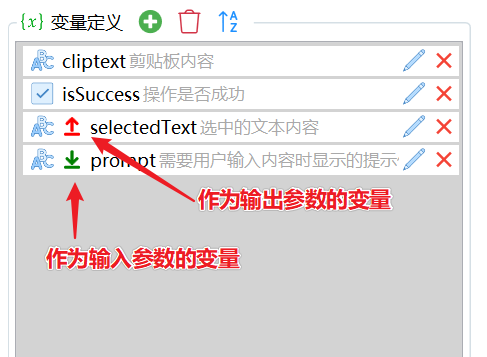

子程序开始运行时，会对作为输入参数的变量赋值。

子程序运行结束后，会将作为输出参数的变量读取出来输出到主程序中。

#### 输入参数

子程序的变量和动作主程序的变量是独立的。你可以通过附加的选项，使得子程序的某个变量变身为输入参数或输出参数。

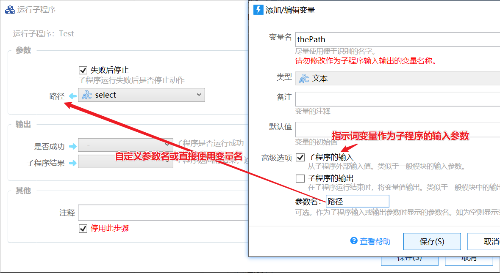

当某个变量作为子程序的输入或输出参数时，尽量不要修改其变量名。如有修改，请编辑使用了此子程序的“运行子程序”模块，重新设置参数值。

#### 输出参数

在变量属性中，选中“子程序的输出”选项即可将此变量转换成子程序的输出参数。

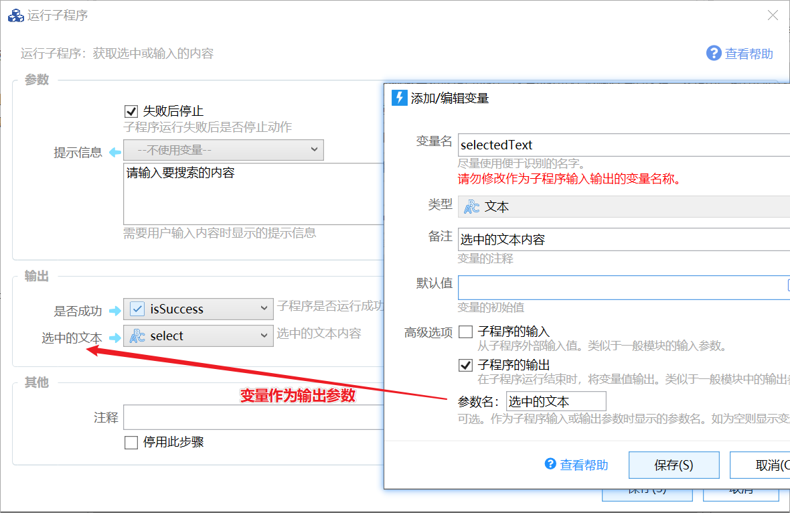

## 动作内子程序

动作内子程序保存在动作内部，仅可在当前动作内使用。

1）动作内子程序标签页。

2）动作内子程序列表。

3）点击编辑子程序。

4）创建新的动作内子程序。

5）导入网络子程序（先在子程序库中复制子程序网址，然后点击此按钮）。也可以直接在共享子程序标签页中搜索到子程序后从右键菜单中直接导入。

6）从文件导入子程序。

7）清理不使用的子程序。

在子程序上点击右键，可以看到右键菜单：

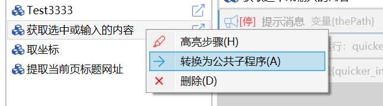

1）高亮步骤：将子程序名称作为高亮关键字，高亮步骤列表中的相应步骤。（只能高亮展开的步骤）。

2）转换为公共子程序：将动作内子程序转换为公共子程序，以方便在其它动作中使用。

3）删除此子程序。

### 创建子程序

点击子程序列表下面的创建按钮，可添加新的动作内子程序。

### 编辑子程序

点击子程序后的编辑按钮即可编辑子程序。

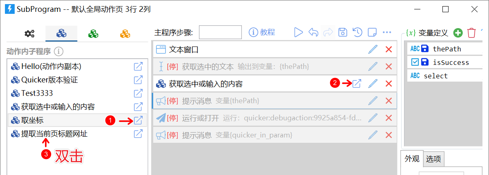

1）点击子程序后的打开按钮。

2）点击步骤列表中子程序后的打开按钮。

3）双击子程序名称。

### 删除子程序

从右键菜单中删除，或者选中子程序后点删除按钮。

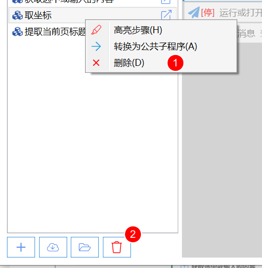

### 转换为动作内子程序

通过步骤的右键菜单，可以将公共子程序和网络共享子程序转换为动作内子程序。

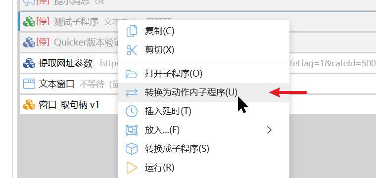

### 其它操作

可以在子程序列表上右键，对子程序进行重命名、复制、创建副本、复制名称等。

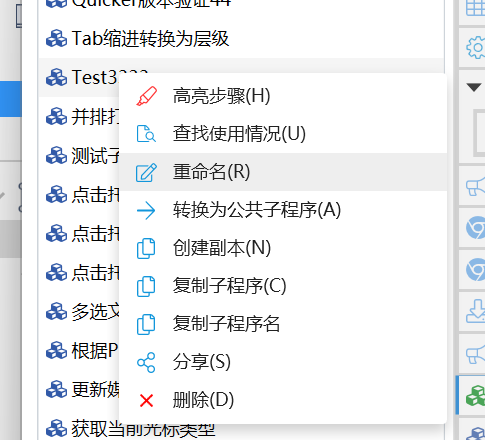

复制子程序后，可以在其它动作的子程序列表的空白处右键粘贴。

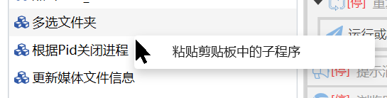

## 公共子程序

公共子程序可以在本地所有动作中使用。

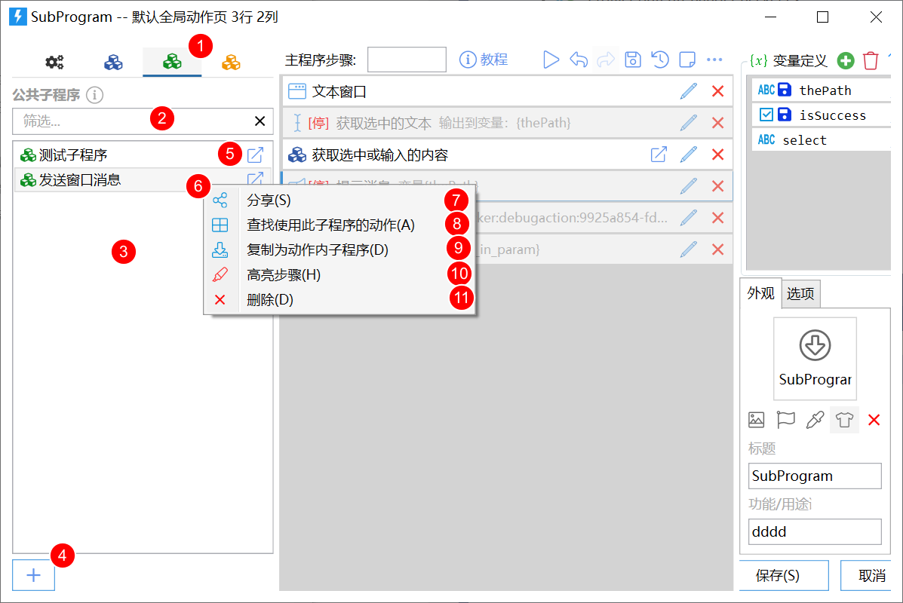

1）公共子程序标签页。

2）筛选子程序（在公共子程序数量较多时使用）

3）子程序列表。

4）创建新的公共子程序。

5）双击，或点击右侧的按钮可以编辑此公共子程序。

6）右键菜单。

7）分享公共子程序到共享库。

8）查找使用此公共子程序的动作：在所有本地动作中查找有使用到此子程序的动作。

9）复制为动作内子程序。

10）在步骤列表中高亮此子程序（仅高亮展开的步骤）。

11）删除此子程序。

### 分享公共子程序

**请勿分享任何含有恶意内容的子程序，否则将停用您的账号！**

在公共子程序上点右键，从菜单中选择“分享”。

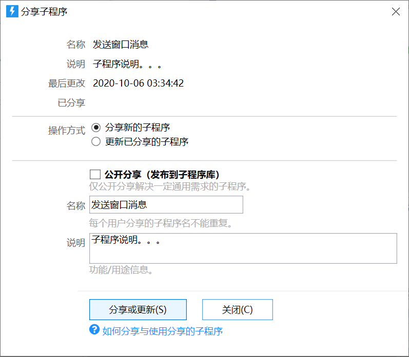

可以选择分享新的子程序，或者更新之前已分享的子程序。

## 共享子程序

子程序网站：[https://getquicker.net/Share/SubPrograms](https://getquicker.net/Share/SubPrograms)

子程序不会经过管理员审核，使用前请检查验证子程序内容。如有发现含有恶意内容的子程序，欢迎反馈到197906@qq.com，将奖励1年专业版兑换码。

### 方法一：导入为动作内子程序

方法见[动作内子程序](/v2/xaction/concepts/subprogram)部分

### 方法二：直接使用共享子程序

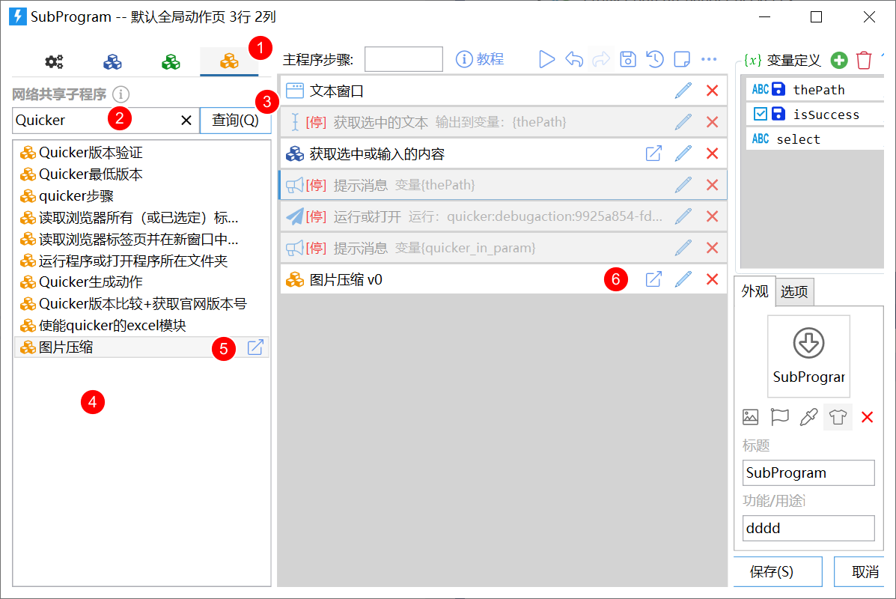

1.  切换到共享子程序标签页。
2.  输入关键词。
3.  点击查询按钮。
4.  符合条件的结果将显示在子程序列表中。
5.  按住并拖放到步骤区域即可。
6.  双击子程序、点击右边的打开按钮，可以打开共享子程序网页。

在共享子程序上点右键，菜单中可选：

1）查看子程序定义：在编辑窗口中查看子程序的内部定义。

2）导入为动作内子程序：如果需要对子程序的定义做修改调整，可以导入为动作内子程序使用。

## 更新历史

-   20250606 修改描述错误。
