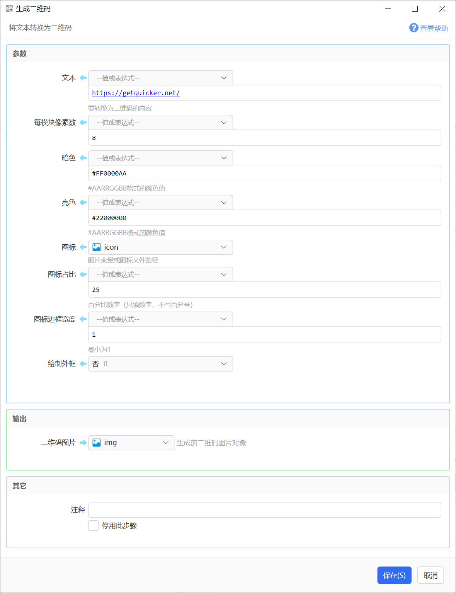

# 生成二维码

将文本转换为二维码

{/* xaction-metadata:start */}
## 当前模块定义

- 模块 Key：`sys:createQrCode`
- 分类：图片处理（`Image`）
- 类型：`Action`
- 风险操作：否
- 专业版：否

## 输入参数

| Key | 名称 | 类型 | 默认值 | 必填 | 变量模式 | 条件 | 说明 |
| --- | --- | --- | --- | --- | --- | --- | --- |
| `code` | 文本 | `Text` |  | 是 | `UseVarOrInput` |  | 要转换为二维码的内容 |
| `pixelsPerModule` | 每模块像素数 | `Integer` | 4 | 否 | `UseVarOrInput` |  |  |
| `darkColor` | 暗色 | `Text` | #FF000000 | 否 | `UseVarOrInput` |  | #AARRGGBB格式的颜色值 |
| `lightColor` | 亮色 | `Text` | #FFFFFFFF | 否 | `UseVarOrInput` |  | #AARRGGBB格式的颜色值 |
| `icon` | 图标 | `Image` |  | 否 | `UseVarOrInput` |  | 图片变量或图标文件路径 |
| `iconPercent` | 图标占比 | `Integer` | 15 | 否 | `UseVarOrInput` |  | 百分比数字（只填数字，不写百分号） |
| `iconBorderWidth` | 图标边框宽度 | `Integer` | 6 | 否 | `UseVarOrInput` |  | 最小为1 |
| `drawQuietZones` | 绘制外框 | `Boolean` | true | 否 | `UseVarOrInput` |  |  |
| `saveToPdfPath` | 输出pdf文件 | `Text` |  | 否 | `UseVarOrInput` |  |  |
| `stopIfFail` | 失败后停止 | `Boolean` | true | 否 | `Input` |  | 失败后是否停止动作 |

## 输出参数

| Key | 名称 | 类型 | 条件 | 说明 |
| --- | --- | --- | --- | --- |
| `isSuccess` | 是否成功 | `Boolean` |  | 操作是否成功 |
| `img` | 二维码图片 | `Image` |  | 生成的二维码图片对象 |
| `svg` | SVG格式结果 | `Text` |  | Svg格式结果代码 |
| `ascii` | Ascii格式结果 | `Text` |  | Ascii字符格式结果代码 |
{/* xaction-metadata:end */}

根据指定的文本内容生成二维码图片。

## 参数

### 输入

【文本】要转换为二维码的文字。

【每模块像素数】二维码图片中每个模块点的像素数量，数量越大生成的图片越大。

【暗色】二维码暗点颜色，格式为#AARRGGBB。

【亮色】二维码背景颜色，格式为#AARRGGBB。

【图标】二维码中心位置显示的图标，可以为图片变量或图片文件路径（仅支持本地计算机路径，不支持网址）。

【图标占比】图标在二维码中所占尺寸。

【图标边框宽度】！！*此参数似乎无效。*

【绘制外框】是否在二维码外面生成边框。

### 输出

【二维码】生成的二维码图片。
