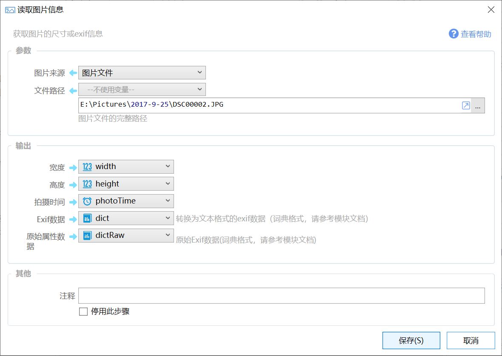

# 读取图片信息

获取图片的尺寸或exif信息

{/* xaction-metadata:start */}
## 当前模块定义

- 模块 Key：`sys:imageinfo`
- 分类：图片处理（`Image`）
- 类型：`Action`
- 风险操作：否
- 专业版：否

## 输入参数

| Key | 名称 | 类型 | 默认值 | 必填 | 变量模式 | 条件 | 说明 |
| --- | --- | --- | --- | --- | --- | --- | --- |
| `sourceType` | 图片来源 | `Enum` | var | 是 | `Input` |  |  |
| `bmpFile` | 文件路径 | `Text` |  | 是 | `UseVarOrInput` | 仅：file | 图片文件的完整路径 |
| `bmpVar` | 图片变量 | `Image` |  | 是 | `UseVar` | 仅：var |  |
| `autoRotate` | 计算旋转后的宽高 | `Boolean` | false | 否 | `Input` |  | 如果Exif中包含旋转角度信息，则获取旋转后的宽高 |
| `stopIfFail` | 失败后停止 | `Boolean` | true | 否 | `Input` |  | 失败后是否停止动作 |

## 输出参数

| Key | 名称 | 类型 | 条件 | 说明 |
| --- | --- | --- | --- | --- |
| `isSuccess` | 是否成功 | `Boolean` |  | 操作是否成功 |
| `width` | 宽度 | `Integer` |  |  |
| `height` | 高度 | `Integer` |  |  |
| `rotateDegree` | 旋转角度 | `Integer` |  |  |
| `dateTimeOriginal` | 拍摄时间 | `DateTime` |  |  |
| `exifData` | Exif数据 | `Dict` |  | 转换为文本格式的exif数据（词典格式，请参考模块文档） |
| `rawExifData` | 原始属性数据 | `Dict` |  | 原始Exif数据(词典格式，请参考模块文档) |
| `fileTypeFromData` | 内容图片格式 | `Text` | 仅：file | 根据文件内容判断的文件格式（可能不准确），用于在无法根据扩展名得到图片格式的情况下使用。 |

## 选项值

### `sourceType` 图片来源

| Value | 名称 | 说明 |
| --- | --- | --- |
| `var` | 图片变量 |  |
| `file` | 图片文件 |  |
{/* xaction-metadata:end */}

读取图片的尺寸和Exif信息。

## 参数

【图片来源】图片的来源类型，可选图片变量或图片文件。

【图片变量】来源为图片变量时，指定从哪个变量读取图片。

【文件路径】来源为图片路径时，指定从那个路径读取图片。

## 输出

【宽度】图片的宽度像素数。

【高度】图片的高度像素数。

【拍摄时间】从Exif数据中读取的照片拍摄时间。如果图片Exif中没有此信息，并且图片来源为文件时，读取文件的创建时间，否则返回一个特别小的时间（时间的最小值，1年1月1日0时）。

【Exif数据】返回一个词典类型的数据。键为经过转换后的Exif属性名称，值为转换为文本格式的Exif数据。

&#123;
  "ImageDescription": "                               ",  "EquipMake": "SONY",  "EquipModel": "DSC-RX10M4",  "Orientation": "1",  "XResolution": "350/1",  "YResolution": "350/1",  "ResolutionUnit": "2",  "SoftwareUsed": "DSC-RX10M4 v1.00",  "DateTime": "2017:09:25 12:18:21",  "YCbCrPositioning": "2",  "ExifExposureTime": "1/250",  "ExifFNumber": "40/10",  "ExifExposureProg": "2",  "ExifISOSpeed": "1250",  "Exif\_Photo\_SensitivityType": "2",  "Exif\_Photo\_RecommendedExposureIndex": "1250",  "ExifVer": "825438768",  "ExifDTOrig": "2017:09:25 12:18:21",  "ExifDTDigitized": "2017:09:25 12:18:21",  "36880": "+08:00",  "36881": "+08:00",  "36882": "+08:00",  "ExifCompConfig": "197121",  "ExifCompBPP": "2/1",  "ExifBrightness": "11414/2560",  "ExifExposureBias": "0/10",  "ExifMaxAperture": "1024/256",  "ExifMeteringMode": "5",  "ExifLightSource": "0",  "ExifFlash": "16",  "ExifFocalLength": "22000/100",  "ExifMakerNote": "....",  "ExifUserComment": "0, 0, 0, 0, 0, 0, 0, 0, 0, 0, 0, 0, 0, 0, 0, 0",  "ExifFPXVer": "808464688",  "ExifColorSpace": "1",  "ExifPixXDim": "5472",  "ExifPixYDim": "3648",  "20545": "R98",  "20546": "808464688",  "ExifFileSource": "",  "ExifSceneType": "",  "CustomRendered": "0",  "ExposureMode": "0",  "WhiteBalance": "0",  "DigitalZoomRatio": "16/16",  "FocalLengthIn35mmFilm": "600",  "SceneCaptureType": "0",  "Contrast": "0",  "Saturation": "0",  "Sharpness": "0",  "Exif\_Photo\_LensSpecification": "880/100, 22000/100, 24/10, 40/10",  "Exif\_Image\_PrintImageMatching": "1852404304, 5065076, 808465200, 131072, 65538, 16842752, 1",  "ThumbnailData": "NOT\_SUPPORTED",  "ThumbnailCompression": "6",  "ThumbnailImageDescription": "                               ",  "ThumbnailEquipMake": "SONY",  "ThumbnailEquipModel": "DSC-RX10M4",  "ThumbnailOrientation": "1",  "ThumbnailResolutionX": "72/1",  "ThumbnailResolutionY": "72/1",  "ThumbnailResolutionUnit": "2",  "ThumbnailSoftwareUsed": "DSC-RX10M4 v1.00",  "ThumbnailDateTime": "2017:09:25 12:18:21",  "JPEGInterFormat": "34662",  "JPEGInterLength": "5648",  "ThumbnailYCbCrPositioning": "2",  "ChrominanceTable": "2, 2, 2, 3, 6, 12, 15, 15, 2, 2, 2, 3, 6, 12, 15, 15, 2, 2, 2, 4, 7, 13, 15, 15, 3, 3, 4, 5, 9, 15, 15, 15, 6, 6, 7, 9, 14, 15, 15, 15, 12, 12, 13, 15, 15, 15, 15, 15, 15, 15, 15, 15, 15, 15, 15, 15, 15, 15, 15, 15, 15, 15, 15, 15",  "LuminanceTable": "1, 1, 1, 2, 2, 4, 5, 7, 1, 1, 2, 2, 3, 4, 5, 7, 1, 2, 2, 2, 3, 4, 6, 8, 2, 2, 2, 3, 3, 5, 6, 8, 2, 3, 3, 3, 4, 5, 7, 9, 4, 4, 4, 5, 5, 7, 8, 10, 5, 5, 6, 6, 7, 8, 10, 12, 7, 7, 8, 8, 9, 10, 12, 14"
&#125;

【原始属性数据】返回一个C#词典对象，Key为Exif属性数字，Value为[System.Drawing.Imaging.PropertyItem](https://docs.microsoft.com/en-us/dotnet/api/system.drawing.imaging.propertyitem)对象。

## 附加信息

【Exif数据中】所有支持的Exif属性名称（不支持的将直接返回属性数字值）：

public enum ExifPropertyTypes
        &#123;            Exif\_Image\_ImageID \= 0x800d,            Exif\_Image\_CFARepeatPatternDim \= 0x828d,            Exif\_Image\_CFAPattern \= 0x828e,            Exif\_Image\_BatteryLevel \= 0x828f,            Copyright \= 0x8298,            ExifExposureTime \= 0x829a,            ExifFNumber \= 0x829d,            Exif\_Image\_IPTCNAA \= 0x83bb,            Exif\_Image\_ImageResources \= 0x8649,            ExifIFD \= 0x8769,            ICCProfile \= 0x8773,            ExifExposureProg \= 0x8822,            ExifSpectralSense \= 0x8824,            GpsIFD \= 0x8825,            ExifISOSpeed \= 0x8827,            ExifOECF \= 0x8828,            Exif\_Image\_Interlace \= 0x8829,            Exif\_Image\_TimeZoneOffset \= 0x882a,            Exif\_Image\_SelfTimerMode \= 0x882b,            Exif\_Photo\_SensitivityType \= 0x8830,            Exif\_Photo\_StandardOutputSensitivity \= 0x8831,            Exif\_Photo\_RecommendedExposureIndex \= 0x8832,            Exif\_Photo\_ISOSpeed \= 0x8833,            Exif\_Photo\_ISOSpeedLatitudeyyy \= 0x8834,            Exif\_Photo\_ISOSpeedLatitudezzz \= 0x8835,            ExifVer \= 0x9000,            ExifDTOrig \= 0x9003,            ExifDTDigitized \= 0x9004,            ExifCompConfig \= 0x9101,            ExifCompBPP \= 0x9102,            ExifShutterSpeed \= 0x9201,            ExifAperture \= 0x9202,            ExifBrightness \= 0x9203,            ExifExposureBias \= 0x9204,            ExifMaxAperture \= 0x9205,            ExifSubjectDist \= 0x9206,            ExifMeteringMode \= 0x9207,            ExifLightSource \= 0x9208,            ExifFlash \= 0x9209,            ExifFocalLength \= 0x920a,            Exif\_Image\_FlashEnergy \= 0x920b,            Exif\_Image\_SpatialFrequencyResponse \= 0x920c,            Exif\_Image\_Noise \= 0x920d,            Exif\_Image\_FocalPlaneXResolution \= 0x920e,            Exif\_Image\_FocalPlaneYResolution \= 0x920f,            Exif\_Image\_FocalPlaneResolutionUnit \= 0x9210,            Exif\_Image\_ImageNumber \= 0x9211,            Exif\_Image\_SecurityClassification \= 0x9212,            Exif\_Image\_ImageHistory \= 0x9213,            SubjectArea \= 0x9214,            Exif\_Image\_ExposureIndex \= 0x9215,            Exif\_Image\_TIFFEPStandardID \= 0x9216,            Exif\_Image\_SensingMethod \= 0x9217,            ExifMakerNote \= 0x927c,            ExifUserComment \= 0x9286,            ExifDTSubsec \= 0x9290,            ExifDTOrigSS \= 0x9291,            ExifDTDigSS \= 0x9292,            Exif\_Image\_XPTitle \= 0x9c9b,            Exif\_Image\_XPComment \= 0x9c9c,            Exif\_Image\_XPAuthor \= 0x9c9d,            Exif\_Image\_XPKeywords \= 0x9c9e,            Exif\_Image\_XPSubject \= 0x9c9f,            ExifFPXVer \= 0xa000,            ExifColorSpace \= 0xa001,            ExifPixXDim \= 0xa002,            ExifPixYDim \= 0xa003,            ExifRelatedWav \= 0xa004,            ExifInterop \= 0xa005,            ExifFlashEnergy \= 0xa20b,            ExifSpatialFR \= 0xa20c,            ExifFocalXRes \= 0xa20e,            ExifFocalYRes \= 0xa20f,            ExifFocalResUnit \= 0xa210,            ExifSubjectLoc \= 0xa214,            ExifExposureIndex \= 0xa215,            ExifSensingMethod \= 0xa217,            ExifFileSource \= 0xa300,            ExifSceneType \= 0xa301,            ExifCfaPattern \= 0xa302,            CustomRendered \= 0xa401,            ExposureMode \= 0xa402,            WhiteBalance \= 0xa403,            DigitalZoomRatio \= 0xa404,            FocalLengthIn35mmFilm \= 0xa405,            SceneCaptureType \= 0xa406,            GainControl \= 0xa407,            Contrast \= 0xa408,            Saturation \= 0xa409,            Sharpness \= 0xa40a,            DeviceSettingDescription \= 0xa40b,            SubjectDistanceRange \= 0xa40c,            ImageUniqueID \= 0xa420,            Exif\_Photo\_CameraOwnerName \= 0xa430,            Exif\_Photo\_BodySerialNumber \= 0xa431,            Exif\_Photo\_LensSpecification \= 0xa432,            Exif\_Photo\_LensMake \= 0xa433,            Exif\_Photo\_LensModel \= 0xa434,            Exif\_Photo\_LensSerialNumber \= 0xa435,            Exif\_Image\_PrintImageMatching \= 0xc4a5,            Exif\_Image\_DNGVersion \= 0xc612,            Exif\_Image\_DNGBackwardVersion \= 0xc613,            Exif\_Image\_UniqueCameraModel \= 0xc614,            Exif\_Image\_LocalizedCameraModel \= 0xc615,            Exif\_Image\_CFAPlaneColor \= 0xc616,            Exif\_Image\_CFALayout \= 0xc617,            Exif\_Image\_LinearizationTable \= 0xc618,            Exif\_Image\_BlackLevelRepeatDim \= 0xc619,            Exif\_Image\_BlackLevel \= 0xc61a,            Exif\_Image\_BlackLevelDeltaH \= 0xc61b,            Exif\_Image\_BlackLevelDeltaV \= 0xc61c,            Exif\_Image\_WhiteLevel \= 0xc61d,            Exif\_Image\_DefaultScale \= 0xc61e,            Exif\_Image\_DefaultCropOrigin \= 0xc61f,            Exif\_Image\_DefaultCropSize \= 0xc620,            Exif\_Image\_ColorMatrix1 \= 0xc621,            Exif\_Image\_ColorMatrix2 \= 0xc622,            Exif\_Image\_CameraCalibration1 \= 0xc623,            Exif\_Image\_CameraCalibration2 \= 0xc624,            Exif\_Image\_ReductionMatrix1 \= 0xc625,            Exif\_Image\_ReductionMatrix2 \= 0xc626,            Exif\_Image\_AnalogBalance \= 0xc627,            Exif\_Image\_AsShotNeutral \= 0xc628,            Exif\_Image\_AsShotWhiteXY \= 0xc629,            Exif\_Image\_BaselineExposure \= 0xc62a,            Exif\_Image\_BaselineNoise \= 0xc62b,            Exif\_Image\_BaselineSharpness \= 0xc62c,            Exif\_Image\_BayerGreenSplit \= 0xc62d,            Exif\_Image\_LinearResponseLimit \= 0xc62e,            Exif\_Image\_CameraSerialNumber \= 0xc62f,            Exif\_Image\_LensInfo \= 0xc630,            Exif\_Image\_ChromaBlurRadius \= 0xc631,            Exif\_Image\_AntiAliasStrength \= 0xc632,            Exif\_Image\_ShadowScale \= 0xc633,            Exif\_Image\_DNGPrivateData \= 0xc634,            Exif\_Image\_MakerNoteSafety \= 0xc635,            Exif\_Image\_CalibrationIlluminant1 \= 0xc65a,            Exif\_Image\_CalibrationIlluminant2 \= 0xc65b,            Exif\_Image\_BestQualityScale \= 0xc65c,            Exif\_Image\_RawDataUniqueID \= 0xc65d,            Exif\_Image\_OriginalRawFileName \= 0xc68b,            Exif\_Image\_OriginalRawFileData \= 0xc68c,            Exif\_Image\_ActiveArea \= 0xc68d,            Exif\_Image\_MaskedAreas \= 0xc68e,            Exif\_Image\_AsShotICCProfile \= 0xc68f,            Exif\_Image\_AsShotPreProfileMatrix \= 0xc690,            Exif\_Image\_CurrentICCProfile \= 0xc691,            Exif\_Image\_CurrentPreProfileMatrix \= 0xc692,            Exif\_Image\_ColorimetricReference \= 0xc6bf,            Exif\_Image\_CameraCalibrationSignature \= 0xc6f3,            Exif\_Image\_ProfileCalibrationSignature \= 0xc6f4,            Exif\_Image\_AsShotProfileName \= 0xc6f6,            Exif\_Image\_NoiseReductionApplied \= 0xc6f7,            Exif\_Image\_ProfileName \= 0xc6f8,            Exif\_Image\_ProfileHueSatMapDims \= 0xc6f9,            Exif\_Image\_ProfileHueSatMapData1 \= 0xc6fa,            Exif\_Image\_ProfileHueSatMapData2 \= 0xc6fb,            Exif\_Image\_ProfileToneCurve \= 0xc6fc,            Exif\_Image\_ProfileEmbedPolicy \= 0xc6fd,            Exif\_Image\_ProfileCopyright \= 0xc6fe,            Exif\_Image\_ForwardMatrix1 \= 0xc714,            Exif\_Image\_ForwardMatrix2 \= 0xc715,            Exif\_Image\_PreviewApplicationName \= 0xc716,            Exif\_Image\_PreviewApplicationVersion \= 0xc717,            Exif\_Image\_PreviewSettingsName \= 0xc718,            Exif\_Image\_PreviewSettingsDigest \= 0xc719,            Exif\_Image\_PreviewColorSpace \= 0xc71a,            Exif\_Image\_PreviewDateTime \= 0xc71b,            Exif\_Image\_RawImageDigest \= 0xc71c,            Exif\_Image\_OriginalRawFileDigest \= 0xc71d,            Exif\_Image\_SubTileBlockSize \= 0xc71e,            Exif\_Image\_RowInterleaveFactor \= 0xc71f,            Exif\_Image\_ProfileLookTableDims \= 0xc725,            Exif\_Image\_ProfileLookTableData \= 0xc726,            Exif\_Image\_OpcodeList1 \= 0xc740,            Exif\_Image\_OpcodeList2 \= 0xc741,            Exif\_Image\_OpcodeList3 \= 0xc74e,            Exif\_Image\_NoiseProfile \= 0xc761,            GpsVer \= 0x0000,            GpsLatitudeRef \= 0x0001,            GpsLatitude \= 0x0002,            GpsLongitudeRef \= 0x0003,            GpsLongitude \= 0x0004,            GpsAltitudeRef \= 0x0005,            GpsAltitude \= 0x0006,            GpsGpsTime \= 0x0007,            GpsGpsSatellites \= 0x0008,            GpsGpsStatus \= 0x0009,            GpsGpsMeasureMode \= 0x000a,            GpsGpsDop \= 0x000b,            GpsSpeedRef \= 0x000c,            GpsSpeed \= 0x000d,            GpsTrackRef \= 0x000e,            GpsTrack \= 0x000f,            GpsImgDirRef \= 0x0010,            GpsImgDir \= 0x0011,            GpsMapDatum \= 0x0012,            GpsDestLatRef \= 0x0013,            GpsDestLat \= 0x0014,            GpsDestLongRef \= 0x0015,            GpsDestLong \= 0x0016,            GpsDestBearRef \= 0x0017,            GpsDestBear \= 0x0018,            GpsDestDistRef \= 0x0019,            GpsDestDist \= 0x001a,            Exif\_GPSInfo\_GPSProcessingMethod \= 0x001b,            Exif\_GPSInfo\_GPSAreaInformation \= 0x001c,            Exif\_GPSInfo\_GPSDateStamp \= 0x001d,            Exif\_GPSInfo\_GPSDifferential \= 0x001e,            NewSubfileType \= 0x00fe,            SubfileType \= 0x00ff,            ImageWidth \= 0x0100,            ImageHeight \= 0x0101,            BitsPerSample \= 0x0102,            Compression \= 0x0103,            PhotometricInterp \= 0x0106,            ThreshHolding \= 0x0107,            CellWidth \= 0x0108,            CellHeight \= 0x0109,            FillOrder \= 0x010a,            DocumentName \= 0x010d,            ImageDescription \= 0x010e,            EquipMake \= 0x010f,            EquipModel \= 0x0110,            StripOffsets \= 0x0111,            Orientation \= 0x0112,            SamplesPerPixel \= 0x0115,            RowsPerStrip \= 0x0116,            StripBytesCount \= 0x0117,            MinSampleValue \= 0x0118,            MaxSampleValue \= 0x0119,            XResolution \= 0x011a,            YResolution \= 0x011b,            PlanarConfig \= 0x011c,            PageName \= 0x011d,            XPosition \= 0x011e,            YPosition \= 0x011f,            FreeOffset \= 0x0120,            FreeByteCounts \= 0x0121,            GrayResponseUnit \= 0x0122,            GrayResponseCurve \= 0x0123,            T4Option \= 0x0124,            T6Option \= 0x0125,            ResolutionUnit \= 0x0128,            PageNumber \= 0x0129,            TransferFunction \= 0x012d,            SoftwareUsed \= 0x0131,            DateTime \= 0x0132,            Artist \= 0x013b,            HostComputer \= 0x013c,            Predictor \= 0x013d,            WhitePoint \= 0x013e,            PrimaryChromaticities \= 0x013f,            ColorMap \= 0x0140,            HalftoneHints \= 0x0141,            TileWidth \= 0x0142,            TileLength \= 0x0143,            TileOffset \= 0x0144,            TileByteCounts \= 0x0145,            Exif\_Image\_SubIFDs \= 0x014a,            InkSet \= 0x014c,            InkNames \= 0x014d,            NumberOfInks \= 0x014e,            DotRange \= 0x0150,            TargetPrinter \= 0x0151,            ExtraSamples \= 0x0152,            SampleFormat \= 0x0153,            SMinSampleValue \= 0x0154,            SMaxSampleValue \= 0x0155,            TransferRange \= 0x0156,            Exif\_Image\_ClipPath \= 0x0157,            Exif\_Image\_XClipPathUnits \= 0x0158,            Exif\_Image\_YClipPathUnits \= 0x0159,            Exif\_Image\_Indexed \= 0x015a,            Exif\_Image\_JPEGTables \= 0x015b,            Exif\_Image\_OPIProxy \= 0x015f,            JPEGProc \= 0x0200,            JPEGInterFormat \= 0x0201,            JPEGInterLength \= 0x0202,            JPEGRestartInterval \= 0x0203,            JPEGLosslessPredictors \= 0x0205,            JPEGPointTransforms \= 0x0206,            JPEGQTables \= 0x0207,            JPEGDCTables \= 0x0208,            JPEGACTables \= 0x0209,            YCbCrCoefficients \= 0x0211,            YCbCrSubsampling \= 0x0212,            YCbCrPositioning \= 0x0213,            REFBlackWhite \= 0x0214,            Exif\_Image\_XMLPacket \= 0x02bc,            Gamma \= 0x0301,            ICCProfileDescriptor \= 0x0302,            SRGBRenderingIntent \= 0x0303,            ImageTitle \= 0x0320,            Exif\_Iop\_RelatedImageFileFormat \= 0x1000,            Exif\_Iop\_RelatedImageWidth \= 0x1001,            Exif\_Iop\_RelatedImageLength \= 0x1002,            Exif\_Image\_Rating \= 0x4746,            Exif\_Image\_RatingPercent \= 0x4749,            ResolutionXUnit \= 0x5001,            ResolutionYUnit \= 0x5002,            ResolutionXLengthUnit \= 0x5003,            ResolutionYLengthUnit \= 0x5004,            PrintFlags \= 0x5005,            PrintFlagsVersion \= 0x5006,            PrintFlagsCrop \= 0x5007,            PrintFlagsBleedWidth \= 0x5008,            PrintFlagsBleedWidthScale \= 0x5009,            HalftoneLPI \= 0x500a,            HalftoneLPIUnit \= 0x500b,            HalftoneDegree \= 0x500c,            HalftoneShape \= 0x500d,            HalftoneMisc \= 0x500e,            HalftoneScreen \= 0x500f,            JPEGQuality \= 0x5010,            GridSize \= 0x5011,            ThumbnailFormat \= 0x5012,            ThumbnailWidth \= 0x5013,            ThumbnailHeight \= 0x5014,            ThumbnailColorDepth \= 0x5015,            ThumbnailPlanes \= 0x5016,            ThumbnailRawBytes \= 0x5017,            ThumbnailSize \= 0x5018,            ThumbnailCompressedSize \= 0x5019,            ColorTransferFunction \= 0x501a,            ThumbnailData \= 0x501b,            ThumbnailImageWidth \= 0x5020,            ThumbnailImageHeight \= 0x5021,            ThumbnailBitsPerSample \= 0x5022,            ThumbnailCompression \= 0x5023,            ThumbnailPhotometricInterp \= 0x5024,            ThumbnailImageDescription \= 0x5025,            ThumbnailEquipMake \= 0x5026,            ThumbnailEquipModel \= 0x5027,            ThumbnailStripOffsets \= 0x5028,            ThumbnailOrientation \= 0x5029,            ThumbnailSamplesPerPixel \= 0x502a,            ThumbnailRowsPerStrip \= 0x502b,            ThumbnailStripBytesCount \= 0x502c,            ThumbnailResolutionX \= 0x502d,            ThumbnailResolutionY \= 0x502e,            ThumbnailPlanarConfig \= 0x502f,            ThumbnailResolutionUnit \= 0x5030,            ThumbnailTransferFunction \= 0x5031,            ThumbnailSoftwareUsed \= 0x5032,            ThumbnailDateTime \= 0x5033,            ThumbnailArtist \= 0x5034,            ThumbnailWhitePoint \= 0x5035,            ThumbnailPrimaryChromaticities \= 0x5036,            ThumbnailYCbCrCoefficients \= 0x5037,            ThumbnailYCbCrSubsampling \= 0x5038,            ThumbnailYCbCrPositioning \= 0x5039,            ThumbnailRefBlackWhite \= 0x503a,            ThumbnailCopyRight \= 0x503b,            LuminanceTable \= 0x5090,            ChrominanceTable \= 0x5091,            FrameDelay \= 0x5100,            LoopCount \= 0x5101,            GlobalPalette \= 0x5102,            IndexBackground \= 0x5103,            IndexTransparent \= 0x5104,            PixelUnit \= 0x5110,            PixelPerUnitX \= 0x5111,            PixelPerUnitY \= 0x5112,            PaletteHistogram \= 0x5113,        &#125;

## 更改历史

-   1.4.7 版本：开始提供。
